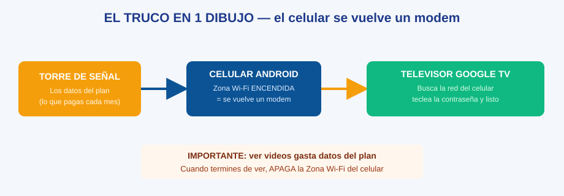
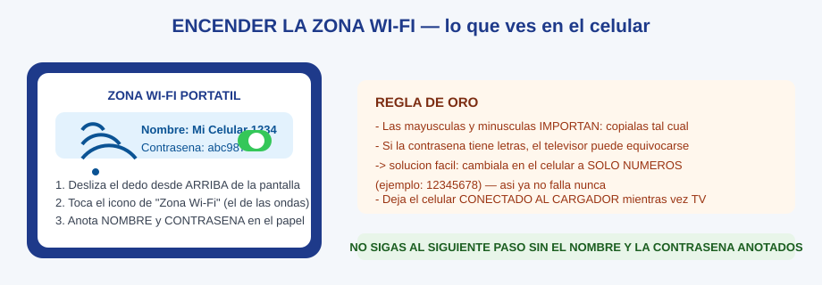

# GT-01 · Módulo 1: Encender la Zona Wi-Fi del celular

> Guía Google TV · Módulo 1 de 3 · Tiempo: 3 minutos · Todo se hace en el celular

---

## Objetivos de este módulo

- [ ] Ver el dibujo y entender la idea de una vez
- [ ] Encender la Zona Wi-Fi del celular
- [ ] Anotar NOMBRE y CONTRASEÑA en el papel

---

## 1. El truco en 1 dibujo

**Frase para decir en voz alta:** *"El celular se vuelve un modem, y el televisor se conecta a él."*

## Diagramas de esta sección

| Diagrama | Qué te enseña |
|----------|---------------|
| [El truco en 1 dibujo](./gt-diagrama-el-truco-en-1-dibujo.svg) | Celular → Zona Wi-Fi → Televisor: la idea completa |

## 2. Encender la Zona Wi-Fi, paso a paso

1. **Desliza el dedo** desde la parte de arriba de la pantalla del celular (hacia abajo). Se abre el panel de botones rápidos.
2. Busca el icono de **"Zona Wi-Fi"** o **"Hotspot"** (parece un foco o unas ondas de señal Wi-Fi). Si no lo ves, desliza el panel hacia un lado o presiona **Editar** para encontrarlo.
3. **Tócalo una vez** para encenderlo: debe quedar de color (encendido). *(Si dudas, tócalo y mantén presionado: se abre la pantalla completa de Zona Wi-Fi portátil.)*
4. El celular mostrará **dos datos importantes**. Anótalos **tal cual** en el papel:
   - **Nombre de la red** (ejemplo: "Mi Celular 1234")
   - **Contraseña** (ejemplo: "abc987")
5. Conecta el celular **al cargador** mientras vayas a ver televisión.

> **Regla de oro:** no sigas al módulo 2 **sin tener en el papel** el nombre y la contraseña. Las mayúsculas y minúsculas importan.

## 3. Si la contraseña es difícil de teclear en el televisor

En la pantalla de Zona Wi-Fi del celular, entra a **Configurar Zona Wi-Fi** (o "Configurar punto de acceso") y **cambia la contraseña por solo números** (ejemplo: 12345678). Así el televisor no se equivoca nunca, y papá solo recuerda 8 números.

## 4. Ejercicio de 1 minuto

1. Enciende la Zona Wi-Fi y anota los 2 datos.
2. Apaga y vuelve a encender la Zona Wi-Fi (practica el interruptor).
3. Di en voz alta: *"Nombre y contraseña en el papel, celular cargando."*

## 5. Checklist de dominio (sin mirar el módulo)

- [ ] Enciendo la Zona Wi-Fi del celular en menos de 30 segundos
- [ ] Tengo el nombre y la contraseña anotados en el papel
- [ ] Sé dónde se cambia la contraseña si quiero ponerla solo de números

**Manual oficial de Google (respaldo):** [Compartir conexión desde un celular Android](https://support.google.com/android/answer/9059108?hl=es-419)

---

**Siguiente módulo**: [GT-02 — Conectar el televisor Google TV](./gt-02-modulo-2-conectar-el-televisor-google-tv.md)