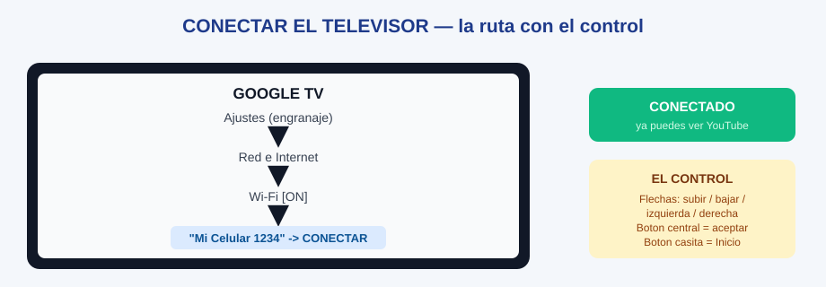

# GT-02 · Módulo 2: Conectar el televisor Google TV

> Guía Google TV · Módulo 2 de 3 · Tiempo: 3 minutos · Todo se hace con el control remoto

---

## Objetivos de este módulo

- [ ] Tener el celular listo con la Zona Wi-Fi encendida (módulo 1)
- [ ] Conectar el televisor a la red del celular
- [ ] Probar con un video en YouTube o Netflix

---

## 1. La ruta del control, en 1 dibujo

**Frase para decir en voz alta:** *"Ajustes, Red e Internet, Wi-Fi, mi celular, CONECTAR."*

## Diagramas de esta sección

| Diagrama | Qué te enseña |
|----------|---------------|
| [Conectar el televisor](./gt-diagrama-conectar-el-televisor.svg) | La ruta del control por los menús del Google TV |

## 2. Conectar el televisor, paso a paso

1. **Enciende el televisor** con el control y espera a que cargue la pantalla de inicio.
2. Presiona el botón **Inicio** (el de la casita) para ver el menú principal.
3. Busca el icono de **Ajustes** (el engranaje), arriba a la derecha de la pantalla. Entra con las flechas y presiona el botón **central** para aceptar.
4. Con las flechas, baja hasta **"Red"** o **"Red e Internet"** y entra.
5. Entra en **"Wi-Fi"** y verifica que esté **activado** (encendido).
6. En la lista de redes, busca el **nombre que anotaste del celular** y selecciónalo.
7. Teclea la **contraseña del papel** y presiona **"Conectar"**.
8. Espera hasta 1 minuto: el televisor debe decir **"Conectado"**.
9. Presiona el botón **Inicio** (la casita) y abre **YouTube** o **Netflix**. Si se reproduce un video, ¡todo quedó listo!

> **Regla de oro:** si el televisor dice "contraseña incorrecta", revisa las **mayúsculas** contra el papel. Si falla otra vez, ponle al celular una contraseña de **solo números** (se explica en el módulo 1, paso 3).

## 3. Ejercicio de 1 minuto

1. Con la Zona Wi-Fi del celular encendida, conecta el televisor siguiendo el dibujo.
2. Abre YouTube y pon un video corto para comprobar.
3. Di en voz alta: *"Ya sé llegar a Red e Internet, esa es la mitad del camino."*

## 4. Checklist de dominio (sin mirar el módulo)

- [ ] Llego a los Ajustes del televisor con el control sin ayuda
- [ ] Encuentro la red del celular en la lista de Wi-Fi
- [ ] Tecleo la contraseña y el televisor dice "Conectado"

**Manuales oficiales de Google (respaldo):** [Configurar un dispositivo Google TV](https://support.google.com/googletv/answer/10050221?hl=es-419) · [Solucionar problemas del Google TV](https://support.google.com/googletv/answer/10070482?hl=es-419)

---

**Siguiente módulo**: [GT-03 — Si algo falla: problemas, consejos y repaso](./gt-03-modulo-3-si-algo-falla-problemas-y-repaso.md)