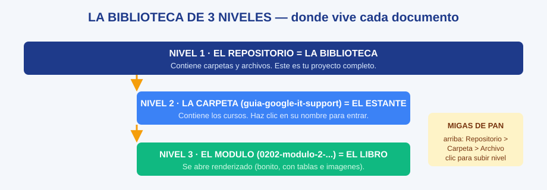

# GH-02 · Módulo 2: Navegar como en Google Drive

> Guía GitHub · Módulo 2 de 6 · Temas: pestaña Code, árbol de carpetas, migas de pan, abrir documentos y diagramas, orden alfabético

---

## Objetivos de este módulo

- [ ] Usar la pestaña **Code** sin miedo
- [ ] Entrar y salir de carpetas con las migas de pan
- [ ] Abrir documentos renderizados y diagramas SVG
- [ ] Explicar por qué los archivos "se ven desordenados" (orden alfabético)

---

## 1. La pestaña Code: tu zona de estudio

Cuando abres un repositorio, ves (de arriba a abajo):

```
Nombre del repositorio + botones (Code · Issues · Commits...)
        ↓
Ruta actual (migas de pan): Repositorio > carpeta > ...
        ↓
Lista de carpetas PRIMERO y luego archivos
        ↓
Portada README renderizada (al final)
```

**Regla de oro** (repetida a propósito): **para estudiar, siempre la pestaña Code**. Las demás pestañas (Issues, Actions) son para desarrollo — no las necesitas aún.

## 2. El diagrama que lo resume todo



| Nivel | Qué es | Qué contiene |
|-------|--------|--------------|
| 1 · Repositorio | Tu biblioteca | Carpetas y archivos |
| 2 · Carpeta | Un estante (ej. `guia-google-it-support`) | Los cursos |
| 3 · Archivo | Un libro (`0202-modulo-2-...md`) | El contenido renderizado |

**Las migas de pan** (arriba, la ruta con `>`): al hacer clic en cualquier parte de esa ruta **subes de nivel**. Es el botón "volver" más confiable.

## 3. Abrir documentos y diagramas

| Tipo de archivo | Al hacer clic | Para volver |
|-----------------|---------------|-------------|
| `*.md` (documento) | Se abre **renderizado** (formato bonito, tablas e imágenes incluidas) | Flecha atrás o miga de pan |
| `*.svg` (diagrama) | Se muestra la **imagen** | Flecha atrás o miga de pan |
| Carpeta | Se entra (nivel 2) | Miga de pan |

**Prueba guiada ahora mismo**: entra a `guia-google-it-support` → `curso-02-redes-de-computadoras` → haz clic en `0202-modulo-2-....md` → desplázate hasta la sección de subnetting → verás el diagrama **dentro del documento** y su tabla de "Diagramas de esta sección" al inicio.

## 4. Por qué "se ve desordenado" (matemática del orden)

GitHub lista **alfabéticamente: primero las carpetas, luego los archivos**. Consecuencias:

- `00-vision-general.md` va primero por el "0" (parece "módulo 0", pero es la introducción).
- `0104-diagrama-...svg` aparece ANTES que `0104-modulo-...md` (porque "diagrama" < "modulo" alfabéticamente).
- `README.md` cae al final de la lista de archivos (pero se renderiza como portada abajo).

**Orden de lectura correcto en cada curso**:

```
README.md (portada) → 00-vision-general.md (plan) → módulo 1 → módulo 2 → ... → módulo 6
```

Siempre conviene leer antes la portada y la visión general: son el mapa que hace comprensible el resto.

## 5. Ejercicio guiado

1. Recorre: raíz → `guia-google-it-support` → `curso-06-...` → abre un módulo y luego vuelve por la miga de pan (2 clics). Repite 3 veces hasta que sea automático.
2. Abre el diagrama `gh-diagrama-las-3-zonas.svg` y dime (en voz alta) cuál es la zona verde.
3. Encuentra el módulo 6 del curso 3 SIN usar el buscador: usa las reglas de orden.
4. Auto-explicación: "¿por qué `00-vision-general` aparece antes que los módulos?"

## 6. Checklist de dominio (sin mirar el módulo)

- [ ] Navego 3 niveles y vuelvo con las migas de pan
- [ ] Abro un `.md` renderizado y un `.svg` como imagen
- [ ] Explico el orden alfabético y el orden de lectura correcto
- [ ] Localizo cualquier módulo 6 sin buscar
- [ ] Uso la regla de oro (pestaña Code) sin confundirme

---

**Siguiente módulo**: [GH-03 — Los commits: el historial del proyecto](./gh-03-modulo-3-los-commits.md)