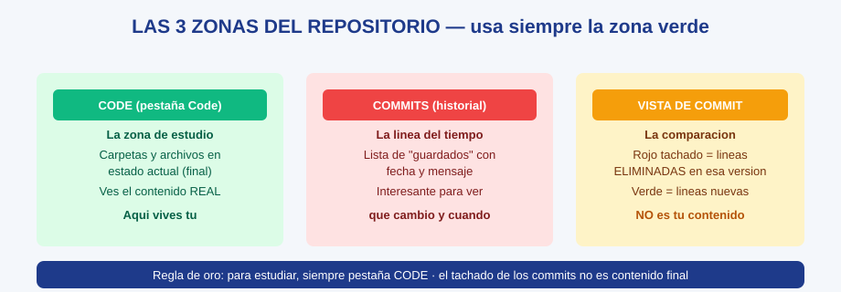

# GH-03 · Módulo 3: Los commits — el historial del proyecto

> Guía GitHub · Módulo 3 de 6 · Temas: qué es un commit, cómo leer el historial, por qué hay texto tachado y verde, fecha vs contenido

---

## Objetivos de este módulo

- [ ] Explicar qué es un commit con una analogía
- [ ] Leer la lista de commits de un repositorio
- [ ] Entender la vista de comparación (rojo tachado / verde nuevo)
- [ ] Distinguir "historial" (Commits) de "contenido actual" (Code)

---

## 1. El commit: la foto del avance

Un **commit** es un "guardado oficial": una foto del proyecto en un momento dado, con autor, fecha y mensaje. Cuando nosotros avanzamos la guía, hacemos un commit; la lista completa de commits es la **historia cronológica** del proyecto.

**Analogía**: los commits son las **fotos de un álbum de viaje** — cada una muestra cómo iba el proyecto ese día. El álbum (historial) crece, pero el proyecto HOY (Code) es solo la última foto... vista en vivo.

## 2. Cómo leer la lista de commits

En el repositorio, pestaña **Commits** (o "History"):

| Columna | Qué significa |
|---------|---------------|
| Mensaje del commit | Qué se hizo (ej. "Curso 06 completo + estado corregido") |
| Hora/fecha | Cuándo fue (hace X horas/días) |
| Autor | Quién lo hizo |
| Hash (código) | Identificador único del guardado |

Es por eso que en el listado de carpetas ves debajo de cada nombre "Curso 03 completo… 8 hours ago": **es el último commit que tocó ese elemento**, no contenido. Es la columna "modificado" del explorador de Windows.

## 3. La vista de comparación (el "texto tachado" que tanto confunde)

Cuando haces clic en un commit, GitHub te muestra **qué cambió en ese guardado** — una comparación entre la versión anterior y la nueva:

| Color | Significado | Ejemplo |
|-------|-------------|---------|
| **Rojo tachado** (`−`) | Líneas que **se eliminaron** en ese commit | La versión vieja de una frase |
| **Verde** (`+`) | Líneas que **se agregaron** | La versión nueva de esa frase |
| Ambos juntos | Cambio de texto | "Antes se decía A; ahora se dice B" |

**Ahí está la clave de tu confusión anterior**: viste "Professor Messer" dos veces (una tachada, una verde) porque el commit mostraba el **antes y el después**. El archivo final solo tiene UNA mención. Tachado ≠ tu contenido; tachado = historia.

## 4. Dato curioso que te vuelve profesional

Abrir el repositorio en el **modo público** (incógnito) muestra exactamente lo mismo que con sesión: GitHub no oculta nada por no tener cuenta. La diferencia es que con cuenta puedes EDITAR (y lo harás en el módulo 6).

## 5. Ejercicio guiado

1. Ve a la pestaña **Commits** de tu repositorio y lee los 5 últimos mensajes. Reescríbelos con tus palabras (¿qué hizo cada uno?).
2. Abre el commit "Curso 06 completo…" y localiza: líneas verdes y líneas rojas tachadas. En voz alta: "esto es lo que cambió, no el contenido final".
3. Auto-explicación: explica a alguien (o a tu grabadora) la diferencia entre la pestaña Commits y la pestaña Code.
4. Investiga: ¿cuántos commits tiene tu repositorio hoy? (el número aparece en la pestaña).

## 6. Checklist de dominio (sin mirar el módulo)

- [ ] Explico qué es un commit con la analogía del álbum
- [ ] Leo un mensaje de commit y deduzco qué se hizo
- [ ] Explico el rojo tachado y el verde sin confundirme
- [ ] Navego Commits y Code sin miedo
- [ ] Defiendo la regla de oro (Code = contenido actual)

---

**Siguiente módulo**: [GH-04 — Descargar con ZIP y trabajar local](./gh-04-modulo-4-descargar-con-zip.md)