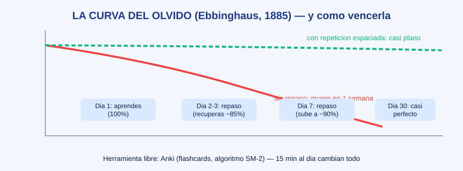
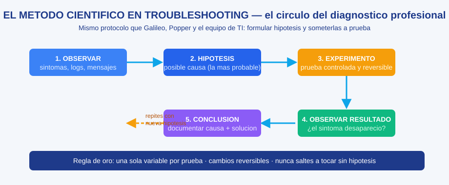

# Guía de Aprendizaje — Google IT Support Professional Certificate

Esta carpeta contiene la **guía completa de estudio** estructurada igual que el certificado: curso por curso, módulo por módulo, con submódulos, teoría ampliada, diagramas, ejercicios y recursos gratuitos.

## Contenido

| Curso | Estado |
|-------|--------|
| [01 · Fundamentos de Soporte Técnico](./curso-01-fundamentos-de-soporte-tecnico/README.md) | Completo |
| [02 · Redes de Computadoras](./curso-02-redes-de-computadoras/README.md) | En construcción |
| [03 · Sistemas Operativos](./curso-03-sistemas-operativos/README.md) | En construcción |
| [04 · Administración de Sistemas e Infraestructura](./curso-04-administracion-de-sistemas/README.md) | En construcción |
| [05 · Seguridad Informática](./curso-05-seguridad-informatica/README.md) | En construcción |

## Paleta de recursos en cada módulo

- **Diagramas visuales**: diagramas de flujo y arquitecturas (renderizados por GitHub).
- **Práctica guiada**: comandos, ejercicios y escenarios.
- **Plataformas gratuitas**: enlaces a laboratorios y simuladores reales.
- **Checklist de dominio**: para verificar que aprendiste antes de avanzar.

## Sistema de enseñanza profesional (método científico aplicado a la pedagogía)

Esta guía no es un listado de apuntes: es un **sistema de instrucción diseñado con base en evidencia científica** (ciencia del aprendizaje / educational research). Cada módulo está construido para activar los mecanismos que la investigación ha demostrado que producen aprendizaje duradero:

| Principio científico | Evidencia | Cómo lo aplicamos aquí |
|----------------------|-----------|------------------------|
| **Canal dual (texto + imagen)** | Mayer (2009), Teoría Cognitiva del Aprendizaje Multimedia | Cada tema abstracto incluye un diagrama visual junto al texto |
| **Ejemplos resueltos desvanecidos** *(faded worked examples)* | Renkl (2014); Tepgeç & Demiraslan Çevik (2025) | Primero resolvemos el ejemplo completo; después dejamos pasos vacíos para que los completes tú; al final, haces el ejercicio solo |
| **Efecto de auto-explicación** | Sandoval-Medina et al. (2024) | Cada módulo te pide "explica en voz alta por qué": explicar con tus palabras es el mejor pegamento de memoria |
| **Andamiaje (scaffolding)** | Shin et al. (2025); Sweller, van Merriënboer & Paas (1998) | Los ejercicios van de guiados → semilibres → libres, reduciendo apoyo gradualmente |
| **Práctica de recuperación** *(retrieval practice)* | Dunlosky et al. (2013); Roediger & Karpicke (2006) | Checklists de dominio al final y preguntas "anticipadas" antes de cada sección: recordar es lo que crea memoria |
| **Repetición espaciada** | Ebbinghaus (1885) — curva del olvido | Plan de repaso en días 2-3, 7 y 30 (diagrama abajo) |
| **Interleaving (mezclar temas)** | Rohrer & Taylor (2007) | Los ejercicios finales mezclan temas del módulo, no solo el último visto |
| **Analogías cotidianas** | Richland, Zur & Holyoak (2007) | Conceptos abstractos anclados a la vida real (carta certificada, pastel, aduana) |
| **Taxonomía de Bloom** | Bloom (1956) / Anderson & Krathwohl (2001) | Cada módulo sube niveles: recordar → comprender → aplicar → analizar → evaluar → crear |
| **Señalización** | Borkin et al. (2013) | Negritas, tablas y trucos resaltan lo que importa (el cerebro no puede procesar todo) |
| **Método científico en diagnóstico** | Protocolo profesional (ver diagrama) | Todo troubleshooting aquí sigue: observar → hipótesis → experimento → observar resultado → concluir |

### La curva del olvido y tu plan de repaso

El ser humano olvida el 50% de lo aprendido en 1 día sin repaso. Tu plan semanal antiolvido:

1. **Día 1**: estudia el módulo y haz sus ejercicios (100%).
2. **Días 2-3**: repaso activo de 10 min: rehaz los checklist de dominio *sin mirar* el módulo.
3. **Día 7**: repaso de 10 min + un ejercicio mezclado del módulo anterior.
4. **Día 30**: repaso final antes de seguir — ya es memoria de largo plazo.
5. Herramienta recomendada: **Anki** (gratis): conviierte cada "checklist de dominio" en flashcards. 15 min al día.

### El método científico en troubleshooting

Reglas que esta guía aplica en todos sus ejercicios de diagnóstico:

- **Nunca toques sin hipótesis**: cada acción debe nombrar la causa que busca probar o descartar.
- **Una variable por prueba**: cambia una sola cosa y observa antes de cambiar otra.
- **Cambios reversibles**: vuelve atrás si no funcionó; documenta qué hiciste.
- **Concluye documentando**: causa raíz + solución en palabras simples (el ticket perfecto).

### Rubrica de evaluación profesional (autoevaluación honesta)

| Nivel | Explicar el concepto | Hacer el ejercicio | Diagnosticar el incidente |
|-------|----------------------|--------------------|---------------------------|
| **1. Novato** | Con ayuda, deduce | Sigue el ejemplo paso a paso | Repite lo que vio hacer |
| **2. Aprendiz** | Lo explica con sus palabras | Lo hace solo mirando apuntes | Resuelve con 1 pista |
| **3. Competente** | Lo explica sin apuntes | Lo hace sin mirar nada | Resuelve siguiendo el protocolo completo |
| **4. Experto** | Lo enseña a otro (auto-explicación) | Inventa su propia variante | Encuentra la causa con métodos eficientes |

**Meta profesional**: llegar a nivel 3 en todos los checklist antes de avanzar de curso; nivel 4 en los temas que más te interesen (serán tu especialización laboral).

### Taxonomía de Bloom aplicada (de qué nivel es cada actividad)

| Nivel | Ejemplo en esta guía |
|-------|----------------------|
| Recordar | Vocabulario y puertos de memoria |
| Comprender | Explicar TCP/IP con la analogía de la carta |
| Aplicar | Comandos reales (ping, ipconfig, nslookup) |
| Analizar | Leer un ticket y separar síntomas/causas |
| Evaluar | Elegir el RAID o estrategia de backup adecuada |
| Crear | Proyectos finales de cada curso (armar red, plan de backup, política de seguridad) |

### Recursos visuales externos recomendados (reforzar con vídeo)

- **Professor Messer** — vídeos gratuitos de soporte técnico y redes (cubre todo el temario con láminas visuales; referente mundial para certificaciones CompTIA).
- **PowerCert Animated Videos** — animaciones cortas de los conceptos abstractos (TCP/IP, DNS, RAID). Busca *"PowerCert animated"* en YouTube.
- **Cisco Networking Academy** (https://www.netacad.com) — cursos gratuitos con laboratorios visuales interactivos + **Packet Tracer**.
- **Servidor de práctica en la nube** — solo recuerda: práctica sobre máquinas virtuales o equipos propios, nunca contra sistemas ajenos.

> **El ciclo dorado de estudio (con evidencia)**: ① Lee la sección (segmentación) → ② estudia su diagrama (canal dual) → ③ reproduce el ejemplo resuelto en papel/comandos (faded worked example) → ④ auto-explicación: explícalo en voz alta como si enseñaras (auto-explicación) → ⑤ ejercicio libre (recuperación). Repite el módulo en día 3, 7 y 30 (repetición espaciada). Ese ciclo de 5+3 pasos es lo que separa "lo leí" de "lo domino".