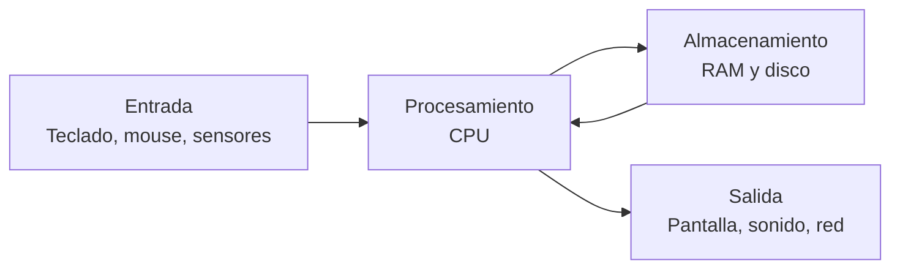
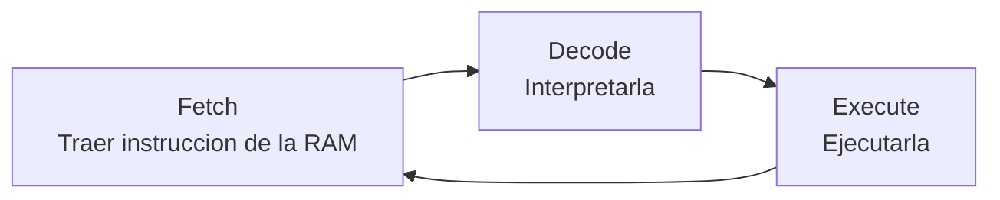

# 0101 · Módulo 1: Introducción a la Informática

> Curso 01 · Módulo 1 de 6 · Temas: qué es una computadora, historia, lógica digital y datos

---

## Objetivos de este módulo

- [ ] Explicar qué es una computadora y sus funciones básicas
- [ ] Entender el sistema binario y las unidades de datos (bit, byte, KB → TB)
- [ ] Conocer la historia de la computación y su evolución
- [ ] Distinguir hardware de software

---

## 1. ¿Qué es una computadora?

Una **computadora** es una máquina electrónica que recibe **datos de entrada**, los **procesa** según instrucciones y produce **salidas útiles**.

Las 4 funciones de toda computadora: **entrada → procesamiento → almacenamiento → salida**.

### Hardware vs Software

| Concepto | Definición | Ejemplos |
|----------|------------|----------|
| **Hardware** | Todo lo físico que puedes tocar | CPU, RAM, disco, placa, teclado |
| **Software** | Todo lo que no es físico: instrucciones y programas | Windows, Word, Chrome, juegos |

El **firmware** es software especial grabado en chips de hardware (p. ej., el BIOS/UEFI de la placa madre).

---

## 2. Lógica digital: cómo piensa la máquina

Las computadoras representan toda la información con **solo dos estados**: `0` (apagado) y `1` (encendido) — **sistema binario** (base 2).

| Unidad | Tamaño | Ejemplo |
|--------|--------|---------|
| **bit** | 1 dígito binario (0 o 1) | un estado |
| **byte** | 8 bits | una letra (A = 01000001) |
| **KB** | 1024 bytes ≈ mil bytes | una página de texto |
| **MB** | 1024 KB ≈ un millón | una canción en MP3 |
| **GB** | 1024 MB ≈ mil millones | una película HD |
| **TB** | 1024 GB ≈ un billón | la capacidad de un disco moderno |

### Traducción rápida de binario

| Binario | Decimal |
|---------|---------|
| 0000 | 0 |
| 0001 | 1 |
| 0010 | 2 |
| 0101 | 5 |
| 1010 | 10 |
| 1111 | 15 |

> **Tip de soporte**: cuando un usuario pregunta "¿por qué mi USB de 16 GB solo muestra 14.9 GB?", la respuesta es que los fabricantes usan el sistema decimal (16 000 000 000 bytes = 14.9 "GB binarios"). No es un error del equipo.

---

## 3. Historia breve de la computación

| Época | Hito |
|-------|------|
| 1940s | **ENIAC** — primera computadora electrónica de propósito general (ocupaba una sala) |
| 1950s | **Transistores** reemplazan los tubos de vacío (menos calor, más rápido) |
| 1960s | **Circuitos integrados** (chips): muchos transistores en un cristal |
| 1970s | **Microprocesadores** (CPU en un chip) → nacen las computadoras personales |
| 1980s–90s | PC masivas (IBM PC, Apple), Internet se abre al público |
| 2000s+ | Móviles inteligentes, nube, IA |

**Ley de Moore**: la cantidad de transistores en un chip se duplica aproximadamente cada 2 años — explica el ritmo de mejora del hardware.

---

## 4. El ciclo de instrucción (cómo ejecuta la CPU)

Cada instrucción pasa por este ciclo millones de veces por segundo (la frecuencia del CPU, en GHz, mide esto).

---

## Práctica del módulo

1. Convierte tu edad a binario (pista: restas sucesivas de potencias de 2).
2. Abre el **Administrador de tareas** (Ctrl+Shift+Esc) y observa cuántos GB de RAM y qué CPU tiene tu PC.
3. Calcula cuántos MB hay en 1.5 GB (respuesta: 1.5 × 1024 = 1536 MB).

## Plataformas gratuitas para practicar

- **Cisco Networking Academy — IT Essentials**: curso gratuito que empieza exactamente por estos fundamentos. Registro en https://www.netacad.com
- **Simulador binario**: busca en la web *"binary calculator interactive"* y practica conversiones.
- **PCPartPicker** (https://pcpartpicker.com): explora componentes reales y sus precios.

---

## Checklist de dominio — Módulo 1

- [ ] Puedo explicar las 4 funciones de una computadora con un ejemplo cada una
- [ ] Convierto números decimales pequeños a binario y viceversa
- [ ] Conozco las unidades (bit → TB) y sus equivalencias
- [ ] Explico a un usuario por qué un disco "de 16 GB" no muestra 16 GB
- [ ] Ordeno los hitos principales de la historia de la computación
- [ ] Describo el ciclo fetch-decode-execute