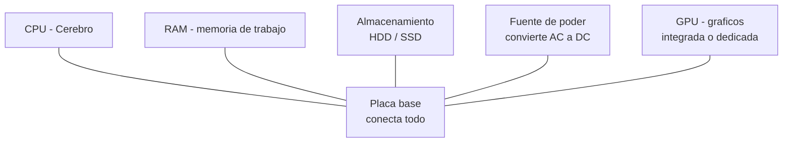

# 0102 · Módulo 2: Hardware

> Curso 01 · Módulo 2 de 6 · Temas: componentes internos, puertos, ensamblaje y hardware móvil

---

## Objetivos de este módulo

- [ ] Identificar los 5 componentes principales de una computadora
- [ ] Explicar la función de cada componente y sus variantes
- [ ] Conocer puertos y conectores comunes
- [ ] Entender el proceso de ensamblaje de una PC
- [ ] Conocer las diferencias del hardware móvil

---

## 1. Los componentes principales

### 1.1 CPU (Unidad Central de Procesamiento)
- Ejecuta instrucciones a través del ciclo *fetch-decode-execute*.
- Marca el rendimiento general: más **núcleos (cores)** y mayor **frecuencia (GHz)** ≈ más velocidad.
- Fabricantes principales: **Intel** (Core i3/i5/i7/i9) y **AMD** (Ryzen 3/5/7/9).
- Se instala sobre el **socket** de la placa; necesita **disipador + pasta térmica** y a veces ventilador/refrigeración líquida.

### 1.2 RAM (Memoria de Acceso Aleatorio)
- Memoria **volátil**: se borra al apagar el equipo.
- Almacena lo que la CPU necesita en este momento; más RAM = más programas fluidos.
- Tipos: **DDR4, DDR5** (sobremesa), **SO-DIMM** (portátiles).
- Buena regla: 8 GB mínimo para ofimática, 16 GB recomendado para soporte técnico/profesional, 32+ GB para virtualización o diseño.

### 1.3 Almacenamiento
| Tipo | Cómo funciona | Ventaja | Desventaja |
|------|---------------|---------|------------|
| **HDD** | Platos magnéticos giratorios | Barato por GB | Lento, frágil, ruidoso |
| **SSD SATA** | Memoria flash | Rápido, silencioso | Más caro que HDD |
| **NVMe (M.2)** | Flash por PCIe | Rapidísimo (10x HDD) | El más caro |

> **Diagnóstico típico**: "mi equipo tarda 5 minutos en arrancar" → suele ser un HDD viejo; migrar a SSD es la mejora de rendimiento más notable de todas.

### 1.4 Placa base (Motherboard)
- El **circuito impreso principal**: conecta CPU, RAM, almacenamiento y periféricos.
- El **chipset** gestiona esos buses de comunicación; el **BIOS/UEFI** es su firmware de arranque.
- Formato común: **ATX** (gabinete grande) y **Mini-ITX** (compacto).

### 1.5 Fuente de Poder (PSU)
- Convierte **AC** (corriente alterna de la pared, 110–240 V) en **DC** (corriente directa, líneas de 12V/5V/3.3V).
- Potencia en **vatios (W)**; una PC gamer requiere 600–850 W, una oficina 300–500 W.
- **Regla de oro**: jamás abras una PSU — los capacitores guardan carga mortal incluso apagados.

### 1.6 GPU (Unidad de Procesamiento Gráfico)
- Integrada en la CPU/placa (oficina) o **dedicada** (Juegos, diseño, IA — NVIDIA/AMD).
- GPU dedicadas tienen su propia VRAM (memoria de video).

---

## 2. Puertos y conectores

| Conector | Uso | Nota |
|----------|-----|------|
| **USB-A** | Ratones, teclados, pendrives | El más común |
| **USB-C** | Universal, carga, video, datos | Reversible, soporta Thunderbolt |
| **HDMI** | Video + audio a pantallas/TV | 4K@60Hz común |
| **DisplayPort** | Video profesional, monitores 144Hz+ | |
| **VGA** | Video antiguo (analógico) | Prácticamente retirado |
| **RJ45** | Cable de red (Ethernet Cat5e/6) | |
| **3.5 mm** | Audífonos/micrófono | |
| **SD/microSD** | Tarjetas de memoria | Cámaras, celulares |

---

## 3. Ensamblaje de una PC (proceso optimizado)

1. **Preparación**: herramientas (destornillador Phillips), pulsera antiestática, superficie limpia.
2. **Instalar la CPU** en el socket (marcas de alineación) + pasta térmica + disipador.
3. **Instalar la RAM** en los slots correctos (canales duales A2/B2).
4. **Instalar el SSD NVMe/M.2** (o cables SATA).
5. **Montar la placa** en el gabinete sobre los separadores (standoffs).
6. **Conectar la PSU**: cables ATX 24 pines, 8 pines CPU, SATA/PCIe según componentes.
7. **Conectar paneles frontales** (power, LEDs, USB frontal).
8. **Verificación visual** antes de encender + **primer POST** (pantalla del BIOS).

> **Tip**: en soporte, el 80% de las fallas de ensamblaje son RAM mal asentada o cables de poder no conectados. Si no enciende: revisa el **LED de la placa** y escucha los **beeps** de diagnóstico.

---

## 4. Hardware móvil (celulares y tablets)

- **Sistemas en chip (SoC)**: CPU + GPU + módem + RAM en un solo chip (Snapdragon, Exynos, Dimensity).
- **Pantallas**: LCD vs **AMOLED/OLED** (negros reales, consume menos).
- **Sensores**: giroscopio, acelerómetro, sensor de luz, huella, cámara.
- **Baterías**: iones de litio; la salud se degrada con cientos de ciclos de carga.
- **Almacenamiento**: eMMC (lento, gama baja) vs **UFS** (rápido, gama moderna).
- Limpieza de hardware: nunca líquidos directamente; usar aire comprimido y paños de microfibra.

---

## Práctica del módulo

1. Con tu PC abierta: `Win + R → msinfo32` (Windows) para ver CPU, RAM y BIOS.
2. Con `dxdiag` identifica tu GPU.
3. En Linux: `lscpu`, `free -h`, `lsblk` para lo mismo.
4. Arma una PC virtual en PCPartPicker verificando compatibilidad.

## Plataformas gratuitas para practicar

- **PCPartPicker** (https://pcpartpicker.com): arma PCs y verifica compatibilidad/precio.
- **Cisco IT Essentials** (NetAcad, https://www.netacad.com): módulo de laboratorio de ensamblaje.
- Busca en la web *"PC building simulator"* para ensamblar virtualmente.

---

## Checklist de dominio — Módulo 2

- [ ] Explico CPU, RAM, almacenamiento (HDD/SSD/NVMe), placa y PSU
- [ ] Identifico los principales puertos a simple vista
- [ ] Describo los pasos seguros de ensamblaje y qué causa que no encienda
- [ ] Justifico cuánta RAM/almacenamiento recomendar según el uso
- [ ] Conozco la diferencia entre SoC móvil y arquitectura de PC
- [ ] Aplico seguridad básica (antiestática, no abrir PSU)