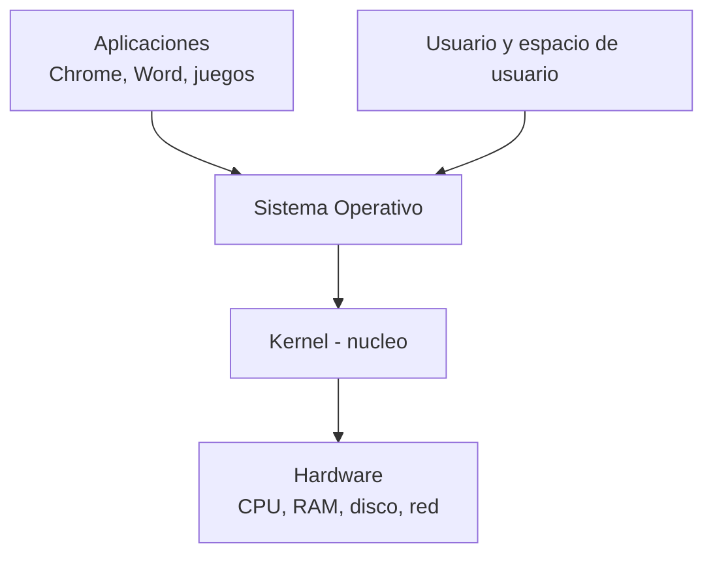
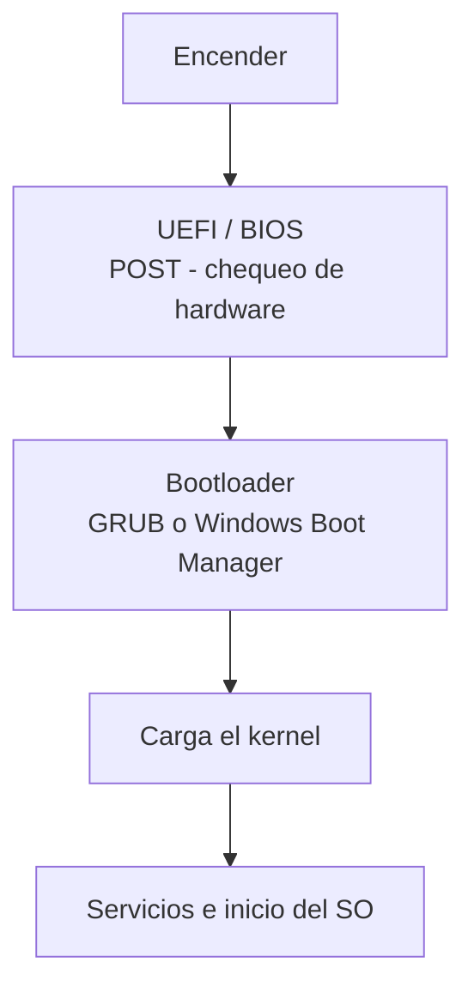

# 0103 · Módulo 3: Sistemas Operativos

> Curso 01 · Módulo 3 de 6 · Temas: qué es un SO, Windows/Linux/macOS, arranque, instalación y línea de comandos

---

## Objetivos de este módulo

- [ ] Explicar qué hace un sistema operativo y sus capas
- [ ] Comparar Windows, Linux y macOS
- [ ] Describir el proceso de arranque paso a paso
- [ ] Instalar un sistema operativo en una máquina virtual sin riesgo
- [ ] Moverme con la línea de comandos básica

---

## 1. ¿Qué es un sistema operativo?

El **sistema operativo (SO)** es el software que gestiona el hardware y permite ejecutar programas.

| Concepto | Función |
|----------|---------|
| **Kernel** | Gestión de CPU, memoria, procesos y dispositivos |
| **Espacio de usuario** | Donde corren las aplicaciones (aisladas del kernel) |
| **Driver** | Traductor entre hardware específico y el SO |
| **Interfaz (GUI/CLI)** | La forma en que el humano usa el SO |

---

## 2. Comparativa de sistemas operativos

| Aspecto | Windows | Linux | macOS |
|---------|---------|-------|-------|
| Uso típico | Oficina, juegos, PC empresarial | Servidores, desarrollo, cloud | Diseño, desarrollo, Apple |
| Kernel | Propietario (NT) | **Linux** (software libre) | Mach/Darwin (Unix) |
| Sistema de archivos | **NTFS** | ext4, XFS, Btrfs | APFS |
| Comandos | PowerShell, CMD | bash, zsh | zsh, bash |
| Costo | Licencia comercial | **Gratis** | Solo en hardware Apple |
| Escritorio | Dominante (70%+) | KDE/GNOME según distro | Dock + Finder |

> **Dato para soporte**: Linux domina el mundo de **servidores** (~96% de los top 1M de sitios web corren servidores Linux) y también **Android** (basado en Linux). Aprender Linux es invertir en tu carrera de soporte TI.

---

## 3. El proceso de arranque (boot)

| Etapa | Función |
|-------|---------|
| **UEFI/BIOS** | Inicializa hardware y busca el disco de arranque |
| **POST** | Comprueba memoria, CPU y dispositivos esenciales (beeps = códigos de error) |
| **Bootloader** | Presenta el menú de SO y carga el kernel |
| **Kernel** | Monta sistemas de archivos e inicia procesos base |
| **Init/systemd** | Arranca el resto de servicios y el escritorio |

**MBR vs GPT**: esquemas de partición de disco; GPT es el moderno (soporta discos >2 TB y copia de seguridad de arranque).

---

## 4. Instalación de un SO (práctica segura con VM)

1. Descarga e instala **VirtualBox** (https://www.virtualbox.org) — gratis.
2. Descarga una ISO de **Linux Ubuntu** (https://ubuntu.com) o de Windows en dispositivos de Microsoft.
3. Crea una máquina virtual: ≥2 GB RAM, ≥25 GB disco virtual.
4. Monta la ISO y arranca la VM → sigue el instalador (idioma, partición, usuario).
5. ¡Experimenta sin miedo! Una VM solo afecta a sí misma.

### Particularidades de instalación reales (útiles en el campo)
- **Arranque desde USB**: entra al menú de arranque (F12/Del/F2 según modelo) y elige el USB.
- **Particionado**: Windows (recovery + EFI + sistema), Linux (/root, /home, swap).
- **Drivers**: Windows suele traerlos; chipsets/GPU se actualizan desde el fabricante.
- **Tiempo típico**: 15–40 min según hardware; la lentitud en este paso casi siempre es disco magnético.

---

## 5. Línea de comandos básica (el superpoder del soporte)

| Comando Windows | Comando Linux | Función |
|-----------------|---------------|---------|
| `dir` | `ls` | Listar archivos |
| `cd carpeta` | `cd carpeta` | Entrar a una carpeta |
| `ipconfig` | `ip a` | Ver la IP |
| `ping 8.8.8.8` | `ping 8.8.8.8` | Probar conectividad |
| `tasklist` | `ps aux` | Ver procesos |
| `shutdown /s` | `sudo shutdown now` | Apagar |
| `mkdir carpeta` | `mkdir carpeta` | Crear carpeta |
| `del archivo` | `rm archivo` | Borrar archivo |

> **Regla de seguridad**: en Linux, `sudo` ejecuta con privilegios de administrador — úsalo solo cuando sea necesario y entiendas qué haces.

---

## Práctica del módulo

1. Instala Ubuntu en una VM de VirtualBox (guía en Azure o Google Cloud "ubuntu virtualbox setup").
2. Averigua la versión de tu SO: `winver` (Windows) / `cat /etc/os-release` (Linux).
3. Practica los comandos de la tabla en tu terminal.
4. Sube el reto **OverTheWire Bandit** (https://overthewire.org) nivel 0–5 para dominar terminal Linux.

## Plataformas gratuitas para practicar

- **VirtualBox** (https://www.virtualbox.org) — máquinas virtuales
- **Linux Journey** (https://linuxjourney.com) — curso interactivo de Linux
- **OverTheWire: Bandit** (https://overthewire.org) — terminal Linux por retos
- **Microsoft Learn** (https://learn.microsoft.com) — rutas oficiales de Windows
- Cisco NetAcad IT Essentials — módulo de so instalación

---

## Checklist de dominio — Módulo 3

- [ ] Explico kernel vs espacio de usuario con lenguaje simple
- [ ] Diferencio NTFS, ext4 y APFS y cuándo importa
- [ ] Narro el arranque completo (UEFI → POST → bootloader → kernel)
- [ ] Instalé un SO en una VM sin afectar mi equipo
- [ ] Me desenvuelvo con los comandos básicos en ambas terminales
- [ ] Ayudo a un usuario con un "arranque lento" o "no arranca"