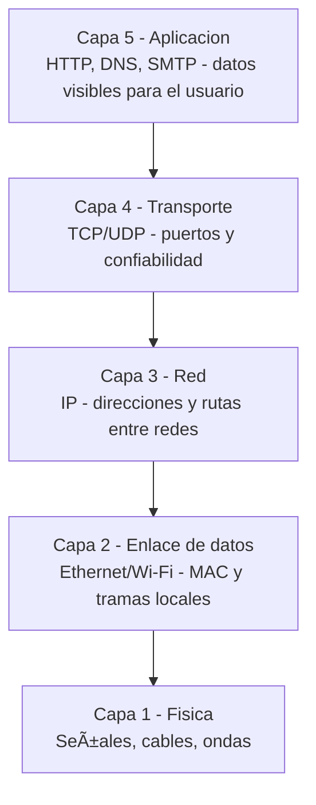
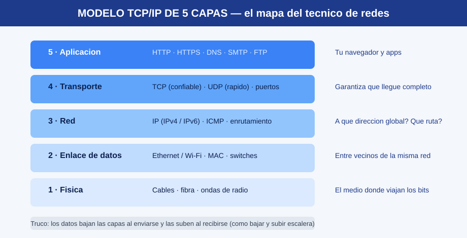

# 0104 · Módulo 4: Redes — Fundamentos

> Curso 01 · Módulo 4 de 6 · Temas: componentes de red, el modelo TCP/IP en 5 capas, IP, DNS, DHCP

---

## Objetivos de este módulo

- [ ] Identificar los componentes de una red (hosts, NIC, router, switch)
- [ ] Explicar el modelo TCP/IP de 5 capas con un ejemplo real
- [ ] Entender qué son IPv4, MAC, DNS y DHCP
- [ ] Ejecutar comandos básicos de diagnóstico de red
- [ ] Diferenciar LAN, WAN y Internet

---

## 1. Componentes básicos de una red

| Componente | Función |
|------------|---------|
| **Host / dispositivo final** | PC, celular, impresora (lo que usa la red) |
| **NIC (tarjeta de red)** | Hardware que conecta el equipo a la red |
| **Switch** | Conecta múltiples dispositivos en la misma red local |
| **Router** | Une redes distintas y da salida a Internet |
| **Cableado / Wi-Fi** | El medio físico |
| **Servidor** | Proporciona servicios (web, correo, archivos) |

```mermaid
flowchart LR
    PC1[PC 1] --> SW[Switch]
    PC2[PC 2] --> SW
    IMP[Impresora] --> SW
    SW --> R[Router]\nSalida a Internet
```

---

## 2. El modelo TCP/IP de 5 capas

Es el mapa mental que usa el soporte profesional (la versión práctica del modelo OSI de 7 capas).





**Ejemplo cotidiano** (envías un mensaje de WhatsApp):

1. **Física**: la señal Wi-Fi del celular hacia el router.
2. **Enlace**: tu Wi-Fi empaqueta la trama con las MAC.
3. **Red**: el IP del mensaje viaja de tu red al servidor de WhatsApp (rutas).
4. **Transporte**: TCP garantiza que llegue completo (números de secuencia).
5. **Aplicación**: WhatsApp (protocolo de mensajería) lo muestra.

---

## 3. Vocabulario imprescindible

### Dirección IP (IPv4)
Identificador de 32 bits escrito en 4 octetos: `192.168.1.50`.
- Define **red** y **host** con la máscara (`/24` = 255.255.255.0).
- Rango privado típico del hogar: **192.168.x.x** — **10.x.x.x** — **172.16–31.x.x** (no salen a Internet).
- **IPv6**: el reemplazo (128 bits, 8 grupos hexadecimales) que resuelve la escasez de IPv4.

### Dirección MAC
Identificador físico único de 48 bits de cada tarjeta de red (los primeros 3 bytes = fabricante).
Ejemplo: `3C:7C:3F:AB:CD:EF`. Funciona **en la red local** (capa 2).

### DNS (Sistema de Nombres de Dominio)
Convierte `www.google.com` → `142.250.190.46` (traducción de nombres a IPs).
Sin DNS, tendríamos que memorizar números.

### DHCP (Asignación dinámica de IP)
El router **entrega** automáticamente IP, máscara, gateway y DNS a cada equipo que se conecta — proceso DORA (Discover → Offer → Request → Acknowledge).

### Gateway (puerta de enlace)
La dirección del router en tu red (normalmente `x.x.x.1`) — la salida hacia otras redes.

---

## 4. LAN vs WAN vs Internet

| Tipo | Alcance | Ejemplo |
|------|---------|---------|
| **LAN** | Red local (un edificio/oficina) | La red de tu casa u oficina |
| **WAN** | Red que une redes locales (ciudad/país/mundo) | La red de sucursales de una empresa |
| **Internet** | La WAN más grande del mundo | Todo interconectado |

---

## 5. Diagnóstico básico (primeros 4 comandos del Técnico)

```powershell
# 1) ¿Tengo IP?
ipconfig /all

# 2) ¿Llego al router?
ping 192.168.1.1

# 3) ¿Llego a Internet?
ping 8.8.8.8

# 4) ¿Se resuelven nombres?
nslookup google.com
```

**Regla de oro**: si el ping al router funciona pero no al 8.8.8.8 → el problema es Internet/proveedor. Si ni el router responde → problema de red local o Wi-Fi.

> **Dato útil**: una IP que empieza con **169.254.x.x** (APIPA) significa que el DHCP no respondió y el equipo se autoconfiguró — casi siempre es cable/red caída.

---

## Práctica del módulo

1. Ejecuta los 4 comandos de diagnóstico en tu PC y anota resultados.
2. Identifica en tu casa: router, switch (si hay), MAC de tu celular (Ajustes → Acerca del teléfono).
3. Cambia el DNS de tu PC a `1.1.1.1` (Cloudflare) o `8.8.8.8` (Google) y compara tiempos de resolución.
4. Observa con `netstat` (`netstat -n`) las conexiones activas de tu equipo.

## Plataformas gratuitas para practicar

- **Cisco Networking Academy** (https://www.netacad.com): *Networking Basics* — el curso gratuito que sigue este temario + **Packet Tracer** para armar redes visualmente.
- **subnettingpractice.com**: entrena subredes.
- **Wireshark** (https://www.wireshark.org): captura tu propio tráfico y mira las 5 capas "en vivo".

---

## Checklist de dominio — Módulo 4

- [ ] Explico IP vs MAC con un ejemplo (casa vs nombre de la persona)
- [ ] Describo el viaje de un dato por las 5 capas
- [ ] Conozco LAN/WAN/Internet y qué es el gateway
- [ ] Diagnostico conectividad con ipconfig/ping/nslookup
- [ ] Identifico una IP APIPA y qué significa
- [ ] He usado Packet Tracer o Wireshark al menos una vez

