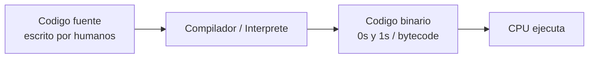

# 0105 · Módulo 5: Software

> Curso 01 · Módulo 5 de 6 · Temas: binario, lenguajes de programación, compiladores, aplicaciones y licencias

---

## Objetivos de este módulo

- [ ] Explicar cómo el software se convierte en instrucciones para la CPU
- [ ] Conocer la diferencia entre código fuente, compilador e intérprete
- [ ] Identificar tipos de aplicaciones y de licencias
- [ ] Entender por qué solo deben instalarse programas de fuentes oficiales

---

## 1. Del texto al binario

El software es **instrucciones** que el hardware puede ejecutar. La progresión es:

| Concepto | Definición | Ejemplo |
|----------|------------|---------|
| **Código máquina** | Instrucciones binarias directas para el CPU | `1010 0011` |
| **Ensamblador** | Muy cercano al hardware, difícil de leer | `MOV AX, 1` |
| **Lenguaje de alto nivel** | Cercano al humano y portable | Python, Java, C#, JS |
| **Compilador** | Traduce TODO el código a binario antes de ejecutar (rápido en ejecución) | C, C++, Go |
| **Intérprete** | Ejecuta línea por línea (flexible, más lento) | Python, JavaScript, Bash |

---

## 2. Aplicaciones y su ciclo de vida

### Tipos de software
| Tipo | Función |
|------|---------|
| **Sistemas operativos** | Gestionan el hardware (Windows, Linux, macOS) |
| **Aplicaciones de escritorio** | Programas del usuario final (Word, Chrome) |
| **Aplicaciones web** | Se ejecutan en el navegador (Gmail, Office 365, bancos) |
| **Aplicaciones móviles** | iOS (App Store) / Android (Play Store) |
| **Utilidades del sistema** | Antivirus, compresores, herramientas de diagnóstico |

> **Formato de instalación**: en Windows `.exe` / `.msi`; en Linux paquetes `.deb`/`.rpm` o repositorios; en macOS `.dmg`/`.pkg`.

---

## 3. Licencias de software (importante para asesorar clientes)

| Tipo | Uso | Ejemplos |
|------|-----|----------|
| **Código abierto (Open Source)** | Gratis, código visible, se puede modificar | Linux, Firefox, VLC |
| **Freeware** | Gratis pero código cerrado | Discord, algunos antivirus |
| **Comercial / Propietario** | De pago, con licencia | Windows (a veces), Adobe, Office |
| **Shareware** | Prueba gratis con límites | Demos de programas |

**Riesgo de piratería** (importante en soporte): los "cracks/activadores" son **la vía nº1 de malware real**. Siempre recomienda software oficial y gratuito equivalente (LibreOffice, GIMP, VLC, 7-Zip).

---

## 4. Buena práctica: gestión de software en el equipo del cliente

1. **Inventario**: revisar programas instalados (`appwiz.cpl`; en Linux `apt list --installed`).
2. **Actualizar todo**: Windows Update, `winget upgrade --all`, `apt update && apt upgrade`.
3. **Desinstalar lo que no se usa** (mejora seguridad y velocidad).
4. **Instalar desde fuentes oficiales** siempre (web oficial, tienda del OS, repositorios).
5. **Verificar requisitos** (RAM/disco/arquitectura 32 vs 64 bits) antes de instalar.

---

## Práctica del módulo

1. Escribe tu primer programa "Hola mundo" en Python: `print("Hola mundo")` (instala Python de https://python.org).
2. En PowerShell crea un script que liste los programas instalados: `Get-ItemProperty HKLM:\Software\Microsoft\Windows\CurrentVersion\Uninstall\* | Where-Object DisplayName`.
3. Instala un programa gratuito desde su fuente oficial (VLC, 7-Zip) y otro desde la Microsoft Store. Compara el flujo.
4. Experimenta en https://github.com/skills con un repositorio de práctica.

## Plataformas gratuitas para practicar

- **GitHub Skills** (https://github.com/skills): ejercicios guiados de Git/software colaborativo
- **freeCodeCamp** (https://www.freecodecamp.org): primer lenguaje de programación gratis
- **Microsoft Learn** (https://learn.microsoft.com): rutas de Windows para TI
- NetAcad IT Essentials: módulo de gestión de software

---

## Checklist de dominio — Módulo 5

- [ ] Explico la ruta código fuente → binario → CPU
- [ ] Diferencio compilador e intérprete con ejemplos
- [ ] Recomiendo software gratuito oficial ante cada necesidad común
- [ ] Sé explicar por qué los "cracks" son un riesgo de seguridad
- [ ] Actualizo y desinstalo software de forma segura en Windows y Linux
- [ ] He escrito y ejecutado un programa básico