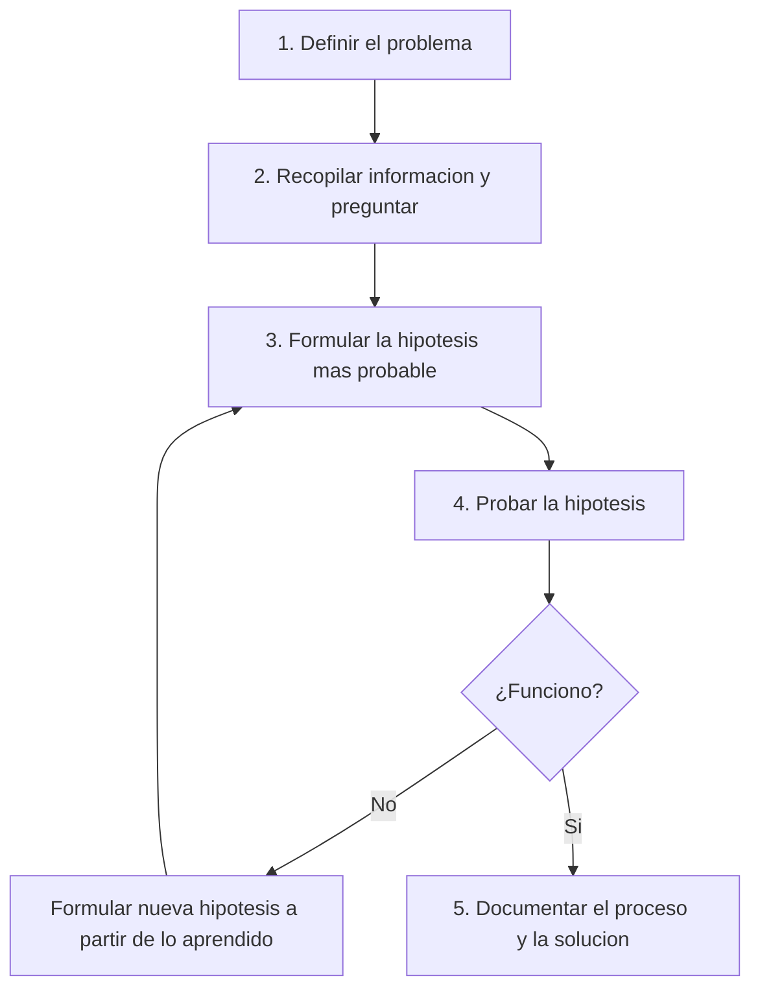

# 0106 · Módulo 6: Resolución de Problemas y Servicio al Cliente

> Curso 01 · Módulo 6 de 6 · Temas: metodología de diagnóstico, comunicación, tickets y SLA

---

## Objetivos de este módulo

- [ ] Dominar la metodología de resolución de problemas en 7 pasos
- [ ] Comunicarme empáticamente con usuarios técnicos y no técnicos
- [ ] Gestionar tickets con prioridades y SLA
- [ ] Documentar soluciones correctamente

---

## 1. La metodología (7 pasos del técnico profesional)

| Paso | Acción concreta |
|------|-----------------|
| **1. Definir** | "¿Qué pasa, cuándo empezó, qué se esperaba?" — pregunta antes de tocar |
| **2. Recopilar** | Capturas, errores exactos, reproducir el problema |
| **3. Hipótesis** | Elige la causa más probable (frecuencia estadística, no adivinanzas) |
| **4. Probar** | Cambia **una variable a la vez**; el resto igual |
| **5. Documentar** | Lo que funcionó → base de conocimiento para la próxima vez |

> **El error nº1 del novato**: aplicar soluciones al azar. Cambiar múltiples cosas a la vez te deja sin saber qué resolvió el problema.

### Ejemplo guiado (problema real)
*"Mi impresora no imprime."*
1. ¿Un equipo o todos? ¿Falla la cola? ¿Aparece error?
2. Revisar cola de impresión, cables, estado en línea.
3. Hipótesis más probable: driver desactualizado o cola atascada.
4. Probar limpia cola → aún no; reinstalar driver → ¡imprime!
5. Documentar en la base de conocimiento.

---

## 2. Servicio al cliente: la otra mitad del trabajo

| Regla | Cómo se hace |
|-------|--------------|
| **Empatía** | "Entiendo lo frustrante que es"— el problema del usuario es real para él |
| **Lenguaje adecuado** | Sin jerga técnica con personas no técnicas ("la memoria RAM" → "la memoria; como el escritorio de trabajo del PC") |
| **Escucha activa** | Repetir el problema con tus palabras ("Entonces, cada vez que abres Excel la PC se reinicia, ¿correcto?") |
| **Tono profesional** | Nunca culpar al usuario ("eso es fácil" jamás) |
| **Confianza sin inventar** | Si no sabes: "Voy a investigar y te confirmo en X tiempo" — y cumple |

**Escalación**: cuando el problema excede tu nivel, escala al Nivel 2/3 **con contexto completo** (qué se hizo, qué se probó, resultados) — el técnico siguiente te lo agradecerá y el cliente no repite la historia.

---

## 3. Gestión de tickets

### Partes de un ticket correcto
| Campo | Contenido |
|-------|-----------|
| **Resumen** | Título claro y accionable (no "problema con PC", sino "correo no envía en Outlook") |
| **Prioridad** | P1 crítica (equipo/negocio parado) → P4 menor |
| **Categoría** | Hardware, software, red, seguridad, consulta |
| **Descripción** | Síntoma, cuándo, qué se intentó, impacto |
| **Pasos realizados** | Bitácora cronológica de la investigación |
| **Solución y cierre** | Qué se hizo y confirmación con el usuario |

### SLA (Service Level Agreement)
Compromisos de tiempo: **respuesta** y **resolución**.
- Ejemplo: P1 → respuesta en 1 h · resolución en 4 h; P2 → 4 h/8 h; P3 → 8 h/24 h; P4 → según disponibilidad.
- La priorización evita que una impresora de la sala de juntas bloquee a la sala de servidores.

---

## 4. Documentación (lo que separa al bueno del excelente)

- Registra **qué pasó, por qué ocurrió, cómo se resolvió**.
- Escribe la solución como **pasos reproducibles** para el siguiente técnico (o para el mismo usuario en el futuro): eso es una **base de conocimiento**.
- Incluye comandos, capturas y tiempos — ahorra horas a todo el equipo.

> En este mismo repositorio tienes un ejemplo real de esto (proyecto Soluciona): un runbook documentado de un incidente real de malware.

---

## Práctica del módulo

1. Redacta 3 tickets de ejemplo (P1 red caída en oficina, P2 correo no envía, P3 impresora atascada) con todos los campos.
2. Juega a "soporte": pide a alguien que describa un problema de su PC y aplícale los 7 pasos.
3. Escribe un mini-runbook de 5 pasos de una solución que hayas aplicado.

## Plataformas gratuitas para practicar

- **Google Support Technician scenarios** (busca en la web *"Google IT support practice scenarios customer service"*).
- Practica role-play con **ChatGPT/agentes de IA** simulando usuarios frustrados (yo puedo ayudarte a simular un usuario aquí mismo).
- Cisco NetAcad *IT Essentials*: escenarios finales de troubleshooting.

---

## Checklist de dominio — Módulo 6

- [ ] Aplico los 7 pasos sin saltarme el orden
- [ ] Cambio una variable a la vez al diagnosticar
- [ ] Explico un problema técnico sin jerga a un usuario
- [ ] Redacto un ticket completo con prioridad y SLA
- [ ] Escalo con el contexto completo
- [ ] Documenté un caso como base de conocimiento

---

## Fin del Curso 01 — Siguiente paso

Completa el examen del curso en Coursera (si te es posible) o valida tu aprendizaje con los checklists. Luego continúa con **Curso 02 · Redes de Computadoras** → (próximamente en esta guía).