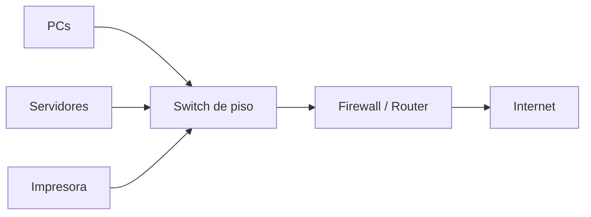

# 0201 · Módulo 1: Introducción a las Redes

> Curso 02 · Módulo 1 de 6 · Temas: qué es una red, dispositivos, cables, datacenters

---

## Objetivos de este módulo

- [ ] Explicar qué es una red y por qué existen
- [ ] Conocer los dispositivos de red (switch, router, servidor)
- [ ] Diferenciar cables de cobre, fibra óptica y conexiones inalámbricas
- [ ] Entender qué es un datacenter y la nube
- [ ] Dibujar una red pequeña completa

---

## 1. ¿Qué es una red?

Una **red** es un grupo de computadoras y dispositivos conectados para **compartir información y recursos**. Sin redes no habría correo, web, bancos en línea ni nube.

**Beneficios**: compartir impresoras/archivos, comunicación, acceso a Internet, trabajo colaborativo.

---

## 2. Dispositivos de red (el vocabulario base)

| Dispositivo | Capa aproximada | Función |
|-------------|-----------------|---------|
| **NIC (tarjeta de red)** | 2 | Hardware que conecta el equipo |
| **Hub** | 1 | Repite señales a todos (obsoleto, inseguro) |
| **Switch** | 2 | Envía tramas a quien corresponde usando MAC |
| **Router** | 3 | Une redes distintas; decide rutas (IP) |
| **Servidor** | — | Proporciona servicios (web, correo, archivos, DNS) |
| **Firewall** | 3-4 | Filtra tráfico por reglas de seguridad |

---

## 3. Medios de transmisión

### 3.1 Cobre (Par trenzado)
- **CAT5e / CAT6 / CAT6a**: categorías de cable Ethernet (CAT6 soporta 10 Gbps a 55 m).
- Conector **RJ45** (8 pines).
- **Puertos**: 100 Mbps (Fast Ethernet), 1000 Mbps (Gigabit), 10 Gbps (10G).
- Ventaja: barato y fácil de instalar. Límite: ~100 m antes de perder señal.

### 3.2 Fibra óptica
- Transmisión por **pulsos de luz** (no electricidad): inmune a interferencias, distancias kilométricas, velocidades de 40–100 Gbps+.
- **Monomodo** (una sola luz, largas distancias) vs **multimodo** (varias luces, distancias cortas, datacenters).
- Conectores: **SC**, **LC**, **ST**.

### 3.3 Inalámbrico
| Tecnología | Uso |
|------------|-----|
| **Wi-Fi (802.11)** | LAN inalámbrica (a/b/g/n/ac/**ax/Wi-Fi 6**) |
| **Bluetooth** | Periféricos a corta distancia |
| **Celular (3G/4G/5G)** | Redes de operadores |
| **Satelital / LTE** | Zonas remotas |

**Seguridad inalámbrica**: usa siempre **WPA2/WPA3** con contraseña larga; jamás WEP (crackeable en minutos).

---

## 4. Datacenters y la Nube

- **Datacenter**: edificio lleno de servidores con redundancia total (energía, red, refrigeración, seguridad física).
- **Nube (cloud)**: servicios ofrecidos a través de Internet usando infraestructura de datacenters ajenos (AWS, Azure, Google Cloud).
- Modelos: **IaaS** (servidores virtuales), **PaaS** (plataforma gestionada), **SaaS** (aplicación terminada: Gmail).

> **Analogía útil**: la nube es literalmente el datacenter de otra empresa, que tú alquilas por Internet.

---

## Práctica del módulo

1. Identifica en tu casa: router (IP 192.168.x.1), switch (si existe), cable CAT usado.
2. En Windows: `ipconfig /all` y anota la MAC, IP y gateway. En Linux: `ip a`.
3. Con **Packet Tracer** arma: 2 PCs + switch + router, cablea con el tipo correcto (verde = cobre) y tráfica paquetes en Modo Simulación.

## Plataformas gratuitas para practicar

- **Cisco Packet Tracer** — simulador oficial (gratis con cuenta NetAcad)
- **Cisco Networking Academy — Networking Basics** (https://www.netacad.com)
- **Wireshark** (https://www.wireshark.org) — captura paquetes de tu propia red

---

## Checklist de dominio — Módulo 1

- [ ] Explico para qué sirve cada dispositivo de red
- [ ] Recomiendo el cable correcto según distancia y velocidad
- [ ] Diferencio cobre, fibra y WiFi con sus usos
- [ ] Reconozco WPA2/WPA3 y los peligros del WEP
- [ ] Explico qué es un datacenter y qué es la nube
- [ ] Armo una LAN pequeña en Packet Tracer