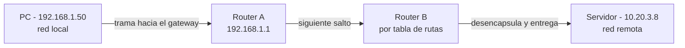

# 0202 · Módulo 2: Capa de Red — IP y Subredes

> Curso 02 · Módulo 2 de 6 · Temas: IPv4, IPv6, máscaras, CIDR, subredes y enrutamiento

---

## Objetivos de este módulo

- [ ] Leer y explicar una dirección IPv4 y su máscara
- [ ] Calcular subredes y hosts por subred
- [ ] Entender CIDR y el direccionamiento sin clases
- [ ] Explicar cómo funciona el enrutamiento entre redes
- [ ] Conocer el formato básico de IPv6

---

## 1. La dirección IP (IPv4)

32 bits agrupados en 4 octetos: `192.168.1.50` = `11000000.10101000.00000001.00110010`

Dos partes: **red** (quién eres de dónde) + **host** (cuál eres). La **máscara de subred** delimita dónde termina cada parte.

| Máscara | CIDR | Hosts útiles |
|---------|------|--------------|
| 255.255.255.0 | /24 | 254 |
| 255.255.255.128 | /25 | 126 |
| 255.255.255.192 | /26 | 62 |
| 255.255.0.0 | /16 | 65 534 |
| 255.0.0.0 | /8 | 16 777 214 |

**Fórmula de hosts**: `2^(32 - CIDR) - 2` (restamos red y broadcast). Ej: /24 → 2^8 - 2 = 254.

**Reglas importantes**:
- La primera IP de cada subred = **dirección de red** (no usable).
- La última IP = **broadcast** (envíos a todos, no usable).
- Rango privado (nunca sale a Internet): **10.x.x.x**, **172.16–31.x.x**, **192.168.x.x**.
- **127.0.0.1** = loopback ("yo mismo"); el alias `localhost`.

---

## 2. Subnetting en la práctica

¿Por qué subdividir? Para **separar redes** (seguridad, tráfico, organización) sin desperdiciar IPs.

**Ejemplo guiado**: la red 192.168.1.0/24 la necesitas en 4 subredes.
1. 4 subredes → necesitas 2 bits (`2^2 = 4`) → máscara /26 (255.255.255.192).
2. Cada subred tiene `2^6 - 2 = 62` hosts.
3. Tabla de resultados:

| Subred | Rango | Broadcast |
|--------|-------|-----------|
| 192.168.1.0/26 | .1 – .62 | .63 |
| 192.168.1.64/26 | .65 – .126 | .127 |
| 192.168.1.128/26 | .129 – .190 | .191 |
| 192.168.1.192/26 | .193 – .254 | .255 |

> **Truco mental**: la "magia" de la subred = la cantidad de la máscara no estándar (192 → paso de 64 IPs).

---

## 3. Enrutamiento (cómo viajan los datos entre redes)

| Concepto | Definición |
|----------|------------|
| **Ruta (route)** | "Para llegar a la red X, envía al host Y" |
| **Tabla de rutas** | El mapa del router (destino → siguiente salto) |
| **Gateway** | El router de salida de tu subred |
| **Ruta estática** | Configurada a mano |
| **Ruta dinámica** | Protocolos (OSPF, BGP, RIP) que aprenden automáticamente |
| **Interconexión (interfaces)** | Cada red conectada al router tiene su propia IP en ese segmento |

**Cómo decide un router**: para cada paquete busca en su tabla la ruta de **mayor coincidencia** (la más específica) hacia el destino.

---

## 4. IPv6 (el futuro ya presente)

- **128 bits**, 8 grupos hexadecimales: `2606:4700:4700::1111`
- No hay escasez: miles de millones de direcciones por persona.
- **Notación `::`** comprime grupos de ceros (solo una vez).
- Los equipos actuales usan IPv4 + IPv6 a la vez (**doble pila**).
- `ping ::1` = loopback IPv6. `nslookup`/`dig` muestran registros AAAA.

---

## Práctica del módulo (clave: hacer muchas subredes a mano)

1. Calcula: ¿cuántas subredes de /28 salen de una /24? (16) ¿Cuántos hosts por subred? (14)
2. Dada 172.16.0.0/16, divide en 8 subredes: escribe los 8 rangos. Usa subnettingpractice.com para verificar.
3. En Packet Tracer: conecta 3 redes con 2 routers, configura IPs estáticas y verifica con `ping` PC→servidor remoto.

## Plataformas gratuitas para practicar

- **subnettingpractice.com** — entrenador infinito de máscaras/subredes
- **Packet Tracer** (NetAcad) — laboratorios de enrutamiento entre routers
- **Quizlet** en la web: busca *"IPv4 subnetting practice questions"*
- Curso gratuito *"CCNA: Introduction to Networks"* en NetAcad (nivel avanzado, opcional)

---

## Checklist de dominio — Módulo 2

- [ ] Explico qué parte de la IP corresponde a red y cuál a host
- [ ] Calculo a mano hosts por subred (2^n - 2)
- [ ] Subdivido una red /24 en 2, 4, 8 o 16 subredes correctamente
- [ ] Identifico dirección de red y broadcast de cualquier rango
- [ ] Pillé la idea de ruta/tabla/gateway y siguiente salto
- [ ] Reconozco una dirección IPv6 y su loopback ::1