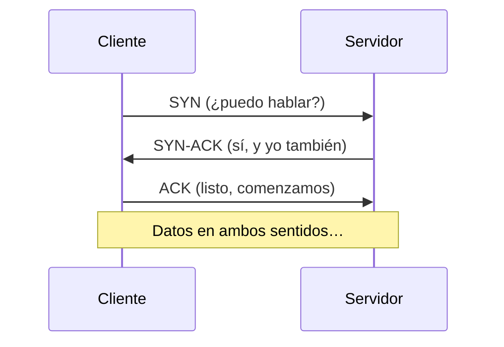
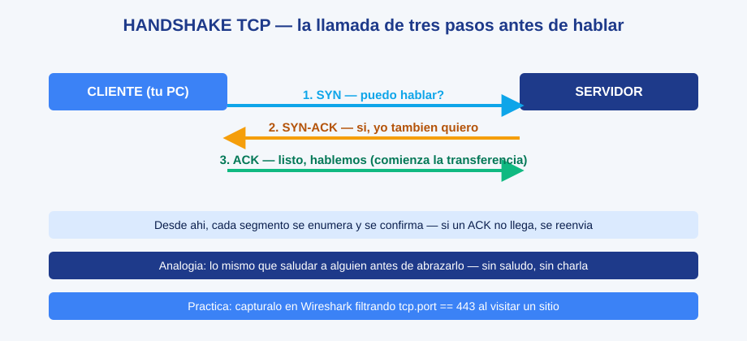

# 0203 · Módulo 3: Capas de Transporte y Aplicación

> Curso 02 · Módulo 3 de 6 · Temas: TCP, UDP, puertos, sockets, firewalls y protocolos de aplicación

---

## Objetivos de este módulo

- [ ] Explicar TCP vs UDP con ejemplos del mundo real
- [ ] Comprender el Three-Way Handshake
- [ ] Conocer los puertos más importantes de memoria
- [ ] Entender qué es un socket y cómo funciona un firewall

---

## 1. TCP — Transmisión confiable

**TCP (Transmission Control Protocol)** garantiza que los datos lleguen completos, en orden y sin duplicados.

| Mecanismo | Función |
|-----------|---------|
| **Números de secuencia** | Ordena los datos al llegar |
| **Acuses (ACK)** | El receptor confirma cada segmento |
| **Reenvío** | Si no llega el ACK a tiempo, se reenvía |
| **Control de flujo** | El receptor indica cuántos datos aceptar |

### Three-Way Handshake (la llamada de la red)

**Puerto de origen**: aleatorio (ej. 52413). **Puerto de destino**: el servicio (ej. 443 para HTTPS).

---

## 2. UDP — Rápido y sin garantías

**UDP (User Datagram Protocol)** no establece conexión ni confirma nada: mándalo y ya.

| Aplicación | Protocolo | ¿Por qué? |
|------------|-----------|-----------|
| Video en vivo / llamadas | UDP | Un paquete perdido no justifica esperar; fluidez > perfección |
| Juegos en línea | UDP | Baja latencia crítica |
| DNS | UDP (puerto 53) | Consulta simple, rápida |
| DHCP | UDP | Descubrimiento sin conexión previa |
| Transferencia de archivos | TCP | Cero errores permitidos |
| Web / correo / bases de datos | TCP | Confiabilidad obligatoria |

**Comparación final**: TCP = carta certificada; UDP = mensaje de voz gritado.

---

## 3. Puertos (las puertas de la red)

| Puerto | Servicio |
|--------|----------|
| 20/21 | FTP |
| 22 | SSH (acceso remoto seguro) |
| 23 | Telnet (antiguo, inseguro) |
| 25 | SMTP (envío de correo) |
| 53 | DNS |
| 80 | HTTP |
| 110/143 | POP3 / IMAP (entrega de correo) |
| 443 | HTTPS (web segura) |
| 3389 | RDP (escritorio remoto Windows) |

> **Soporte diario**: si un sitio no carga pero el ping funciona, revisa con `netstat -ano` / `Test-NetConnection` si el puerto 443 responde.

---

## 4. Sockets y Firewalls

**Socket** = IP + puerto → identifica una conversación concreta (`192.168.1.50:52413 → 142.250.190.46:443`).

**Firewall**: filtra tráfico con reglas de los dos sentidos.
- **Denegar por defecto** (whitelist): solo lo permitido pasa — el estándar seguro.
- Reglas por IP, puerto, dirección y estado (conexiones establecidas→devolver respuestas).

---

## 5. Capa de aplicación: los protocolos que usamos

| Protocolo | Función | Puerto |
|-----------|---------|--------|
| **HTTP/HTTPS** | Navegación web (HTTPS = cifrado TLS) | 80/443 |
| **FTP/SFTP** | Transferencia de archivos (SFTP = seguro) | 21/22 |
| **SMTP** | Envío de correo | 25 |
| **POP3 / IMAP** | Recibir correo (IMAP sincroniza en servidor) | 110/143 |
| **DNS** | Traducción nombre → IP | 53 |

**Verificación manual** (sin navegador): `curl https://web.capture` o `Test-NetConnection sitio -Port 443`.

---

## Práctica del módulo

1. `netstat -ano | findstr :443` (Windows) / `ss -tn` (Linux): observa conexiones TCP activas.
2. `Test-NetConnection google.com -Port 443` (PowerShell): prueba puertos específicos.
3. Wireshark: filtro `tcp.port == 443` y observa el handshake SYN/SYN-ACK/ACK en una visita web.
4. Inicia un juego o llamada de video y compara qué puertos UDP usa (`netstat -an | findstr /i udp`).

## Plataformas gratuitas para practicar

- **Wireshark** (https://www.wireshark.org) — capturar handshakes "de verdad"
- **TryHackMe — Intro to LAN / Port Scanning rooms** (https://tryhackme.com)
- NetAcad *Networking Basics*: módulos de capa de transporte

---

## Checklist de dominio — Módulo 3

- [ ] Explico TCP y UDP con ejemplos de servicios reales
- [ ] Narro el three-way handshake paso a paso
- [ ] Conozco los puertos 22, 25, 53, 80, 443, 3389 sin mirar apuntes
- [ ] Explico qué es un socket (IP + puerto)
- [ ] Configuro una regla mental de firewall "denegar por defecto"
- [ ] Verifico un puerto abierto/cerrado con comandos

