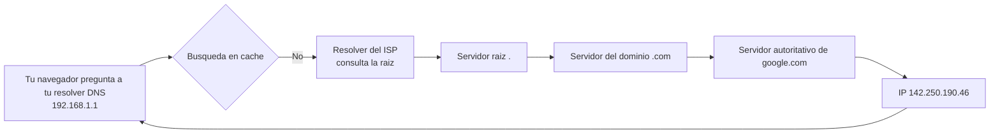
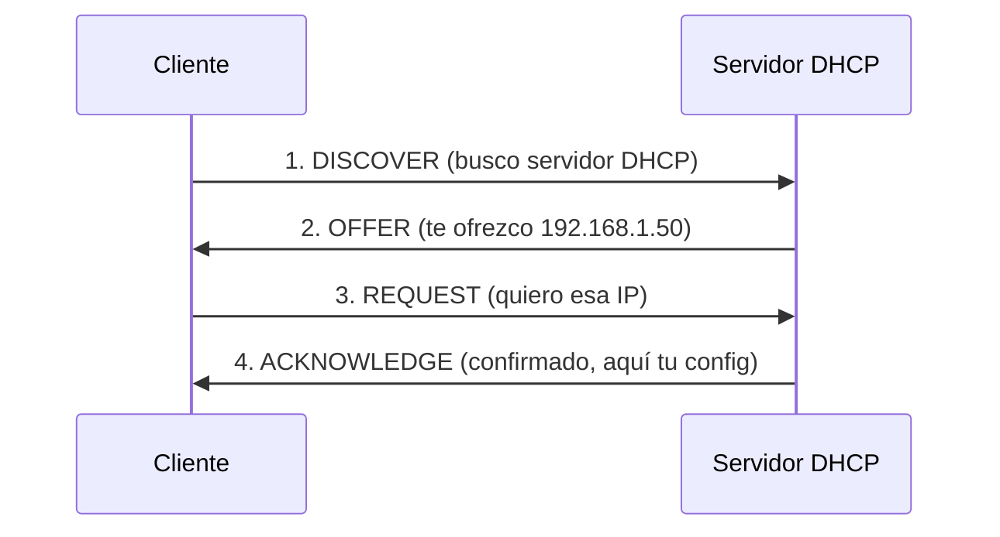
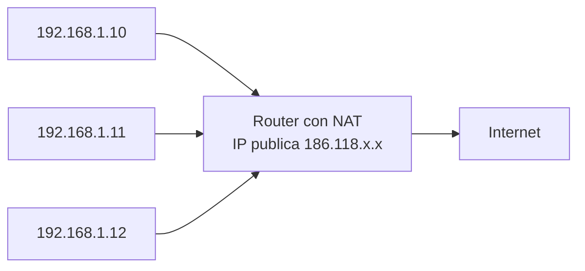

# 0204 · Módulo 4: Servicios de Red — DNS, DHCP, NAT, VPN

> Curso 02 · Módulo 4 de 6 · Temas: los servicios que mantienen viva a Internet

---

## Objetivos de este módulo

- [ ] Explicar DNS en profundidad: registros, zonas y resolución
- [ ] Dominar el proceso DHCP (DORA) y sus opciones
- [ ] Entender NAT y por qué convierte IPs privadas en públicas
- [ ] Explicar VPN y proxy y cuándo usar cada uno

---

## 1. DNS en profundidad

El DNS es el **directorio telefónico** de Internet: traduce nombres → IPs.



### Registros DNS (los más usados)
| Registro | Para qué | Ejemplo |
|----------|----------|---------|
| **A** | IPv4 de un host | www → 142.250.190.46 |
| **AAAA** | IPv6 de un host | www → 2606:..:.. |
| **MX** | Servidores de correo | @ → mail.empresa.com |
| **CNAME** | Alias de otro host | ftp → www |
| **TXT** | Texto (verificaciones SPF/DKIM) | "v=spf1 ..." |

### Zonas y niveles
- **Zona de búsqueda directa**: nombre → IP.
- **Zona de búsqueda inversa (PTR)**: IP → nombre.
- **TTL (Time To Live)**: segundos que otros servidores conservan la respuesta en caché.

### Comandos de diagnóstico
```powershell
nslookup google.com          # consulta rápida
nslookup -type=MX gmail.com  # registros MX
dig google.com +trace        # (Linux) recorrido completo
ipconfig /flushdns           # limpiar caché local
```

> **Caso de soporte real**: "la web no abre pero el celular sí" → prueba `ipconfig /flushdns` y cambia el DNS a 1.1.1.1 o 8.8.8.8.

---

## 2. DHCP en profundidad

Entrega automática de configuración de red (IP, máscara, gateway, DNS, duración de arrendamiento).

### Proceso DORA


**Datos importantes**:
- **Arrendamiento (lease)**: la IP se presta por horas/días; al vencer se renueva.
- **Reserva**: una IP fija para un equipo especial (impresora, servidor) por MAC.
- **Servidor DHCP** típico: el router del hogar/empresa (u otro servidor en infraestructuras grandes).
- Sin DHCP: mil errores de IP manuales (`169.254.x.x` = APIPA = DHCP falló).

---

## 3. NAT — el traductor de Internet

**NAT (Network Address Translation)**: permite que cientos de dispositivos con IPs privadas compartan **una única IP pública**.



**PAT (Port Address Translation)**: el router usa puertos para identificar quién pidió qué (ej. 192.168.1.10:51234). Sin NAT, habríamos agotado IPv4 hace décadas.

> **Para soporte**: cuando un servidor interno debe ser accesible desde Internet (ej. cámara IP), configuras **redirección de puertos (port forwarding)** en el router: puerto público → IP interna. OJO: cada puerto público apunta a un solo dispositivo.

---

## 4. VPN y Proxy

| Herramienta | Qué hace | Cuándo usarla |
|-------------|----------|---------------|
| **VPN** | Crea un **túnel cifrado** entre tu equipo y la red remota; tu equipo parece estar allá | Trabajo remoto en la red corporativa; seguridad en Wi-Fi público |
| **Proxy** | Intermediario que pide páginas por ti (puede ocultar identidad, filtrar contenido, cachear) | Filtrado corporativo de contenidos, control parental |

**Tipos de VPN**: sitio a sitio (oficinas conectadas) y acceso remoto (usuario desde casa). Protocolos: OpenVPN, WireGuard, IPsec.

> **Regla**: VPN ≠ "hacerse invisible a la ley"; es autenticación + cifrado. Usa las oficiales de tu empresa, no "VPNs gratis" que venden datos.

---

## Práctica del módulo

1. `ipconfig /displaydns | more` para ver tu caché DNS; `ipconfig /flushdns` y vuelve a cargar un sitio.
2. Configura una **reserva DHCP** en tu router (busca "DHCP reservation" en su panel).
3. En Packet Tracer: arma un servidor DNS+DCHP+web para una red y configura PCs en DHCP automático.
4. Investiga el IP público de tu casa (busca en la web "what is my IP") y compáralo con tu IP local — así ves el NAT en acción.

## Plataformas gratuitas para practicar

- **Packet Tracer** (NetAcad): laboratorios DNS/DHCP/NAT guiados
- **TryHackMe — DNS in detail room** (https://tryhackme.com)
- **Wireshark**: filtra `dns` y `dhcp` y observa las consultas reales

---

## Checklist de dominio — Módulo 4

- [ ] Explico la ruta de una consulta DNS (caché → raíz → TLD → autoritativo)
- [ ] Conozco A, AAAA, MX, CNAME, TXT y para qué sirven
- [ ] Narro DORA y explico qué pasa si el DHCP falla (APIPA)
- [ ] Explico NAT/PAT con un ejemplo de mi propia casa
- [ ] Configuré una redirección de puertos (al menos entendí el concepto)
- [ ] Diferencio VPN de proxy y elijo cuál usar