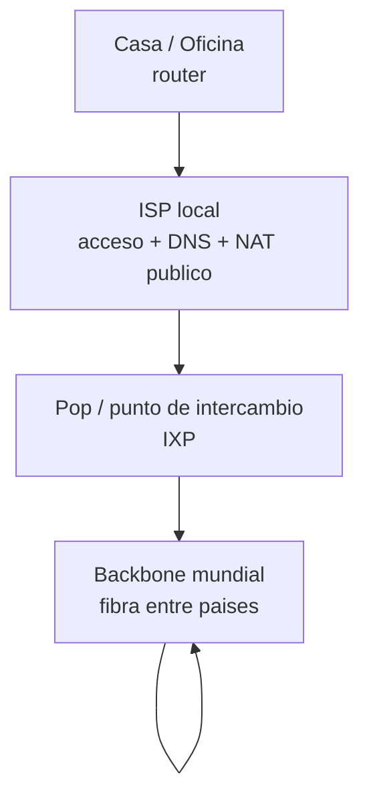
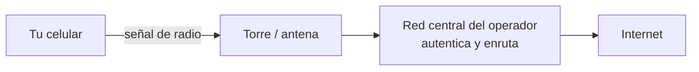

# 0205 · Módulo 5: Conectándose a Internet

> Curso 02 · Módulo 5 de 6 · Temas: ISP, tecnologías WAN, fibra, banda ancha y redes móviles

---

## Objetivos de este módulo

- [ ] Explicar qué es un ISP y las tecnologías de acceso a Internet
- [ ] Diferenciar DSL, cable, fibra, LTE/5G y satelital
- [ ] Entender cómo funcionan las redes celulares
- [ ] Conocer las tecnologías Wi-Fi (802.11) y sus bandas

---

## 1. ISP — tu puerta a Internet

El **ISP (Proveedor de Servicios de Internet)** vende el acceso: conexión, IP pública y enrutamiento.

**Estructura de Internet** (no es "una nube"):

| Concepto | Qué es |
|----------|--------|
| **WAN** | Red amplia que conecta ciudades/paises |
| **IXP (punto de intercambio)** | Lugar donde los ISP intercambian tráfico |
| **Latencia** | Tiempo de ida y vuelta de un paquete (ms); clave para juegos/videollamadas |
| **Ancho de banda** | Cantidad máxima de datos por segundo (Mbps) |

> **Diagnóstico típico**: "Internet lenta" → 1º medir latencia (`ping 8.8.8.8` constante), 2º medir velocidad (speedtest web), 3º probar otro dispositivo — así ubicas si es tu red, tu equipo o el ISP.

---

## 2. Tecnologías de acceso (cómo llega Internet a tu puerta)

| Tecnología | Medio | Velocidad típica | Notas |
|------------|-------|------------------|-------|
| **DSL** | Línea telefónica de cobre | 1–100 Mbps | Depende de la distancia a la central |
| **Cable (HFC)** | Cable coaxial de TV | 25–1000 Mbps | Compartido por el vecindario (se congestiona) |
| **Fibra óptica (FTTH)** | Fibra hasta el hogar | 100–1000+ Mbps | Simétrica, estable, la mejor |
| **LTE/5G** | Señal celular | 20–1000 Mbps | Móvil y hogares rurales |
| **Satelital** | Antena → satélite | 20–300 Mbps | Alta latencia (500+ ms), zonas remotas |

> **¿Por qué "el cable es lento a las 7 pm"?** El cable coaxial es compartido: muchos usuarios → cuello de botella. La fibra es dedicada por hogar.

---

## 3. Redes celulares (3G/4G/5G)

| Generación | Velocidad aprox. | Foco |
|------------|------------------|------|
| 3G | 1–8 Mbps | Datos básicos |
| 4G LTE | 10–100 Mbps | Video streaming móvil |
| 5G | 100 Mbps–1 Gbps | Baja latencia (IoT, autos, realidad aumentada) |

**Roaming**: usar la red de otro operador fuera de tu zona — cuidado con costos.
**Tethering / hotspot**: tu celular comparte su conexión por Wi-Fi con otros equipos.

---

## 4. Wi-Fi en detalle (802.11)

| Generación | Estándar | Velocidad | Banda |
|------------|----------|-----------|-------|
| Wi-Fi 4 | 802.11n | hasta 600 Mbps | 2.4 GHz |
| Wi-Fi 5 | 802.11ac | hasta 3.5 Gbps | 5 GHz |
| Wi-Fi 6 | 802.11ax | hasta 9.6 Gbps | 2.4 + 5 GHz |

- **2.4 GHz**: mejor alcance, más interferencia (microondas, vecinos).
- **5 GHz**: menos alcance, más velocidad y menos ruido.
- **Interferencia**: muros gruesos, espejos, microondas y redes vecinas degradan la señal.
- **Métricas**: señal (dBm: -30 excelente, -70 débil) y velocidad del enlace.

> **Soporte práctico**: ¿Wi-Fi lento en una habitación lejana? Prueba: mover el router central y alto, usar banda 5 GHz cerca, cambiar canal (2.4 GHz: 1, 6 u 11), o agregar un repetidor/mesh.

---

## 5. Solución de problemas de "no hay Internet"

1. ¿El router está encendido y con luces normales? (WAN encendida = hay ISP)
2. En tu equipo: `ipconfig /release` + `/renew` (renueva IP del DHCP).
3. Reinicia en orden: módem → router → equipo (espera 30-60 s entre pasos).
4. Prueba con otro dispositivo: si todo falla, el problema es el ISP → llama al soporte con datos (luces del router, speedtest, hora exacta).
5. Documenta lo que hiciste (¿reinicio? ¿cambio de canal? ¿DNS?).

---

## Práctica del módulo

1. Identifica tu tecnología de Internet (fibra/cable/DSL/móvil) — suele venir en la factura del ISP.
2. Haz un speedtest de tu conexión en dos momentos del día y compara.
3. Examina tus redes Wi-Fi disponibles: identifica bandas 2.4/5 GHz con tu celular.
4. Averigua con tu ISP si tu plan es simétrico o asimétrico (subida vs bajada).

## Plataformas gratuitas para practicar

- **Speedtest** por la web (Ookla) para medir tu conexión
- **WifiAnalyzer** (Android, gratis): mapa de canales y señal
- NetAcad *Networking Basics*: módulo de conexión a Internet
- Packet Tracer: ejercicio "smart home" con módems y routers

---

## Checklist de dominio — Módulo 5

- [ ] Explico DSL vs cable vs fibra vs 5G al elegir un plan
- [ ] Sé por qué el cable se congestiona y la fibra no
- [ ] Mido y reporto un problema de Internet correctamente (latencia/velocidad/hora)
- [ ] Aplico el reinicio módem→router→equipo en el orden correcto
- [ ] Elijo banda y canal Wi-Fi según el escenario
- [ ] Explico cómo funciona el roaming y el tethering