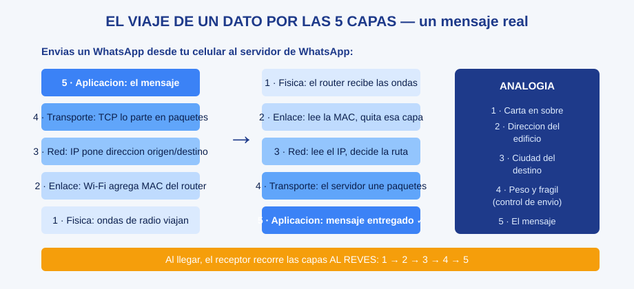

# 0206 · Módulo 6: Troubleshooting y Futuro de las Redes

> Curso 02 · Módulo 6 de 6 · Temas: caja de herramientas de diagnóstico, nube, IPv6, SDN, IoT

---

## Objetivos de este módulo

- [ ] Dominar las herramientas de diagnóstico de red (ping, traceroute, dig, netstat)
- [ ] Resolver los incidentes de red más comunes paso a paso
- [ ] Conocer las tendencias: nube, IPv6, SDN, IoT

---

## 1. La caja de herramientas del técnico de redes

| Herramienta | Qué responde | Ejemplo |
|-------------|--------------|---------|
| **ping** | ¿Está vivo? (ICMP echo) | `ping 8.8.8.8` |
| **traceroute / tracert** | ¿Dónde se corta la ruta? | `tracert 8.8.8.8` |
| **nslookup / dig** | ¿Resuelve el DNS? | `nslookup google.com` |
| **netstat / ss** | ¿Qué conexiones hay? ¿Escucha este puerto? | `netstat -ano` |
| **ipconfig / ifconfig / ip** | ¿Qué IP tengo? | `ipconfig /all` |
| **Test-NetConnection** | ¿Este puerto está abierto? (PowerShell) | `Test-NetConnection sitio -Port 443` |
| **curl** | ¿Responde el servicio HTTP? | `curl -I https://sitio` |
| **arp** | ¿Qué MAC hay en mi LAN? | `arp -a` |

### Flujo de diagnóstico profesional

```mermaid
flowchart TD
    A[Problema: no hay conexion] --> B{¿IP valida? ipconfig}
    B -- APIPA 169.254 --> C[DHC P fallo: revisar cable / reiniciar router]
    B -- IP normal --> D{¿Ping al gateway?}
    D -- No --> E[Red local: cable, Wi-Fi, router]
    D -- Si --> F{¿Ping a 8.8.8.8?}
    F -- No --> G[ISP / acceso: reinicio modem, soporte ISP]
    F -- Si --> H{¿Resuelve DNS? nslookup}
    H -- No --> I[DNS: flushdns, cambiar DNS]
    H -- Si --> J{¿Responde el servicio? puerto 443}
    J -- No --> K[Servidor/aplicacion: avisar al responsable]
    J -- Si --> L[Todo OK: problema especifico del equipo/app]
```

---

## 2. Incidentes típicos y sus causas №1

| Síntoma | Causa más probable | Primera acción |
|---------|--------------------|----------------|
| Internet lenta en todo | Saturación ISP / Wi-Fi congestionado | Speedtest + probar por cable |
| Internet lenta en un equipo | Antivirus/actualizaciones en segundo plano | Revisar uso de red (`taskmgr`) |
| Sitio no carga, otros sí | DNS o firewall del equipo | flushdns + probar otro DNS |
| Red intermitente | Señal Wi-Fi débil / canal saturado | Canal 1/6/11, banda 5 GHz |
| Sin IP (169.254) | DHCP no contesta | Reiniciar router, revisar cable |
| Un servicio no responde | Firewall o puerto mal configurado | Test-NetConnection puerto |

---

## 3. El futuro de las redes (para estar al día)

### Nube (Cloud Computing)
- **Público**: AWS, Azure, GCP — infraestructura alquilada (IaaS/PaaS/SaaS).
- **Privado/híbrido**: infraestructura propia + nube.
- **Colocation / hiperescala / borde (edge)**: dónde viven los datos hoy.
- Ventajas: escala, pago por uso, resiliencia global.

### IPv6 — la migración
- Mitiga el agotamiento de IPv4; **doble pila** convive hoy.
- Automática (**SLAAC**) sin servidor DHCP clásico.
- Comandos: `ping6`, `ip -6 addr`.

### SDN (Redes Definidas por Software)
- La **lógica** (control) se separa del **hardware** (envío): centralizado y programable.
- Beneficio: configurar toda la red con código (network-as-code).

### IoT (Internet de las Cosas)
- Miles de dispositivos pequeños conectados: sensores, cámaras, electrodomésticos.
- **Riesgo de seguridad**: muchos IoT son inseguros por defecto → segméntalos en una red separada (VLAN de invitados).
- Estándares: Zigbee, LoRaWAN, NB-IoT, Matter.

---

## 4. Laboratorio final del curso (integrador)

Diseña y arma en **Packet Tracer**:
1. 3 subredes interconectadas con 2 routers (IPs estáticas correctas).
2. Un servidor DNS + DHCP + web en una subred.
3. PCs en DHCP automático, con DNS que resuelve el sitio local.
4. Regla de firewall que permite HTTP pero bloquea otro puerto.
5. Verificación final: `ping` PC→PC entre subredes y navegación al servidor.

Toma capturas del laboratorio → son material de portafolio profesional (como este guía).

---

## Checklist de dominio — Módulo 6

- [ ] Corro un diagnóstico completo (IP → gateway → Internet → DNS → puerto) sin ayuda
- [ ] Explico qué me dice cada comando de la caja de herramientas
- [ ] Resuelvo "sitio no carga pero Internet funciona" en minutos
- [ ] Explico nube pública/privada/híbrida y SDN en términos simples
- [ ] Digo por qué IPv6 existe y qué es la doble pila
- [ ] Completo el laboratorio integrador de Packet Tracer

---

## Fin del Curso 02 — Siguiente paso
Completa el examen del curso (opcional) y continúa con **Curso 03 · Sistemas Operativos** →
