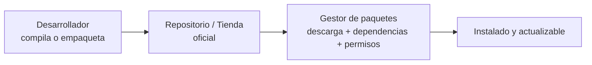

# 0303 · Módulo 3: Gestión de Software y Paquetes

> Curso 03 · Módulo 3 de 6 · Temas: cómo se distribuye el software y cómo gestionarlo profesionalmente

---

## Objetivos de este módulo

- [ ] Entender la distribución del software (fuente → repositorio → instalación)
- [ ] Usar los gestores de paquetes de Windows, Linux y macOS
- [ ] Actualizar, instalar y desinstalar software de forma segura
- [ ] Conocer el modelo de tiendas de aplicaciones (móviles y SO)

---

## 1. Cómo llega el software a tu equipo



**Dependencias**: paquetes que otro paquete necesita. Los gestores las resuelven solos (una razón poderosa para usarlos en vez de instalar ".exe" sueltos).

---

## 2. Los gestores de paquetes

| SO | Gestor | Ejemplo |
|----|--------|---------|
| Windows | **winget** (nativo), Chocolatey, Scoop | `winget install vlc.vlc` |
| Windows | Microsoft Store / instaladores MSI | app oficial |
| Linux Debian/Ubuntu | **apt / dpkg** | `sudo apt install firefox` |
| Linux Fedora | **dnf** | `sudo dnf install git` |
| Linux Arch | **pacman** | `sudo pacman -S curl` |
| macOS | **Homebrew** | `brew install git` |
| Móvil | Play Store / App Store / FDroid | actualizaciones automáticas |

### Trabajo diario con apt (el más común en servidores)
```bash
sudo apt update            # actualiza la lista de paquetes disponibles
sudo apt upgrade           # actualiza los instalados
sudo apt install curl      # instala
sudo apt remove curl       # desinstala (conservando config)
sudo apt purge curl        # desinstala y borra configuración
apt search "editor"        # busca
```

### Trabajo diario con winget (Windows)
```powershell
winget search chrome
winget install Google.Chrome
winget upgrade --all        # actualiza TODO el equipo de una vez
winget uninstall Google.Chrome
```

---

## 3. Repositorios y canales

- **Repositorio**: inventario oficial de paquetes verificados de la distribución.
- **PPA / canal adicional**: repos extra de terceros (útil pero añade riesgo: solo de fuentes confiables).
- **Canales de actualización** (Windows Insider / beta): estables vs de pruebas — jamás insiders en producción.

> **Regla profesional**: en servidores/productivos, instala solo paquetes de repositorios oficiales y actualiza en ventanas de mantenimiento programadas, con prueba previa en staging.

---

## 4. Seguridad al instalar software

| Riesgo | Mitigación |
|--------|------------|
| "Cracks"/activadores | Jamás: vía #1 de malware real |
| .exe de sitios desconocidos | Descargar solo de la web oficial del fabricante |
| Paquetes de terceros sin verificar | Verificar firma/hash del paquete cuando sea crítico |
| Software viejo sin parches | `winget upgrade --all` / `apt upgrade` semanal |
| Aplicaciones con más permisos de los necesarios | Revisar permisos al instalar (móvil) y UAC (Windows) |

**Verificación de hashes** (cuando el proveedor publica el SHA-256):
```powershell
Get-FileHash archivo.iso -Algorithm SHA256   # Windows
sha256sum archivo.iso                        # Linux
```

---

## 5. Escenarios de soporte

| Petición | Solución profesional |
|----------|----------------------|
| "Instálenme X gratis" | 1º buscar alternativa gratuita **oficial** (LibreOffice, GIMP, VLC, 7-Zip) |
| "El antivirus deja de actualizarse" | Verificar firma/licencia + reinstalar desde fuente oficial |
| "No puedo actualizar un programa" | Revisar permisos (admin), espacio en disco y archivos bloqueados |
| Equipo lento por software | `winget upgrade --all` + desinstalar lo que no se usa + limpiar inicio |

---

## Práctica del módulo

1. `winget upgrade --all` en tu Windows (mira cuántas apps actualiza de una vez).
2. En tu VM Linux: `sudo apt update && sudo apt upgrade`, instala `htop` y `git`.
3. Instala un programa **solo** desde su fuente oficial y compáralo con una instalación desde tienda.
4. Verifica el hash de una ISO que descargues (sitio oficial publica el valor).

## Plataformas gratuitas para practicar

- **Microsoft Learn: winget** (https://learn.microsoft.com)
- **Linux Journey** (https://linuxjourney.com): sección "Getting Around / Packages"
- **TryHackMe — Linux fundamentals** (https://tryhackme.com): instalar paquetes con retos

---

## Checklist de dominio — Módulo 3

- [ ] Instalo/actualizo/desinstalo con winget, apt y brew (concepto)
- [ ] Explico qué es una dependencia y por qué importan los repos
- [ ] Aplico la regla de fuentes oficiales siempre
- [ ] Verifico un hash cuando la seguridad lo exige
- [ ] Recomiendo alternativas gratuitas oficiales en cada caso común
- [ ] Mantengo actualizados los equipos de mis clientes de forma programada