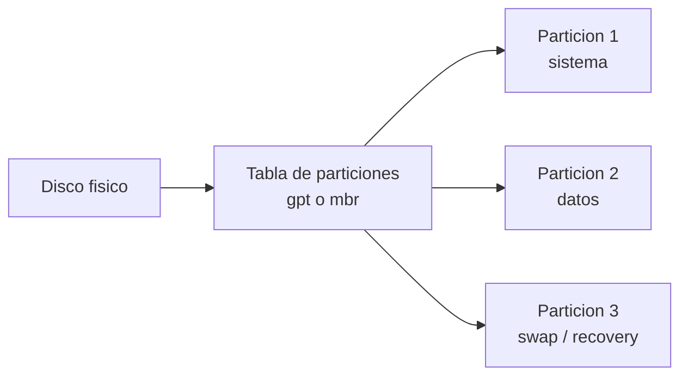

# 0304 · Módulo 4: Sistemas de Archivos

> Curso 03 · Módulo 4 de 6 · Temas: tipos de FS, particiones, montaje, rutas y transferencia de archivos

---

## Objetivos de este módulo

- [ ] Diferenciar NTFS, ext4 y APFS y elegirlos bien
- [ ] Crear particiones y formatear discos
- [ ] Montar/unir sistemas de archivos (Linux)
- [ ] Transferir archivos de forma segura (SFTP, SCP, herramientas)

---

## 1. Los sistemas de archivos modernos

| FS | SO | Características |
|----|----|-----------------|
| **NTFS** | Windows | Permisos avanzados, cifrado (EFS), journaling, cuotas; ideal sistema |
| **FAT32** | Universal | Simple, compatible con todo; límite archivo 4 GB, sin permisos |
| **exFAT** | Universal | USB/SSD externos grandes (archivos >4 GB) |
| **ext4** | Linux | Estándar: journaling, rápido, extendible |
| **XFS/Btrfs** | Linux (servidores) | Escala masiva / snapshots avanzados |
| **APFS** | macOS | Optimizado para SSD, cifrado nativo |

**Journaling**: registra las operaciones pendientes → si el equipo se apaga de golpe, el FS se recupera sin corrupción.

> **Decisión de soporte**: un USB para intercambiar archivos con Windows+Mac+TV → **exFAT**. Disco interno del sistema → NTFS (o ext4 en Linux).

---

## 2. Particiones y formateo



| Herramienta | Uso |
|-------------|-----|
| `diskpart` (Windows) | listar/crear/formatear particiones |
| `fdisk` / `gdisk` / `parted` (Linux) | particionado |
| `mkfs.ext4 /dev/sdb1` | formatear (ojo: ¡borra datos!) |
| Administrador de discos (GUI Windows) | fácil para principiantes |
| `lsblk` / `Get-Disk` | ver discos y particiones |

**MBR vs GPT**: GPT es el estándar actual (discos >2 TB, arranque UEFI, copias de respaldo de la tabla).

> **Aviso crítico**: formatear/particionar borra datos. Verifica siempre `lsblk`/`Get-Disk` y cita el disco correcto. En producción: haz backup antes.

---

## 3. Montaje (Linux) — asignar el FS a una carpeta

En Linux un disco no tiene letra: se **monta** en una carpeta (mount point).

```bash
lsblk                          # ver discos
sudo mount /dev/sdb1 /mnt/datos   # montar manualmente
sudo umount /mnt/datos          # desmontar
cat /etc/fstab                  # montajes automáticos al arrancar
sudo blkid                      # UUID de discos (se usa en fstab)
```

> **Windows análogo**: asignar letra de unidad (D:) es el "montaje" de Windows. También puedes montar unidades en carpetas.

---

## 4. Transferencia de archivos (protocolos)

| Protocolo | Puerto | Uso |
|-----------|--------|-----|
| **FTP** | 21 | Clásico, **sin cifrar** → evita |
| **SFTP** | 22 | FTP sobre SSH (cifrado) |
| **SCP** | 22 | Copia directa sobre SSH |
| **SMB/Samba** | 445 | Compartir carpetas de Windows (o Linux↔Windows) |
| **WebDAV** | 443 | Acceso a archivos vía web |

```bash
scp archivo.txt usuario@servidor:/home/usuario/        # Linux/Mac
scp usuario@servidor:/ruta/archivo.txt .               # descargar
# Windows: WinSCP (GUI gratis) o scp integrado en PowerShell
```

> **Tip**: para soporte de casa, SFTP es perfecto para intercambiar archivos con el equipo del cliente por VPN.

---

## 5. Disco lleno / casi lleno (incidente nº1 de servidores)

```bash
df -h                    # uso global de discos
du -sh /var/log/*        # qué carpeta pesa
sudo du -sh --exclude=proc /* 2>/dev/null | sort -h | tail  # top peso
journalctl --vacuum-size=200M   # limpiar logs viejos (systemd)
```
**Windows**: Administrador de discos/Copias de seguridad → Limpieza de disco (`cleanmgr`), `Get-ChildItem` para tamaños.

---

## Práctica del módulo

1. En tu VM: crea un archivo de 100 MB (`dd if=/dev/zero of=test bs=1M count=100`), verifícalo con `df`/`du`.
2. Formatea un USB (copias de seguridad antes): prueba FAT32 vs exFAT (archivo >4 GB en cada uno).
3. Monta un disco USB en Linux en `/mnt/usb` y desmóntalo bien (`umount` — ¡nunca lo extraigas montado!).
4. Transfiere 3 archivos entre tu Windows y la VM por **SFTP** (WinSCP o `scp`).

## Plataformas gratuitas para practicar

- **Linux Journey** (https://linuxjourney.com): Files and Filesystems
- **VirtualBox** para particionar discos virtuales sin miedo
- **WinSCP** — cliente SFTP gratuito (https://winscp.net)

---

## Checklist de dominio — Módulo 4

- [ ] Elijo el FS correcto según el caso (explico por qué)
- [ ] Particiono un disco virtual de principio a fin
- [ ] Monto/desmonto sistemas en Linux y entiendo /etc/fstab
- [ ] Transfiero archivos por SFTP/SCP sin errores
- [ ] Libero espacio en un servidor diagnosticando con df/du
- [ ] Nunca saco un USB montado sin desmontar