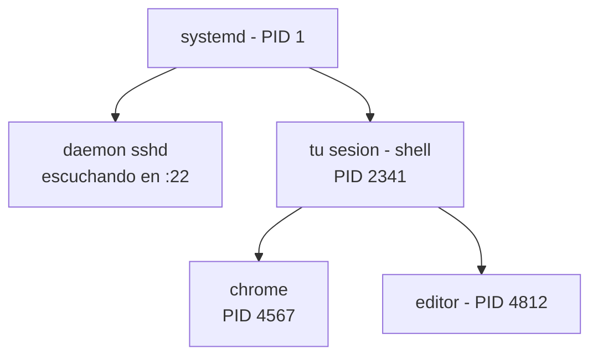
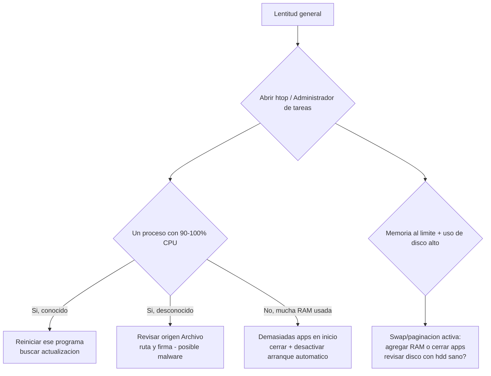

# 0305 · Módulo 5: Gestión de Procesos

> Curso 03 · Módulo 5 de 6 · Temas: procesos, señales, prioridades y rendimiento del sistema

---

## Objetivos de este módulo

- [ ] Entender qué es un proceso y un PID
- [ ] Listar, analizar y terminar procesos en ambos SO
- [ ] Explicar señales de Linux (TERM, KILL, HUP)
- [ ] Diagnosticar problemas de rendimiento (CPU/RAM)

---

## 1. ¿Qué es un proceso?

Un **proceso** es un programa en ejecución con su propio espacio de memoria. Identificador único: **PID**.

- **Proceso padre/hijo**: los hijos nacen de un padre (en Linux, `init`/`systemd` es el proceso raíz, PID 1).
- **Hilo (thread)**: una unidad de ejecución dentro de un proceso.
- **Daemon/servicio**: proceso que corre en segundo plano (impresora, servidor web).



---

## 2. Herramientas de procesos

| Acción | Windows | Linux |
|--------|---------|-------|
| Listar | `tasklist` | `ps aux` |
| Monitoreo en vivo | Administrador de tareas (Ctrl+Shift+Esc) | `top`, `htop` |
| Detalles | `Get-Process | Format-Table *` | `ps -ef`, `pgrep -a` |
| Terminar | `taskkill /PID 1234 /F` | `kill 1234`, `kill -9 1234` |
| Por nombre | `taskkill /IM chrome.exe /F` | `pkill chrome` |

> **Orden de terminar (Linux)**: primero `kill` (TERM, educado) → si no responde `kill -9` (KILL, definitivo — pierde datos sin limpiar). En Windows: `taskkill` normal y `/F` forzado.

---

## 3. Señales de Linux (el lenguaje de control)

| Señal | Nº | Comportamiento |
|-------|----|----------------|
| **TERM** | 15 | Pide terminar limpiamente (por defecto en `kill`) |
| **KILL** | 9 | Destrucción instantánea (no se puede ignorar) |
| **HUP** | 1 | "Cuelga y recarga tu configuración" (recargar daemons) |
| **STOP/CONT** | 19/18 | Detener/reanudar |

```bash
sudo systemctl restart apache2   # recargar servicio elegantemente
kill -HUP 1234                   # recargar config de un proceso
```

**Prioridades**: `renice -n 10 PID` cambia la prioridad de CPU; `nice` lanza con prioridad inicial. `top`/`htop` muestran el % de CPU y RAM por proceso.

---

## 4. Diagnóstico de rendimiento (el caso más frecuente)

**"Mi PC está lenta"** → siempre empezar por el Administrador de tareas/`top`:



| Señal de alerta | Qué indica |
|-----------------|------------|
| 100% CPU en un proceso conocido | Bucle/programa pesado → actualizar o reiniciar |
| 100% CPU en proceso desconocido | **Posible malware** (investiga ruta y firma) |
| RAM al 100% + swap activo | Falta RAM (o fuga de memoria) |
| Disco al 100% continuo | HDD moribundo / SSD a punto de fallar → backup YA |

**Fugas de memoria**: RAM usada crece sin parar (aplicación vieja) → reiniciar el servicio periódicamente.

**Arranque lento**: revisa lo que inicia con el equipo → Windows: `Administrador de tareas → Inicio` (o Sysinternals **Autoruns**); Linux: `systemd-analyze`, `systemd-analyze blame`.

---

## 5. Buenas prácticas en servidores

- Monitorea con **htop**, **glances** o Nagios/Zabbix → alertas proactivas.
- Reinicia servicios en ventanas de mantenimiento, no "cuando el usuario se queja".
- Registra procesos críticos como **servicios** (systemd `[Service] Running`), no como procesos sueltos.
- Aísla servicios pesados por contenedor/VM cuando el equipo lo permite.

---

## Práctica del módulo

1. `htop`/Administrador de tareas: ordena por CPU y por RAM; identifica tus 3 procesos más pesados (¿los conoces todos?).
2. Lanza un bucle infinito en tu VM (`while true; do :; done`) y termínalo con `htop`/`ps`+`kill` — mira el CPU subir y bajar.
3. En Windows termina un programa colgado con `taskkill /IM` (elige algo inocuo).
4. `systemd-analyze` y `systemd-analyze blame` en tu VM: ¿qué servicio tarda más en arrancar?

## Plataformas gratuitas para practicar

- **Linux Journey** (https://linuxjourney.com): Process Management
- **TryHackMe — Linux Fundamentals** (https://tryhackme.com): procesos
- **htop** en tu VM (libre) — `sudo apt install htop`

---

## Checklist de dominio — Módulo 5

- [ ] Explico proceso, PID, padre/hijo y daemon con ejemplos
- [ ] Encuentro y termino un proceso en ambos SO
- [ ] Conozco TERM vs KILL vs HUP y cuándo usar cada uno
- [ ] Diagnostico "PC lenta" con datos (CPU/RAM/disco), no a ciegas
- [ ] Sigo el flujo CPU 100% → conocer/reiniciar/analizar malware
- [ ] Detecto y describo una posible fuga de memoria