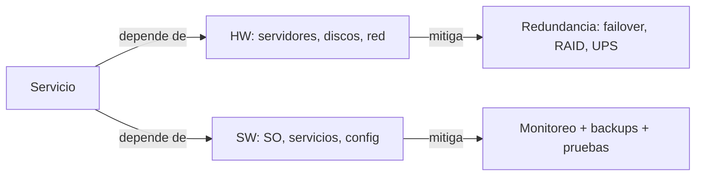

# 0401 · Módulo 1: ¿Qué es la Administración de Sistemas?

> Curso 04 · Módulo 1 de 6 · Temas: rol del sysadmin, fiabilidad, SLA, failover y documentación

---

## Objetivos de este módulo

- [ ] Explicar el rol y las responsabilidades de un administrador de sistemas
- [ ] Entender fiabilidad, disponibilidad y failover
- [ ] Manejar conceptos de SLA (RPO, RTO, uptime)
- [ ] Valorar la documentación como parte del trabajo

---

## 1. El rol del administrador de sistemas

El sysadmin mantiene **los sistemas funcionando** para que la empresa trabaje sin fricción.

| Responsabilidad | Ejemplo concreto |
|-----------------|------------------|
| Aprovisionar | Crear usuarios, equipos, cuentas de correo |
| Mantener | Aplicar parches y actualizaciones en ventanas |
| Monitorear | Alertas de disco lleno, CPU, red |
| Responder | Incidentes y peticiones (tickets) |
| Respaldar | Backups programados y probados |
| Documentar | Procedimientos para que cualquiera pueda seguir |

**Diferencia clave**: soporte de nivel 1 arregla lo inmediato; el sysadmin **previene** que pase.

---

## 2. Fiabilidad y disponibilidad

| Término | Definición |
|---------|------------|
| **Disponibilidad (uptime)** | % de tiempo que el servicio está operativo (99.9% ≈ 8.7 h/año de caída) |
| **Fiabilidad** | Capacidad de funcionar sin fallar |
| **Redundancia** | Duplicar componentes para que no exista punto único de falla |
| **Failover** | Cambio automático a un sistema de respaldo cuando falla el principal |
| **Punto único de falla (SPOF)** | Componente cuyo fallo tira todo el sistema → eliminarlo |

**Ejemplo**: servidor de correo con 2 discos en RAID 1 (espejo) + UPS + dos líneas de red + copias en otro sitio.

---

## 3. SLA y los números del acuerdo

El **SLA** (Acuerdo de Nivel de Servicio) define compromisos de tiempo:

| Métrica | Qué mide |
|---------|----------|
| **Respuesta** | En cuánto tiempo se contesta el ticket |
| **Resolución** | En cuánto tiempo se resuelve |
| **Uptime** | Disponibilidad garantizada (99.9%) |
| **RPO** | Datos perdidos máximos aceptables (ej. 1 hora de backups) |
| **RTO** | Tiempo máximo para restaurar el servicio |

> **Para el día a día**: documenta cada incidente con horas de inicio/fin y qué se hizo: con eso justificas (o no) el SLA y mejoras los procesos.

---

## 4. Hardening inicial del servidor (antes de ponerlo en producción)

1. Cambiar contraseñas por defecto y **deshabilitar root/administrador remoto**.
2. Actualizar el SO completo.
3. Firewall activo con reglas mínimas (denegar por defecto).
4. Desactivar servicios y puertos innecesarios.
5. Configurar backups **antes** que el negocio.
6. Logging activo + rotación de logs.
7. Hora sincronizada (NTP) — clave para auditorías y logs.

---

## 5. Documentación: el activo invisible

| Documento | Contenido |
|-----------|-----------|
| **Runbook** | Pasos exactos para operaciones recurrentes (reinicio de servicio, alta de usuario) |
| **Diagrama de red/infra** | Cómo está conectado todo (nombres, IPs, VLANs) |
| **Inventario** | Servidores, VMs, licencias, contratos |
| **Procedimiento de incidentes** | Quién avisa, quién actúa, cómo escalar |
| **Base de conocimiento** | Soluciones ya validadas (este mismo repositorio es un ejemplo) |

> **Regla**: si no está documentado, no pasó. En una auditoría (o cuando renuncies), la documentación vale oro.

---

## Práctica del módulo

1. Define para un servicio hipotético (ej. correo de 20 empleados): RPO, RTO, uptime objetivo y plan de failover.
2. Haz un diagrama de infraestructura de "tu futura oficina": 1 router, 1 switch, 2 servidores (web y archivos), backups.
3. Redacta un runbook de "reiniciar el servicio de correo" en 5 pasos exactos.
4. Lista 3 puntos únicos de falla típicos en un hogar/oficina pequeña y cómo eliminarlos.

## Plataformas gratuitas para practicar

- **VirtualBox** para tu "servidor" de práctica (Linux)
- **Draw.io / diagrams.net** (https://app.diagrams.net): diagramas de infra profesionales
- **NetAcad IT Essentials/CCNA**: conceptos de fiabilidad
- Comunidades: r/sysadmin (Reddit) para casos reales

---

## Checklist de dominio — Módulo 1

- [ ] Explico el rol del sysadmin y lo que lo diferencia del nivel 1
- [ ] Defino RPO/RTO/uptime para un servicio real
- [ ] Identifico y elimino puntos únicos de falla
- [ ] Aplico el orden de hardening inicial de un servidor
- [ ] Redacto runbooks y diagramas de infraestructura
- [ ] Mido y justifico SLA con la documentación de incidentes