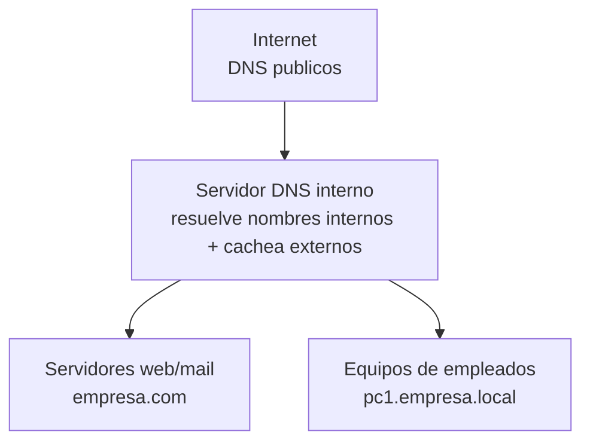
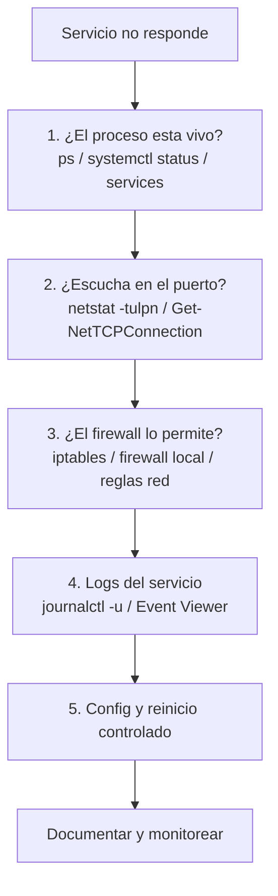

# 0402 · Módulo 2: Servicios de Red e Infraestructura

> Curso 04 · Módulo 2 de 6 · Temas: servidores DNS y DHCP en producción, configuración y resolución de problemas

---

## Objetivos de este módulo

- [ ] Configurar un servidor DNS y DHCP básico
- [ ] Entender el diseño de DNS para una infraestructura
- [ ] Diagnosticar y arreglar servidores que no responden
- [ ] Interpretar los archivos de configuración clave

---

## 1. El DNS en la infraestructura empresarial

**Diseño típico** en una empresa:

| Pieza | Función |
|-------|---------|
| **Zona directa** | nombre → IP (desde adentro de la empresa) |
| **Zona inversa** | IP → nombre (auditorías, correo, monitoring) |
| **Reenviador (forwarder)** | "Si no lo conozco, pregúntale a 8.8.8.8" |
| **TTL** | Tiempo de caché de las respuestas |
| **Zona**.local / `.corp` | Dominios internos (no registrables) |

**En la práctica (Linux Bind9)**: archivos `/etc/bind/named.conf*` y `/etc/bind/db.empresa`. En Windows: role DNS del Server.

> **Caso real clásico**: el correo de la empresa va a los clientes como spam → falta el registro **SPF (TXT)**, **DKIM** y **DMARC**, o el **PTR** inverso pedido por el proveedor antis spam.

---

## 2. El servidor DHCP centralizado

**Por qué centralizado**: una sola configuración, sin IPs manuales en cientos de equipos, y **reservas** para impresoras/servidores.

| Opción DHCP | Ejemplo |
|-------------|---------|
| Rango (pool) | 192.168.10.100 – 200 |
| Máscara / gateway / DNS | /24, .1, DNS interno + público |
| Reserva por MAC | impresora → 192.168.10.10 fija |
| **Duración del arrendamiento** | 8 h (oficina con visitas: má s corto) |
| Escaneo de conflictos | evitar que 2 equipos usen la misma IP |

**Solución de problemas de DHCP**:

| Síntoma | Revisar |
|---------|---------|
| IP 169.254.x.x (APIPA) | ¿El servidor DHCP está arriba? ¿El equipo llega a la red? |
| Un equipo sin IP, otros sí | Cable/puerto del switch/NIC de ese equipo |
| Todos sin IP tras un cambio | Config del scope (rango lleno, máscara, relay si hay VLANs) |
| IP duplicada | Reservas vs rango dinámico en conflicto |

**Comandos clave**: `dhcpconfig`-family (Windows Server), `/etc/dhcp/dhcpd.conf` (Linux), `ipconfig /release /renew` (cliente), `lease review` en el servidor.

---

## 3. Solución de problemas de servidores (metodología sysadmin)

**Drill-down de un caso**: "El sitio web interno no carga".
1. `systemctl status nginx` → ¿activo?
2. `ss -tlnp | grep 80` → ¿escucha?
3. Desde otro equipo `curl -I http://IP` y `Test-NetConnection -Port 80`.
4. Logs: `tail -f /var/log/nginx/error.log`.
5. Si nada sirve: reinicio en ventana, revisar disco lleno (`df -h`) — el 50% de los "servidores caídos" son discos llenos o logs que explotaron.

---

## 4. Monitoreo básico proactivo (la diferencia profesional)

| Nivel | Herramientas gratuitas |
|-------|------------------------|
| Sistema | `htop`, `glances`, `df -h`, `uptime` |
| Servicios | `systemctl`, `cron` de checks + alertas por correo/Telegram |
| Red | MTR, SmokePing, Prometheus + Grafana (avanzado) |
| Centralizado | Zabbix (excelente y gratis), Nagios |

**Lo mínimo que debes monitorear hoy**: disco (90% → alerta), RAM/swap, uptime del servicio crítico, latencia del enlace, fecha de los backups.

---

## Práctica del módulo

1. En tu VM: instala `bind9` y crea la zona `empresa.local` con 2 hosts; prueba `nslookup` desde otro equipo.
2. Configura `dhcp` (isc-dhcp-server) con rango + 1 reserva; verifica con un segundo equipo/VM.
3. Rompe (a propósito) el servicio DNS y practica el flujo de diagnóstico de 5 pasos.
4. Monitorea con `glances` tu VM por 10 minutos y anota lo que ves.

## Plataformas gratuitas para practicar

- **Cisco Packet Tracer** — simulador DNS/DHCP con servidores (NetAcad)
- **TryHackMe — DNS in detail / Networking rooms** (https://tryhackme.com)
- **Linux Journey** (https://linuxjourney.com)
- Docs oficial: https://www.isc.org/bind/ | Zabbix (https://www.zabbix.com)

---

## Checklist de dominio — Módulo 2

- [ ] Creo una zona DNS directa con archivos bind9 de memoria de su estructura
- [ ] Explico SPF/DKIM/DMARC/PTR para el correo de la empresa
- [ ] Configuro scope DHCP con rango y reservas
- [ ] Diagnostico "servicio no responde" en 5 pasos ordenados
- [ ] Reviso logs y disco antes de reiniciar a ciegas
- [ ] Configuro alertas básicas de disco y servicio