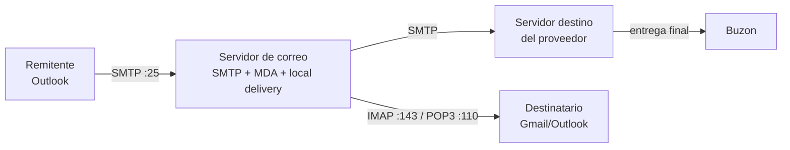
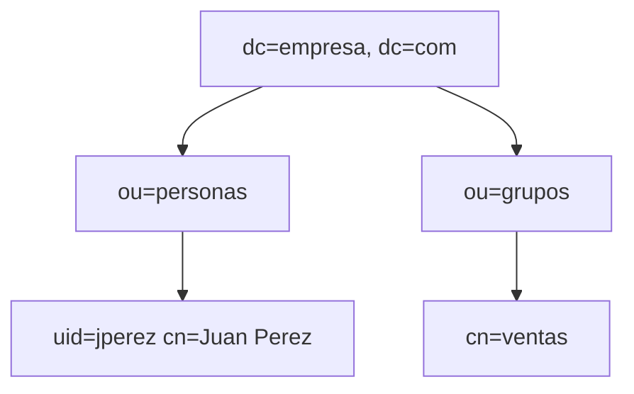

# 0403 · Módulo 3: Servicios de Software y Plataforma

> Curso 04 · Módulo 3 de 6 · Temas: servidores web, correo, LDAP, monitoreo y escalado

---

## Objetivos de este módulo

- [ ] Levantar y configurar un servidor web (Apache/Nginx)
- [ ] Entender el funcionamiento del correo empresarial (SMTP/POP3/IMAP)
- [ ] Conocer servidores LDAP y su propósito
- [ ] Implementar monitoreo básico de servicios

---

## 1. Servidores Web (Apache y Nginx)

**Función**: servir páginas web por HTTP/HTTPS, escuchando en los puertos 80/443.

```bash
# En la VM Debian/Ubuntu
sudo apt install nginx
sudo systemctl enable --now nginx
echo "<h1>Hola</h1>" | sudo tee /var/www/html/index.html
curl http://localhost          # verifica
```

| Concepto | Explicación |
|----------|-------------|
| **Virtual Host / Server Block** | Varios sitios (dominios) en un mismo servidor |
| **DocumentRoot** | Carpeta con los archivos del sitio (/var/www/...) |
| **TLS/HTTPS** | Certificado + configuración 443 (Let's Encrypt con `certbot --nginx`) |
| **Reverse proxy** | Nginx sirviendo como "puerta" hacia apps (Node, python) |
| **Logs** | `/var/log/nginx/access.log` (quién pidió) y `error.log` |

**Diagnóstico clásico**: "el sitio no carga" → 1) `systemctl status nginx` 2) `ss -tlnp` 3) `curl -I localhost` 4) logs 5) permisos de DocumentRoot (`403 Forbidden` = permisos mal puestos).

---

## 2. Correo empresarial

El correo usa **3 protocolos** en cadena:



| Papel | Función |
|-------|---------|
| **MTA (SMTP)** | transporta el correo entre servidores |
| **MDA** | entrega al buzón correcto |
| **IMAP** | sincroniza buzón con varios dispositivos (correo queda en servidor) — estándar actual |
| **POP3** | descarga el correo al equipo (tradicional) |

**Entregabilidad** (por qué el correo cae en spam): registros **SPF, DKIM, DMARC** y **PTR** bien configurados + reputación de la IP. Servicios: **Postfix** (Linux), Microsoft 365 / Gmail (gestionado — la opción que las PYMEs deberían pagar, no auto-hostear).

**Autenticación**: hoy casi todo el correo legítimo usa **STARTTLS** y rechaza SMTP sin cifrar.

---

## 3. Servicios LDAP (directorio de identidades)

**LDAP (Lightweight Directory Access Protocol)** almacena y consulta información de la organización (usuarios, grupos, impresoras, políticas) en un directorio jerárquico.



**Uso práctico**: la autenticación centralizada (usuario/contraseña valida contra LDAP, no contra cada máquina). Ejemplo: OpenLDAP en Linux. (Active Directory se cubre en el módulo 4.)

---

## 4. Escalado y alta disponibilidad (lo que verás en ambientes reales)

| Estrategia | Qué resuelve |
|------------|--------------|
| **Balanceador de carga** | Reparte peticiones entre varios servidores web (HAProxy, Nginx LB, cloud LB) |
| **Pool de servidores** | N servidores tras el balanceador → failover automático |
| **Base de datos dedicada** | Separar web de datos (mismo host = cuello de botella) |
| **Cache (Redis/Memcached)** | Velocidad de repeticiones (sesiones, consultas) |
| **Contenedores/Kubernetes** | Escalar apps y servicios como unidades (moderno estándar) |

> **Regla de usuario**: para una PYME, no auto-hospedar correo ni DNS; pagar SaaS (Microsoft 365, Google Workspace, Cloudflare). La administración compleja solo vale cuando la empresa es la infraestructura (ISP, grandes corporativos).

---

## 5. Monitoreo de servicios end-to-end

**Ejercicio guiado**: monitorizar el sitio web.
1. Check de proceso: ¿`nginx` corriendo?
2. Check HTTP: `curl -s -o /dev/null -w "%{http_code}" http://localhost` → esperar 200.
3. Check externo: ¿responde desde Internet?
4. Alertas: cron cada 5 min → si falla 3 veces seguidas, notificar (correo/Telegram).
5. Métricas históricas: Zabbix/Grafana muestran tendencia (memoria creciendo = fuga → reinicio programado).

---

## Práctica del módulo

1. Levanta Nginx en tu VM; crea 2 sitios con server blocks y accede a ambos por nombre.
2. Emite un certificado de prueba para localhost con OpenSSL (`openssl req -x509...`) y actívalo en 443.
3. Instala `postfix` (solo local) y prueba enviar con `mail` a tu propia cuenta local.
4. Habilita el check de monitoreo tipo cron del punto 5 para tu sitio.

## Plataformas gratuitas para practicar

- **Nginx docs** (https://nginx.org/en/docs/), **Apache httpd docs**
- **Let's Encrypt / certbot** para HTTPS real (https://certbot.eff.org)
- **Zabbix** (https://www.zabbix.com) — monitoreo gratis
- **TryHackMe — HTTP servers rooms** (https://tryhackme.com)
- ServerWorld tutoriales (https://www.server-world.info/en/) — manuales paso a paso

---

## Checklist de dominio — Módulo 3

- [ ] Levanto un sitio web de cero y verifico con curl
- [ ] Configuro 2 virtual hosts y diferencio sus logs
- [ ] Explico SMTP/IMAP/POP3 y qué registro evita el spam (SPF/DKIM/DMARC)
- [ ] Sé cuándo recomendar SaaS vs auto-hosting
- [ ] Describo LDAP y su estructura jerárquica
- [ ] Armo un check de monitoreo con alerta básica