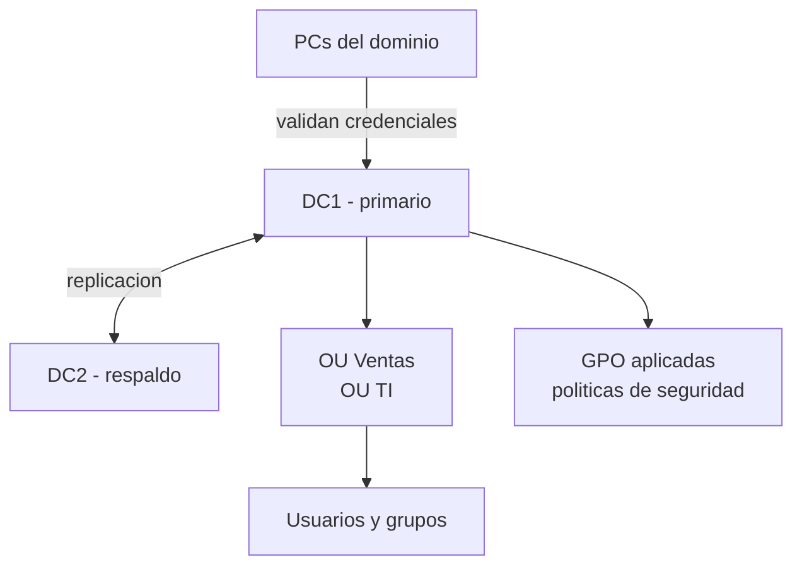

# 0404 · Módulo 4: Servicios de Directorio

> Curso 04 · Módulo 4 de 6 · Temas: Active Directory, LDAP, GPO, autenticación centralizada

---

## Objetivos de este módulo

- [ ] Explicar qué es un servicio de directorio y por qué es central
- [ ] Conocer Active Directory (AD) y sus componentes
- [ ] Crear usuarios, grupos y aplicar GPO
- [ ] Comparar directorio local vs en la nube

---

## 1. ¿Qué es un servicio de directorio?

Un **directorio** centraliza la identidad de la organización: quién existe, a qué pertenece y qué puede hacer. Todo se valida contra 1 sola fuente → una contraseña para todo.

```
Directorio
├── Usuarios (jperez, arojas, ...)
├── Grupos (ventas, soporte, administradores)
├── Equipos y servicios
└── Políticas (GPO)
```

**Beneficios**: alta y baja de usuarios en 1 minuto, políticas uniformes, auditoría central, desaprovisionamiento inmediato.

---

## 2. Active Directory (Windows Server) — el estándar empresarial

| Componente | Función |
|------------|---------|
| **Dominio** | Ámbito administrativo (empresa.local) |
| **Controlador de dominio (DC)** | Servidor que valida autenticación y replica el directorio |
| **OU (Unidad Organizativa)** | Contenedores para organizar y aplicar políticas (Ventas, TI, NB) |
| **GPO (Group Policy)** | Configuraciones en masa (fondos, contraseñas, mapeos, software) |
| **DNS + Kerberos** | Resolución de nombres y autenticación segura del dominio |
| **FSMO / roles** | Roles especiales repartidos entre DCs (por replicación) |



### Operaciones diarias (cmdlets PowerShell)
```powershell
# Alta de usuario
New-ADUser -Name "Juan Perez" -SamAccountName jperez `
  -UserPrincipalName jperez@empresa.local -Enabled $true `
  -Path "OU=Personas,DC=empresa,DC=local"

Add-ADGroupMember -Identity "ventas" -Members jperez
Get-ADUser -Filter * -Server dc1            # consultar
Disable-ADAccount -Identity jperez           # desaprovisionar YA
```

---

## 3. GPO — la palanca de configuración masiva

| Ejemplo de política | Resultado |
|---------------------|-----------|
| Contraseña mínima 12 caracteres + historial 10 | Seguridad uniforme |
| Mapear unidad P: → \\servidor\ventas | Usuarios de ventas con su carpeta |
| Prohibir Panel de control | Control de equipos prestados |
| Instalar software automáticamente (MSI) | Despliegue en masa |
| Screensaver + bloqueo tras 5 min | Cumplimiento básico |

**Orden GPO**: Local → Sitio → Dominio → OU (más específico gana) — con excepciones (Block inheritance / Enforced / WMI filters).

> **En entrevistas/soporte**: la pregunta clásica es "¿cómo aplicas una configuración a 500 usuarios a la vez?" → **GPO**, jamás ir equipo por equipo.

---

## 4. Directorio en la Nube (el presente de las PYMEs)

| Plataforma | Qué es |
|------------|--------|
| **Microsoft Entra ID (Azure AD)** | Directorio cloud de Microsoft (usuarios, MFA, SSO con Office 365) |
| **Google Workspace (Admin)** | Directorio cloud de Google |
| **Okta / JumpCloud** | IDaaS (identidad como servicio), multi-SSO |

**Ventajas cloud**: sin servidores que mantener, MFA incluido, SSO (un inicio de sesión para todo: correo, apps, impresoras), desaprovisionamiento inmediato, licencias integradas.

> **Recomendación profesional a PYMEs**: Microsoft 365 Business + Entra ID cubre correo, dominio, MFA y políticas sin montar un DC físico. El AD on-premise se justifica en empresas grandes o reguladas.

---

## 5. Escenarios de soporte de directorio

| Caso | Acción |
|------|--------|
| "No me deja entrar a nada" | Verificar cuenta habilitada + contraseña + políticas (bloqueo por intentos) |
| Empleado nuevo | Alta en AD/Entra + grupos + correo + licencias → **runbook de alta** |
| Empleado que se va | **Deshabilitar YA** + quitar grupos + revisar correo en poder de la empresa |
| PC no entra al dominio | DNS del equipo debe apuntar al DC / restablecer cuenta de equipo |
| "La GPO no se aplica" | `gpupdate /force` → `gpresult /r` para ver cuál GPO llegó y por qué |

---

## Práctica del módulo

1. Instala en tu VM: `sudo apt install slapd ldap-utils` (OpenLDAP) y crea la estructura base `dc=empresa,dc=local` con un usuario.
2. (Opcional, Windows Server en VM) Crea un dominio de prueba local con 2 usuarios y una GPO de contraseñas.
3. Documenta un runbook de "alta de usuario" (5-8 pasos) como si fuera para tu futuro trabajo.
4. Explora la consola admin de un servicio cloud gratuito que uses (Google admin, etc.) para ver usuarios y grupos.

## Plataformas gratuitas para practicar

- **Microsoft Learn — Active Directory** (https://learn.microsoft.com): rutas oficiales
- **VirtualBox + Windows Server eval / Ubuntu + OpenLDAP**
- **TryHackMe — Active Directory basics room** (https://tryhackme.com)

---

## Checklist de dominio — Módulo 4

- [ ] Explico dominio, DC, OU y GPO como si enseñara a un nivel 1
- [ ] Creo un usuario con el runbook correcto (alta completa)
- [ ] Desaprovisiono una cuenta al instante
- [ ] Aplico políticas en masa con GPO (concepto + ejemplos)
- [ ] Diagnostico "la GPO no aplica" con gpresult
- [ ] Recomiendo Entra ID para una PYME con argumentos