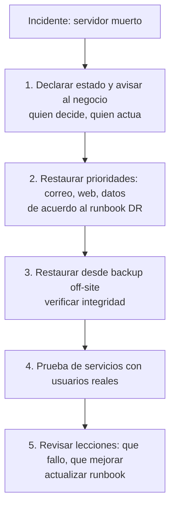

# 0405 · Módulo 5: Backups y Recuperación de Datos

> Curso 04 · Módulo 5 de 6 · Temas: tipos de backup, RAID, replicación, estrategias y disaster recovery

---

## Objetivos de este módulo

- [ ] Elegir el tipo de backup adecuado (full/incremental/diferencial)
- [ ] Explicar RAID y elegir el nivel correcto
- [ ] Entender replicación vs backup
- [ ] Diseñar una estrategia 3-2-1 completa con RPO/RTO

---

## 1. Tipos de backup y su combinación

| Tipo | Respaldas | Recuperación | Ejemplo semanal |
|------|-----------|--------------|-----------------|
| **Completo (Full)** | Todo | La más rápida | Domingo |
| **Incremental** | Solo lo nuevo **desde el último backup** (cualquiera) | Necesitas full + todos los incrementales en orden | Lunes-Viernes |
| **Diferencial** | Solo lo nuevo **desde el último full** | Solo full + último diferencial | Sábado |


**Cálculo de RPO**: con backup diario, pierdes como máximo 24 h de datos (RPO = 24 h). Para RPO menor → backups más frecuentes (cada hora) o replicación continua.

---

## 2. RAID — redundancia a nivel de disco

| Nivel | Mín. discos | Cómo funciona | Resultado |
|-------|-------------|---------------|-----------|
| **0** | 2 | Fragmenta (stripe) | + velocidad, **sin** redundancia |
| **1** | 2 | Espejo | 1 disco falla y sigues (50% pérdida de capacidad) |
| **5** | 3 | Paridad distribuida | 1 disco falla y sigues; buen equilibrio |
| **10** | 4 | Espejo + stripe | Rápido + tolerante (bases de datos) |


> **RAID ≠ backup**: RAID protege contra **fallo de disco físico**, no contra errores humanos, ransomware, incendio o borrado accidental. El ransomware cifra los discos RAID por igual.

---

## 3. Replicación vs Backup

| Estrategia | Qué hace | RPO/RTO |
|------------|----------|---------|
| **Backup** | Copias en el tiempo (versiones) | Horas/días |
| **Replicación síncrona** | Espejo en vivo entre 2 sistemas | Casi cero |
| **Replicación asíncrona** | Espejo con ligero retraso (multi-sitio) | Minutos |

**Snapshots (VM)**: instantáneas de estado de una VM — increíbles para rollback rápido, pero **no son backup**: viven en el mismo disco/almacén que la VM.

> **Diseño ganador**: backups (versiones) + replicación off-site (continuidad) + snapshots (rollback rápido) — cada capa cubre una amenaza distinta.

---

## 4. La estrategia 3-2-1 (el estándar de oro)


**3 copias** de los datos · **2 medios/formatos** distintos · **1 copia fuera del sitio**

| Capa | Ejemplo |
|------|---------|
| Copia 1 | Disco local del servidor (producción) |
| Copia 2 | NAS local o disco externo (backup programado) |
| Copia 3 | **Nube / otro sitio** (S3, Google Drive cifrado, datacenter) |

**Extra recomendado: 3-2-1-1** — la copia off-site debe ser **inmutable o aislada** para sobrevivir a ransomware (los atacantes borran los backups visibles).

---

## 5. Herramientas de backup

| Herramienta | Tipo |
|-------------|------|
| **Veeam** | Estándar de la industria (VM, ruta gratuita limitada) |
| **BorgBackup / restic / Duplicati** | Backup por archivos, cifrado, deduplicación — gratuitas y excelentes |
| **`rsync`** | Copia incremental por línea de comandos (Linux) |
| **`dd`** | Clonado bruto de discos (imagen completa) |
| **Solutions cloud** | Azure Backup, AWS Backups, Google Vault/Drive, IDrive, Backblaze |
| **Windows Server Backup / ntbackup sucesores** | Sistemas Windows |

```bash
# Ejemplo rsync + cron (backup diario de /var/www y /etc)
rsync -av --delete /var/www/ /backup/www/
rsync -av --delete /etc/ /backup/etc/
# En el crontab: 0 2 * * *  rsync -av ... (02:00 diario)
```

**Restauración**: se prueba, se prueba, se prueba. Un backup sin probar es un diploma de esperanza.

---

## 6. Plan de Recuperación ante Desastres (DR)



**RTO del diseño**: para una PYME, meta razonable = restaurar servicios críticos en el mismo día (RTO ≤ 24 h) y datos con RPO ≤ 24 h, mejorable según críticas. **Probar el DR una vez al año como mínimo.**

---

## Práctica del módulo

1. Configura un backup automático diario con `rsync` + `cron` en tu VM (carpetas /etc y /var/www).
2. Rompe algo (borra un archivo del repositorio Web) y **restaura** desde tu backup — práctica real de restauración.
3. En VirtualBox: crea 3 snapshots de tu VM y vuelve atrás; compara "snapshot vs backup".
4. Diseña el plan 3-2-1 de "tu futuro cliente": memoria en papel de dónde va cada copia y cada cuánto.

## Plataformas gratuitas para practicar

- **restic** (https://restic.net) y **BorgBackup** (https://www.borgbackup.org) — documentación impecable
- **Veeam** (https://www.veeam.com) — versión Community
- **rsync** tutorial: búsqueda en la web *"rsync tutorial backup"*
- Azure/AWS free tier para una copia off-site real en la nube

---

## Checklist de dominio — Módulo 5

- [ ] Explico full/incremental/diferencial y calculo RPO con ellos
- [ ] Elijo RAID correcto según la carga de trabajo
- [ ] Digo por qué "RAID no es backup" y "snapshot no es backup"
- [ ] Diseño 3-2-1 (y 1-1 inmutable) para un cliente real
- [ ] Configuro un backup automático real y **lo restauro con éxito**
- [ ] Redacto un runbook DR con RPO/RTO y pasos de restauración