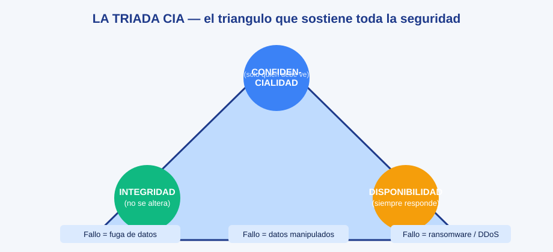

# 0501 · Módulo 1: Riesgos de Seguridad

> Curso 05 · Módulo 1 de 6 · Temas: tríada CIA, malware, ataques a la red e ingeniería social

---

## Objetivos de este módulo

- [ ] Explicar la tríada CIA con ejemplos
- [ ] Identificar los tipos de malware y sus vectores de infección
- [ ] Conocer los ataques de red clásicos
- [ ] Defenderme de la ingeniería social

---

## 1. La tríada CIA (el fundamento de la seguridad)

| Pilar | Significa | Ejemplo de fallo |
|-------|-----------|------------------|
| **Confidencialidad** | Solo quien debe, puede ver | Fuga de datos personales |
| **Integridad** | Los datos no se alteran | Cambian tus cifras sin que se note |
| **Disponibilidad** | Los servicios responden | Ransomware o DDoS apagan el sistema |

**Conceptos de riesgo**:
- **Amenaza**: cualquier cosa que puede causar daño (hacker, malware, incendio).
- **Vulnerabilidad**: debilidad que la amenaza explota (SO sin parches).
- **Riesgo**: probabilidad × impacto de que exploten una vulnerabilidad.
- **Mitigación**: reducir la probabilidad o el impacto (parches, backups, MFA).

---

## 2. Malware — el zoologico

| Tipo | Comportamiento | Ejemplo célebre |
|------|----------------|------------------|
| **Virus** | Se adjunta a archivos ejecutables | ILOVEYOU |
| **Gusano (Worm)** | Se autorreplica por red sin clic | WannaCry |
| **Troyano** | Se disfraza de software legítimo | Emotet |
| **Ransomware** | Cifra tus datos y pide rescate | WannaCry, LockBit |
| **Spyware / keylogger** | Espía actividad y roba credenciales | Pegasus (espionaje) |
| **Rootkit** | Se oculta en el sistema | Bootkits |
| **Botnet** | Tu equipo se une a un ejército controlado | Mirai (IoT) |

**Vectores de infección** (cómo entra):
1. **Phishing** (correo/WhatsApp con enlaces o adjuntos) — el nº1 mundial.
2. Descargas de sitios falsos y "cracks".
3. Vulnerabilidades sin parchear.
4. USB infectados.
5. Malvertising (anuncios venenosos), drive-by downloads, exploits de navegador.

> **Caso real (el que ya vivimos)**: un `.bat` de una supuesta app financiera descargado de un anuncio falso → cuarentena + análisis + rotación de contraseñas + runbook. La defensa funciona en cadena.

---

## 3. Ataques de red clásicos

| Ataque | Cómo funciona | Defensa |
|--------|---------------|---------|
| **DoS / DDoS** | Saturar recursos hasta caer | Firewalls, rate limiting, CDN |
| **Man-in-the-Middle** | Intercepta tu tráfico | HTTPS/TLS, VPN, no usar Wi-Fi público abierto |
| **Packet sniffing** | Lee tramas en la red | Cifrado (no se puede leer lo cifrado) |
| **Ataque de diccionario / fuerza bruta** | Probar contraseñas | Bloqueo de intentos + 2FA |
| **Replay** | Reutiliza datos captados | Nonces/timestamps en los protocolos |
| **Port scanning** | Reconocimiento de puertos abiertos | Firewall + no exponer servicios innecesarios |

---

## 4. Ingeniería social — el malware "de humanos"

El **80% de los incidentes** empiezan con un humano engañado, no con tecnología.

| Técnica | Señal de alerta | Defensa |
|---------|-----------------|---------|
| **Phishing** (correo) | Remitente raro, urgencia, errores | Verificar dominio, no abrir adjuntos, reportar |
| **Smishing/vishing** (SMS/voz) | "Tu banco te llama", códigos | Colgar y llamar al banco tú mismo |
| **Pretexting** | Una historia para que des datos | Nunca dar credenciales por teléfono |
| **Baiting** | USB "encontrado" en el parqueo | Nunca conectar dispositivos desconocidos |
| **Whaling** | Suplantación del jefe (CEO) | Confirmar por segundo canal |

**3 reglas de oro para enseñar a los usuarios**:
1. **Ninguna entidad legítima pide tu contraseña o código por mensaje/llamada.**
2. Urgencia + presión = fraude. Detente, verifica por otro canal.
3. Ante la duda: **no hagas clic**, reporta a TI.

---

## Práctica del módulo

1. Inventa 3 correos de phishing (uno de banco, uno de "premio", uno del "jefe") y anota qué trampas usaste — luego pídele a alguien que los detecte.
2. Busca ejemplos reales: *"ejemplos phishing banco España/real email"* y analiza las señales.
3. En tu equipo: revisa los adjuntos que no debes abrir: `.exe .bat .scr .vbs .js .msi` comprimidos.
4. Defiende a tu familia: explica la regla nº1 con un ejemplo real cotidiano.

## Plataformas gratuitas para practicar

- **TryHackMe** (https://tryhackme.com): rooms gratuitas de phishing y redes
- **Phishing quiz**: busca *"phishing quiz sony"* o *"google phishing quiz"* (juego oficial de Google)
- **picoCTF** (https://picoctf.org): retos iniciales de seguridad

---

## Checklist de dominio — Módulo 1

- [ ] Explico CIA con 3 ejemplos cotidianos
- [ ] Reconozco cada tipo de malware y cómo entra
- [ ] Describo DDoS, MitM y fuerza bruta con defensas
- [ ] Detecto phishing sin abrir nada
- [ ] Aplico la regla de "verificar por segundo canal"
- [ ] Sigo el flujo de respuesta ante un correo sospechoso (reportar)

