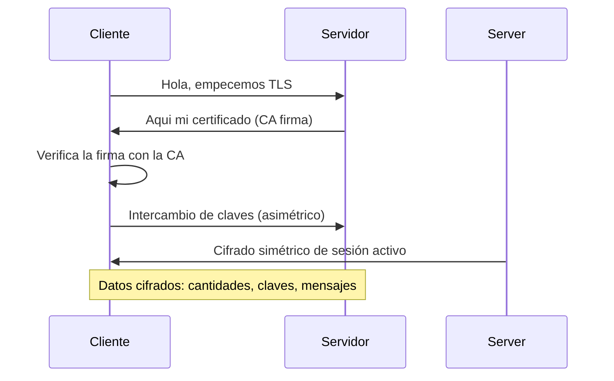

# 0502 · Módulo 2: Criptografía

> Curso 05 · Módulo 2 de 6 · Temas: cifrado simétrico/asimétrico, hashing, certificados, TLS y PKI

---

## Objetivos de este módulo

- [ ] Diferenciar cifrado simétrico y asimétrico
- [ ] Explicar hashing e integridad
- [ ] Entender certificados y el candadito HTTPS
- [ ] Conocer la PKI y las CA

---

## 1. Cifrado — la privacidad de los datos

```mermaid
flowchart LR
    A[Texto plano\nhola] -->|cifrado con clave| B[Cifrado\n#%&/()=?¿]
    B -->|descifrado con clave| C[Texto plano\nhola]
```

### Simétrico (AES)
- **Una sola clave** para cifrar y descifrar.
- Rápido → se usa para datos en reposo y volumen (discos BitLocker, archivos).
- Problema: compartir la clave con seguridad.

### Asimétrico (RSA / ECC)
- **Par de claves**: pública (para todos) y privada (secreta).
- Lo cifrado con una, solo lo descifra la otra.
- Lento → se usa para intercambio inicial y firmas.

### En la práctica: HTTPS usa ambos
1. Cliente y servidor intercambian claves con **asimétrico** (handshake TLS).
2. A partir de ahí usan una **clave de sesión simétrica** (rápida).

---

## 2. Hashing — la integridad de los datos

Un **hash** es una "huella digital" única de un contenido (SHA-256 → 64 caracteres).

| Propiedad | Implicación |
|-----------|-------------|
| Siempre el mismo hash para el mismo dato | Verificas que nada cambió |
| Un carácter distinto → hash completamente distinto | Detectas alteración |
| **Irreversible** (no se puede "deshacer") | Ideal para contraseñas |

**Usos profesionales**:
- Verificar descargas (`sha256sum archivo.iso` vs valor oficial).
- Guardar contraseñas (hash + **salt** — jamás texto plano).
- Detectar archivos maliciosos (bases de firmas de antivirus).

---

## 3. TLS y el candadito HTTPS

**TLS** (Transport Layer Security) cifra la comunicación cliente ↔ servidor.



**Qué significa el candadito**: conexión cifrada + identidad verificada del sitio.
**Señales de problema**: certificado caducado ("no es seguro"), dominio distinto al certificado, advertencias del navegador → **no continúes** en esos casos.

---

## 4. PKI — la infraestructura que lo hace confiable

| Pieza | Función |
|-------|---------|
| **Certificado digital** | Documento con identidad + clave pública + firma de una CA |
| **CA (Autoridad Certificadora)** | Entidad que emite y valida (Let's Encrypt, DigiCert, Microsoft) |
| **Firma digital** | Prueba de identidad + integridad (hash cifrado con clave privada) |
| **Cadena de confianza** | Tu navegador confía en la CA raíz → confía en el sitio |

**En la empresa**: emiten sus propios certificados internos (AD CS) para sitios internos y SSH. Alertas "certificado no confiable" en la intranet → instalar la CA raíz en los equipos gestionados.

---

## 5. Criptografía en la práctica diaria del soporte

| Herramienta | Uso |
|-------------|-----|
| **BitLocker / LUKS** | Cifrado de disco completo (portátiles perdidos = datos a salvo) |
| **7-Zip / zip cifrado** | Archivos cifrados para transferencia |
| **SSH key pairs** | Acceso remoto con claves asimétricas (mejor que contraseñas) |
| **Let's Encrypt (certbot)** | HTTPS gratuito para cualquier sitio |
| **VPN (WireGuard/OpenVPN)** | Tráfico cifrado entre redes |
| **GPG (GnuPG)** | Cifrado/firma de correo (concepto PKI) |

> **Mensaje a clientes**: "cifrar el disco" en laptops es darle a un ladrón un disco inútil; "cifrar el tráfico" (HTTPS/VPN) es que nadie lea lo que envías.

---

## Práctica del módulo

1. Verifica el hash de una ISO: el sitio oficial publica el SHA-256; compáralo con `Get-FileHash` / `sha256sum`.
2. Genera un par de claves SSH (`ssh-keygen`) en tu equipo y agrégalo a tu VM (`ssh-copy-id`).
3. Cifra un archivo con 7-Zip y pide que te lo pasen: transfiérelo y verifiquen que se abre con la clave.
4. Examina el certificado de cualquier sitio HTTPS (candadito → detalles); hora de validez, emisor.
5. Habilita BitLocker en tu equipo (si es compatible) o explora LUKS en tu VM.

## Plataformas gratuitas para practicar

- **CryptoHack** (https://cryptohack.org): retos de criptografía para principiantes (gratis)
- **TryHackMe — Cryptography 101 room** (https://tryhackme.com)
- **certbot** (https://certbot.eff.org): HTTPS real gratis
- **WireGuard** (https://www.wireguard.com): VPN moderna de práctica

---

## Checklist de dominio — Módulo 2

- [ ] Explico simétrico vs asimétrico y dónde se usa cada uno
- [ ] Digo qué es un hash y por qué las contraseñas van con salt
- [ ] Narro el handshake TLS simplificado (asimétrico → simétrico)
- [ ] Analizo el candadito de un sitio (emisor, caducidad)
- [ ] Verifico integridad de descargas con hashes
- [ ] Recomiendo BitLocker/LUKS, SSH keys y Let's Encrypt correctamente