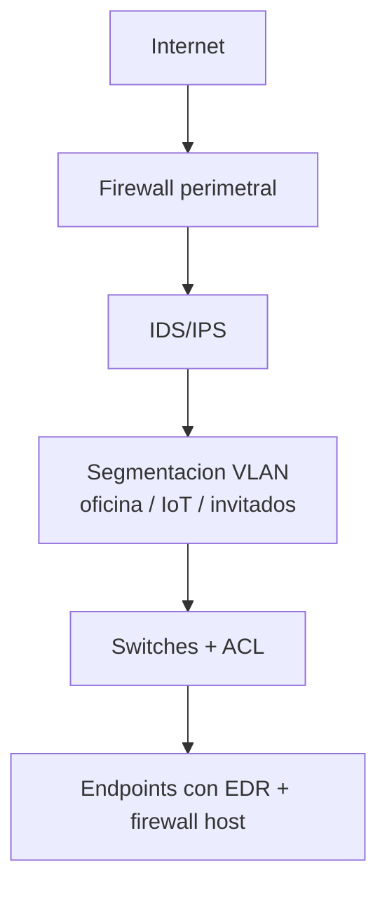

# 0504 · Módulo 4: Asegurando la Red

> Curso 05 · Módulo 4 de 6 · Temas: firewalls, VPN, seguridad Wi-Fi, IDS/IPS y segmentación

---

## Objetivos de este módulo

- [ ] Configurar firewalls con reglas de seguridad
- [ ] Explicar y desplegar VPN
- [ ] Asegurar redes Wi-Fi (WPA2/WPA3, segmentación)
- [ ] Conocer IDS/IPS y defensa en la red

---

## 1. Firewalls — la puerta con aduana

**Firewall**: filtra tráfico según reglas (IPs, puertos, protocolos, estado).

| Regla | Sentido | Acción |
|-------|---------|--------|
| Denegar todo por defecto | ambos | Whitelist: solo lo necesario pasa |
| Permitir 443 saliente | out | Navegación HTTPS |
| Permitir 22 hacia servidor | in (desde VPN) | SSH solo desde red confiable |
| Bloquear 3389 hacia Internet | in | RDP nunca expuesto directo |

**Tipos**: host (Windows Defender Firewall, `ufw`, iptables) y perimetral (pfSense/OPNsense, appliances). Regla DPI-avanzada (inspección de contenido) y stateful (solo respuestas de conexiones establecidas).

> **Frase de venta**: un firewall "denegar por defecto" significa que lo que no está explícitamente permitido no pasa — así tu oficina solo expone lo que decide exponer.

---

## 2. VPN — el túnel privado

Conecta **redes o equipos remotos** con un túnel cifrado y autenticado.

| Tipo | Ejemplo |
|------|---------|
| **Acceso remoto** | Empleado en casa → red de la oficina (OpenVPN, WireGuard, Cisco AnyConnect, Microsoft Always On VPN) |
| **Sitio a sitio** | Sucursal ↔ sede central (IPsec) |

**Verdades importantes** (para no vender humo):
- VPN **no te hace anónimo** en Internet: tu empresa/operador ve tus conexiones (el túnel va a la red corporativa).
- **Antivirus ≠ VPN ≠ proxy**: cada cosa cubre una necesidad.
- Las "VPN gratis" monetizan tus datos — nunca para el trabajo.

**Implementación mínima real**: WireGuard en una VM VPS (digital ocean/Vultr free tier de prueba) o en el router de la oficina (algunos soportan WireGuard).

---

## 3. Seguridad Wi-Fi — la frontera invisible

| Estándar | Estado |
|----------|--------|
| WEP | **Inseguro** — crackeable en minutos. Prohibido |
| WPA | Obsoleto |
| WPA2 | Aceptable (mínimo actual) |
| **WPA3** | Recomendado: cifrado más fuerte, mejores defensas |

**Buenas prácticas de Wi-Fi**:
1. **WPA2/WPA3** con contraseña larga (16+ caracteres).
2. **Red de invitados (guest)** separada: visitas sin acceso a la red interna.
3. **Segmentar IoT** (cámaras, bombillas) en su propia red/VLAN: si un IoT es hackeado, no llega a tus archivos.
4. Desactivar WPS (abre un agujero de fuerza bruta).
5. Cambiar contraseñas del router por defecto y actualizar su firmware.
6. **Ocultar la red no te protege** (el SSID se ve igual): la seguridad real es cifrado y contraseña.

---

## 4. IDS/IPS y EDR — la vigilancia activa

| Sigla | Qué hace |
|-------|----------|
| **IDS** | **Detecta** (alerta) actividad sospechosa — observador |
| **IPS** | Detecta **y bloquea** en línea — guardia armado |
| **EDR** | Protege el **endpoint** con comportamiento (no solo firmas) — el "anti-malware moderno" |

Herramientas: **Snort/Suricata** (IDS/IPS gratis), **Wazuh** (SIEM+EDR open source), Defender for Endpoint (comercial).

**Defensa en profundidad en la red** (lo que se espera de ti):

---

## 5. Escenarios prácticos de la oficina

| Caso | Solución |
|------|----------|
| "El Wi-Fi de la oficina es lentísimo y los clientes entran a la red" | Red guest + limitar banda + WPA3 |
| "El dueño quiere trabajar desde casa seguro" | VPN de acceso remoto al router/servidor + MFA |
| "Un empleado descargó algo raro" | Aislar equipo + EDR + revisar red (¿contactó con IPs raras?) |
| "No sé qué puertos están abiertos" | `nmap localhost` / escaneo externo controlado |

---

## Práctica del módulo

1. Investiga las reglas de tu router (panel de administración): activa WPA3/WPA2, pon contraseña larga y crea la red de invitados.
2. En tu VM: configura `ufw` (firewall) y abre solo 22 y 80; verifica desde afuera con `nmap`.
3. Levanta WireGuard entre tu Windows y la VM (tutorial oficial) y revisa que el túnel funciona (`wg show`).
4. Instala Wireshark y (en tu propia VM) observa el tráfico cifrado vs el que no lo está.

## Plataformas gratuitas para practicar

- **TryHackMe — Network Security / Firewalls rooms** (https://tryhackme.com)
- **OPNsense** (https://opnsense.org) — firewall completo para VM de práctica
- **WireGuard** (https://www.wireguard.com) + **OpenVPN** (https://openvpn.net/community)
- **Wazuh** (https://wazuh.com) — SIEM/EDR open source
- **pfSense** (https://www.pfsense.org) — firewall/VPN de comunidad

---

## Checklist de dominio — Módulo 4

- [ ] Configuro reglas de firewall denegar-por-defecto
- [ ] Explico y despliego una VPN (acceso remoto vs sitio a sitio)
- [ ] Sé exactamente por qué WEP/WPA no se usan jamás
- [ ] Segmento red (invitados/IoT/oficina) en un caso real
- [ ] Diffencio IDS, IPS y EDR
- [ ] Aseguro el Wi-Fi de una oficina de principio a fin