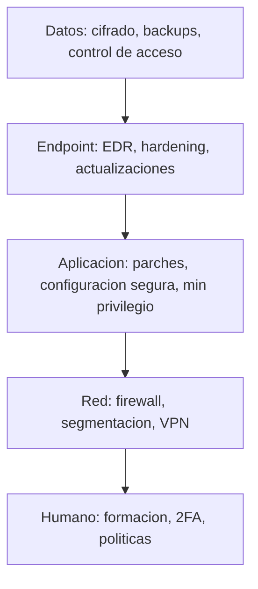

# 0505 · Módulo 5: Defensa en Profundidad

> Curso 05 · Módulo 5 de 6 · Temas: hardenizar el endpoint, las apps y los datos — capas que se sostienen

---

## Objetivos de este módulo

- [ ] Explicar el concepto de "defensa en profundidad"
- [ ] Hardenizar sistemas (endpoint) de principio a fin
- [ ] Proteger aplicaciones y datos
- [ ] Aplicar hardening a equipos y servidores

---

## 1. Defensa en profundidad (las capas de la cebolla)

Si una capa falla, la siguiente te atrapa. **Ninguna defensa única es suficiente**.



**Ejemplo de cadena real**: phishing → 2FA lo detiene; si pasa (robo de sesión) → EDR detecta el inicio raro → segmentación limita el daño → backups restaura.

---

## 2. Hardening del sistema operativo (endpoint)

| Área | Práctica concreta |
|------|-------------------|
| **Parches** | Actualizaciones automáticas activas (SO + apps + navegadores) |
| **Cuentas** | Admin separado del usuario diario; deshabilitar invitados por defecto |
| **Servicios** | Desactivar los que no se usan (SMB/445 fuera de necesidad, RDP interno) |
| **Firewall host** | Activo con reglas mínimas |
| **Cifrado de disco** | BitLocker/LUKS en portátiles |
| **Inicio limpio** | Revisar Autoruns: menos apps al arranque = menos superficie |
| **Navegador** | Extensiones mínimas y de fuentes verificadas, bloqueador de anuncios |
| **Backups** | Activos y probados (3-2-1) |

**Checklist rápido de un portátil empresarial** (10 min): Windows Update al día · BitLocker activo · Defender con escaneo semanal · UAC alto · firewall activo · cuenta sin privilegios · navegador con bloqueador · sin "cracks" · sincronización de backups revisada.

---

## 3. Seguridad de aplicaciones

| Riesgo | Mitigación |
|--------|------------|
| App desactualizada | Parcheo automático (winget/apt + renovar) |
| Permisos excesivos | Mínimo privilegio (cuentas, servicios, roles) |
| Config débil por defecto | Revisar ajustes de seguridad al instalar |
| Extensiones/plugins maliciosos | Instalar solo de tiendas oficiales |
| Scripts/descargas | Tratar todo adjunto como sospechoso hasta verificar |
| **Pivoting** | Segregación: un servicio comprometido no debe saltar a todo |

**Práctica de servidores**: ejecutar servicios con su propio usuario sin privilegios, cambiar puertos de administración, deshabilitar funciones no usadas (PHP modules, IIS funciones), sanitizar logs.

---

## 4. Seguridad de datos

| Capa | Práctica |
|------|----------|
| **Cifrado** | Disco (BitLocker), archivos sensibles, copias de seguridad cifradas |
| **Acceso** | Permisos granulares (ACL) + revisión periódica |
| **Retención** | Política de cuánto guardar y cómo borrar (nunca "acumular todo para siempre") |
| **Clasificación** | Datos sensibles → protecciones extra (carpeta restringida, DLP) |
| **Backup inmutable** | Copia que el ransomware no puede borrar (3-2-1-1) |

> **Saneamiento**: al reciclar discos/PCs, borra de verdad (`cipher /w:` en Windows, `shred`/`wipe` en Linux) o destruye físicamente — formatear NO elimina datos de forma segura.

---

## 5. Gestión de vulnerabilidades (el ciclo profesional)

```mermaid
flowchart LR
    A[Inventario\nde activos] --> B[Escaneo de vulnerabilidades\nOpenVAS / Nessus / Defender]
    B --> C[Priorizar por critica]\nCVE con explotacion activa > todo
    C --> D[Remediar: parche, configuracion,\ncompensacion]
    D --> E[Re-escaneo y registro]
    E --> A
```

**CVE** (Common Vulnerabilities and Exposures): catálogo público de vulnerabilidades. La regla operativa: **prioriza las CVE con exploit público activo** (ver periódicamente advisories del fabricante y bases como CISA KEV).

---

## 6. Escenarios de hardening aplicado

| Escenario | Plan de 15 min |
|-----------|-----------------|
| Portátil nuevo para empleado | Actualizar todo → BitLocker → cuenta estándar → firewall → 2FA en correo → backup configurado |
| Servidor web recién desplegado | SSH sin contraseña (claves) → root deshabilitado → firewall solo 80/443/22 → parches → logs rotados |
| Wi-Fi de oficina | WPA3 + guest separada + IoT en VLAN propia |
| Revisión post-incidente | Aplicar lecciones del runbook: cerrar vector, rotar claves, endurecer punto de entrada |

---

## Práctica del módulo

1. Aplica el checklist de portátil empresarial a TU equipo (10 min, real).
2. En tu VM: endurece SSH (claves + deshabilitar password + root), confirma con `ss` qué puertos quedan.
3. Cifra un USB de respaldo (BitLocker To Go en Windows / `cryptsetup` en Linux).
4. Sanea un USB viejo con `cipher /w:U:` (o `shred`) antes de desecharlo.

## Plataformas gratuitas para practicar

- **CIS Benchmarks** (https://www.cisecurity.org) — guías de hardening profesionales
- **OpenVAS / Greenbone** — escáner de vulnerabilidades gratis en VM
- **TryHackMe — Windows/Linux hardening rooms** (https://tryhackme.com)
- **Microsoft Learn — Windows security** (https://learn.microsoft.com)

---

## Checklist de dominio — Módulo 5

- [ ] Explico defensa en profundidad con una cadena de ataque real
- [ ] Aplico el checklist de portátil empresarial en <15 min
- [ ] Endurezco SSH y servicios de un servidor de práctica
- [ ] Cifro discos y archivos sensibles correctamente
- [ ] Saneo datos antes de desechar hardware
- [ ] Gestiono un ciclo de vulnerabilidades con priorización