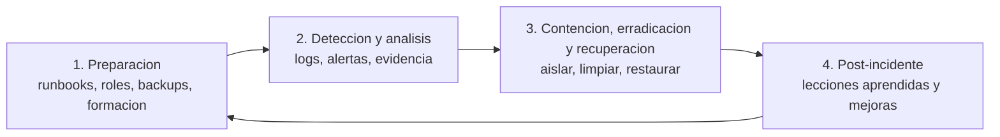

# 0506 · Módulo 6: Cultura de Seguridad en la Empresa

> Curso 05 · Módulo 6 de 6 · Temas: políticas, respuesta a incidentes (NIST), continuidad y formación

---

## Objetivos de este módulo

- [ ] Diseñar una política de seguridad básica
- [ ] Ejecutar el ciclo de respuesta a incidentes (NIST)
- [ ] Planificar la continuidad del negocio
- [ ] Formar y medir la cultura de seguridad de los usuarios

---

## 1. Política de seguridad: el marco de la empresa

Una política convierte "buenas intenciones" en **reglas escritas y aplicables**.

| Sección del documento | Qué define |
|----------------------|------------|
| **Alcance** | A quién aplica (empleados, contratistas, dispositivos propios) |
| **Contraseñas y MFA** | Longitud, gestor, 2FA obligatorio |
| **Uso aceptable** | Qué se puede hacer con los equipos y la red |
| **Acceso remoto** | VPN obligatoria, no Wi-Fi público sin cifrado |
| **Manejo de datos** | Clasificación, retención, borrado |
| **Respuesta a incidentes** | Qué hacer y a quién avisar en cada tipo |
| **Sanciones** | Consecuencias del incumplimiento |
| **Revisión** | Frecuencia de actualización anual |

---

## 2. Respuesta a incidentes — el ciclo NIST (lo estandarizado)

| Fase | Acciones clave |
|------|----------------|
| **Preparación** | Runbook listo, roles definidos, backups probados (el 90% del éxito ocurre aquí) |
| **Detección** | Evidencia preservada (logs con timestamps, capturas, hashes) — puede ser evidencia legal |
| **Contención** | **Aislar YA**: desconectar en red del equipo, cuarentena, deshabilitar cuentas |
| **Erradicación** | Eliminar malware, cerrar el vector, **rotar credenciales** de lo expuesto |
| **Recuperación** | Restaurar de backups limpios, monitoreo intensivo 2 semanas |
| **Post-incidente** | Reunión de lecciones, actualizar runbooks, medir qué falló |

**Reglas de oro**:
- **No tocar** (o anotás todo) el equipo comprometido antes de tomar evidencia.
- **Confidencialidad**: no compartir detalles del incidente hasta el reporte oficial.
- **Comunicar**: informar al negocio con impacto (no solo técnica) y a las autoridades cuando la ley lo exige (dato personal = reportable).

---

## 3. Continuidad del negocio (BCP/DR)

| Plan | Cubre |
|------|-------|
| **BCP (Business Continuity Plan)** | Cómo sigue operando el negocio durante la crisis (trabajo manual, sede alterna) |
| **DRP (Disaster Recovery)** | Cómo vuelven los sistemas (servidores, datos, red) |
| **RTO/RPO** | Números objetivos: en cuánto vuelvo y cuánto pierdo |

**Ejercicio**: incendio/servidor muerto/ransomware → ¿cuántos minutos puede la empresa operar sin correo? ¿con papel? ¿dónde trabajan los empleados? (teletrabajo), ¿cuándo vuelven los sistemas? Prueba anual del plan.

---

## 4. Formación y cultura de seguridad (lo que muchas empresas no hacen)

| Acción | Cómo |
|--------|------|
| **Inducción** | Formación de 30 min al nuevo empleado (phishing, contraseñas, reporte) |
| **Simulacros de phishing** | Envíos internos de prueba a equipos e informe de resultados (GoPhish, basado en Gophish open source) |
| **Consejos cortos** | Mensajes mensuales de 1 minuto, no manuales de 100 páginas |
| **Canal de reporte** | Botón/facilitar "vi algo raro" sin miedo al regaño (cultura de reporte, no de culpa) |
| **Métricas** | % clics en simulacros, tiempo de reporte, tickets de seguridad |

**El objetivo no es la tecnología perfecta sino que el humano sea la última capa que avisa**.

---

## 5. El plan de seguridad para una PYME (entregable final integrador)

1. **Inventario** de activos y sus dueños.
2. **Políticas**: contraseñas/MFA, uso aceptable, acceso remoto, datos.
3. **Tecnología**: firewall + antivirus/EDR + backups 3-2-1 + cifrado + Wi-Fi WPA3 + segmentación.
4. **Respuesta**: runbook (aislar → escanear → rotar → restaurar → documentar).
5. **Formación** y simulacros trimestrales.
6. **Revisión** anual + prueba del DR.

> Ya tienes la mitad hecha: en el proyecto **Soluciona** documentamos un incidente real de malware con su runbook — ese es exactamente el tipo de evidencia que diferencia a un técnico promedio de un profesional de seguridad.

---

## Práctica del módulo

1. Redacta la política de seguridad de 1 página para una oficina de 10 personas.
2. Escribe el runbook "soy testigo de un correo de phishing" en 6 pasos (para usuarios).
3. Simula un incidente con tu familia/amigos: "recibieron este correo, ¿qué hacen?" y evalúalos.
4. Revisa los runbooks del proyecto Soluciona (privado) y propón mejoras con las lecciones del curso.

## Plataformas gratuitas para practicar

- **NIST SP 800-61** (https://csrc.nist.gov) — la guía oficial de incidentes (resumida en la web)
- **TryHackMe — Incident Response room** (https://tryhackme.com)
- **GoPhish** (https://getgophish.com) — simulador de phishing open source
- **Wazuh** (https://wazuh.com) — detección SIEM para el flujo de incidentes

---

## Checklist de dominio — Módulo 6

- [ ] Redacto una política de seguridad de 1 página aplicable
- [ ] Ejecuto el ciclo NIST de incidentes de memoria (fases + reglas de oro)
- [ ] Tome evidencia sin contaminarla
- [ ] Comunico un incidente al negocio con impacto, no tecnicismos
- [ ] Defino BCP/DRP con RTO/RPO y prueba anual
- [ ] Diseño formación y simulacros con métricas de mejora

---

## Fin de los 5 cursos — Certificado completo en tu bolsillo

**Siguiente paso final de la guía**:
1. Repasa las **visiones generales** de los 5 cursos (lectura rápida de repaso).
2. Completa cualquier checklist pendiente (sé honesto: vuelve al módulo si hay un "no").
3. Si puedes, completa los exámenes de Coursera para el certificado oficial.
4. Actualiza la [guía maestra](../README.md) — regresa al inicio y celebra: terminaste la especialización completa de soporte TI + tu repositorio de conocimiento público que nadie te puede quitar.