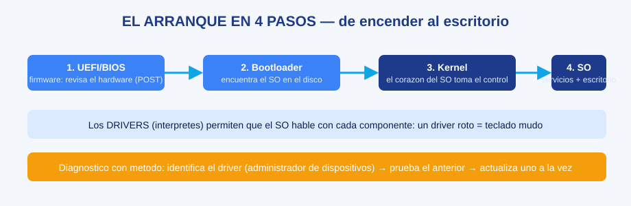

# MS-02 · Módulo 2: Sistemas operativos

> Guía Microsoft · Módulo 2 de 6 · Temas: qué es un SO, procesos, memoria, interacción hardware-SO, Windows/macOS/Linux

---

## Objetivos de este módulo

- [ ] Definir qué hace un sistema operativo y por qué es imprescindible
- [ ] Gestionar procesos y memoria (verlos y controlarlos en mi equipo)
- [ ] Explicar cómo el SO habla con el hardware (drivers, interrupciones, UEFI)
- [ ] Comparar Windows, macOS y Linux con criterio profesional

---

## Diagramas de esta sección

| Diagrama | Qué te enseña |
|----------|---------------|
| [El arranque en 4 pasos](./ms-02-modulo-2-sistemas-operativos-diagrama-arranque-4-pasos.svg) | UEFI → bootloader → kernel → escritorio, y el rol de los drivers |

## 1. El SO como director de orquesta

El sistema operativo es el **programa maestro**: gestiona el hardware, organiza los programas, reparte memoria y protege los datos de cada usuario.

| Función del SO | Qué hace | Analogía |
|----------------|----------|----------|
| **Gestión de procesos** | Decide qué programa usa la CPU y cuándo | El director de orquesta reparte los solos |
| **Gestión de memoria** | Asigna RAM a cada programa y los aísla | Repartir las mesas del restaurante |
| **Gestión de archivos** | Organiza el disco en carpetas con permisos | El archivero central |
| **Gestión de dispositivos** | Traduce órdenes a cada hardware (drivers) | Los intérpretes de idiomas |
| **Seguridad** | Usuarios, contraseñas, permisos | Guardias de seguridad por piso |
| **Interfaz** | Ventanas, íconos, terminal | La recepción del edificio |

Sin SO, cada programa tendría que saber controlar directamente el hardware: un caos (y así era en los años 50-60).

## 2. Procesos y memoria (la parte que más usarás)

| Concepto | Definición | Ejemplo |
|----------|------------|---------|
| **Proceso** | Un programa en ejecución con sus recursos | El navegador (tiene varios procesos: una pestaña, un proceso) |
| **Hilo (thread)** | Subtarea dentro de un proceso | Descargar un video mientras reproduces otro |
| **Planificador** | El SO decide qué proceso va en la CPU | El semáforo del cruce: nadie se muere de hambre |
| **Memoria virtual** | Disco usado como RAM extra | Cuando la RAM se agota y el disco "suplanta" |
| **Interrupción** | El hardware avisa al SO | El teclado "toca el timbre" cuando presionas una tecla |

**Laboratorio guiado (Windows)**: administrador de tareas → pestaña "Procesos". Identifica: 3 procesos propios, su uso de CPU y RAM, y mata un proceso inocuo (una app que no uses) para ver el efecto. En macOS: monitor de actividad. En Linux: `top` o `htop`.

**El proceso zombie y el congelado** (caso real): si un programa "no responde", el SO te da la opción de terminarlo. Es seguro: la memoria se libera y el resto queda intacto — prueba real de la gestión de memoria.

## 3. El SO hablando con el hardware

El arranque en 4 pasos (repaso + profundización del curso de soporte):

1. **UEFI/BIOS**: enciende y carga el firmware → revisa el hardware (POST).
2. **Bootloader**: encuentra el SO en el disco y lo carga en RAM.
3. **Kernel**: el corazón del SO toma control total del hardware.
4. **Servicios y sesión**: inicia drivers, servicios y tu escritorio.

**Drivers**: cada componente tiene su traductor (el driver). Un problema de driver = el "intérprete" se confundió → ¿qué ves? Pantalla azul, audio roto, teclado sin responder. Proceso de diagnóstico: identifica el driver (administrador de dispositivos) → prueba el driver anterior (reversible) → actualiza uno solo a la vez (una variable por prueba).

## 4. Windows, macOS y Linux (comparación profesional)

| Criterio | Windows | macOS | Linux |
|----------|---------|-------|-------|
| Dueño | Microsoft | Apple | Comunidad (millones de desarrolladores) |
| Usuarios típicos | Empresas, juegos, mayoría del mundo | Diseño, creadores, integración Apple | Servidores, desarrollo, TI |
| Modelo de licencia | De pago (incluida en la mayoría de PCs) | Incluido con el hardware Apple | Gratis (cientos de "distribuciones") |
| Interfaz | Escritorio clásico + terminal (PowerShell) | Minimalista + terminal (zsh) | Escritorios (GNOME/KDE) + terminal total |
| Fortaleza | Compatibilidad universal | Estabilidad y ecosistema | Control total, transparencia |
| Dónde reina | Desktops, laptops, gaming | Segmento Apple | Servidores (>90% de la web que usas) |

**Regla práctica**: el profesional de TI no es "fan de una marca"; **habla los 3 idiomas**. Linux para servidores y automatización, Windows para la empresa, macOS para soporte de usuarios creativos.

## 5. Ejercicios

1. **Ejemplo resuelto — el planificador**: 3 programas piden la CPU (A necesita 2 s, B 5 s, C 1 s). Solución con "round-robin" (turnos de 1 s cada uno). Ahora resuelve tú con turnos de 2 s y explica qué pasó con el programa C.
2. **Laboratorio**: identifica 5 procesos del sistema que no conocías y busca en la documentación oficial qué hacen (técnica de investigación profesional).
3. **Comparativa aplicada**: elige SO para 3 escenarios (servidor de correo, oficina contable, estudio de diseño) y justifica con la tabla (Bloom: evaluar).
4. **Auto-explicación**: explica en voz alta el arranque en 4 pasos sin apuntes.
5. **Investigación científica**: busca la cuota de mercado de SO en PC de escritorio y en servidores web (2 fuentes distintas) y escribe 3 conclusiones con tus palabras.

## 6. Checklist de dominio (sin mirar el módulo)

- [ ] Explico las 6 funciones del SO con analogías
- [ ] Gestiono procesos y memoria en mi sistema (práctica real)
- [ ] Describo el arranque en 4 pasos y el rol del kernel
- [ ] Diagnostico problemas de drivers con una variable por prueba
- [ ] Comparo Windows/macOS/Linux con 3 criterios técnicos

---

**Siguiente módulo**: [MS-03 — Sistemas empresariales](./ms-03-modulo-3-sistemas-empresariales.md)