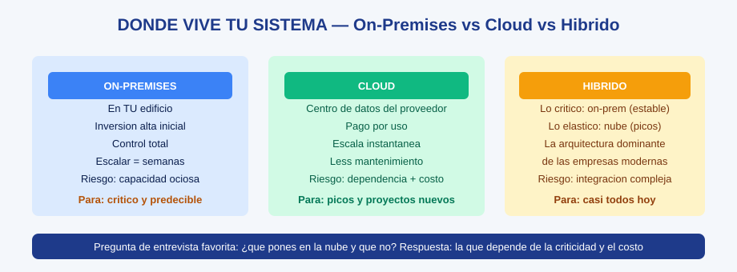

# MS-03 · Módulo 3: Sistemas empresariales

> Guía Microsoft · Módulo 3 de 6 · Temas: servidores, almacenamiento empresarial, backups, entornos on-premises/cloud/híbrido

---

## Objetivos de este módulo

- [ ] Explicar qué es un servidor y en qué se diferencia de una PC
- [ ] Comparar almacenamiento empresarial (SAN, NAS, DAS) y elegir según el caso
- [ ] Dominar la estrategia de respaldo empresarial (copias, frecuencia, ubicación)
- [ ] Describir entornos on-premises, cloud e híbrido con ventajas y riesgos

---

## Diagramas de esta sección

| Diagrama | Qué te enseña |
|----------|---------------|
| [On-premises vs Cloud vs Híbrido](./ms-03-modulo-3-sistemas-empresariales-diagrama-onprem-cloud-hibrido.svg) | Dónde vive cada sistema, con ventajas, riesgos y cuándo elegir cada uno |



## 1. El servidor: la PC que no se apaga

Un **servidor** es una computadora optimizada para servir otros equipos sin descanso.

| Criterio | PC de escritorio | Servidor |
|----------|------------------|----------|
| Objetivo | Un usuario, tareas variadas | Muchos clientes, una tarea dedicada (o varias) |
| Disponibilidad | Se apaga a diario | 24/7/365 con redundancias |
| Hardware | Un disco, una fuente, sin ECC | Discos RAID, fuentes dobles, RAM ECC, racks |
| Software | Escritorio (Windows/macOS) | Sistemas sin escritorio (Windows Server, Linux) |
| Casualidad | Sí | No: el fallo de un servidor cuesta dinero por minuto |

**Ejemplo resuelto**: un servidor de archivos para 50 empleados → disco en RAID 1 (espejo), fuente redundante, en el rack con UPS, acceso por permisos y backup nocturno. Desarrolla: ¿por qué RAID y no "un disco más grande"? → Porque un disco se rompe; el espejo aguanta el golpe mientras lo cambian.

**Práctica casera (sin comprar nada)**: instala una máquina virtual (VirtualBox) con Linux y configúrala como "servidor de archivos" local compartiendo una carpeta con tu PC. Verás en la práctica qué hace un servidor de verdad.

## 2. Almacenamiento empresarial: DAS, NAS, SAN

| Tipo | Qué es | Ventaja | Caso típico |
|------|--------|---------|-------------|
| **DAS** (directo) | Discos conectados directo al servidor | Simple y barato | Servidor pequeño |
| **NAS** (de red) | Un "cajón de discos" en la red (por Ethernet) | Compartido fácil, protocolos de archivos | Pymes, oficinas |
| **SAN** (de red especial) | Red dedicada de almacenamiento (Fibre Channel/iSCSI) | Altísimo rendimiento y escala | Grandes empresas, bases de datos |

**Regla de decisión** (memorizable): *¿necesitas 10 personas compartiendo archivos? NAS. ¿una base de datos crítica con miles de operaciones por segundo? SAN. ¿un proyecto chico y sencillo? DAS.*

**RAID en contexto empresarial** (repaso con decisión):

| Nivel | Mín. discos | Protege | Uso típico |
|-------|-------------|---------|------------|
| RAID 1 | 2 | 1 disco (espejo) | SO, archivos |
| RAID 5 | 3 | 1 disco (paridad) | Almacenamiento general (rendimiento ok) |
| RAID 10 | 4 | 1 disco por par de espejos | Bases de datos críticas |

## 3. Backups empresariales: la regla 3-2-1 y más allá

| Elemento | Estándar |
|----------|----------|
| 3 copias | 1 producción + 2 respaldos |
| 2 medios | Ej.: NAS local + nube |
| 1 fuera de sitio | Otra ubicación física o nube |

**Frecuencia y tipo por criticidad** (matriz profesional):

| Dato | Consecuencia de perderlo | Backup |
|------|--------------------------|--------|
| Base de clientes | Catastrófica | Incremental cada hora + full semanal + off-site inmediato |
| Documentación interna | Notable | Diario incremental + semanal full |
| Correos antiguos | Media | Diario |
| Instaladores antiguos | Baja | Mensual |

**RPO y RTO** (los números que siempre salen en entrevistas):

```
RPO (Recovery Point Objective) = cuánto dato estás dispuesto a perder (tiempo)
RTO (Recovery Time Objective)  = cuánto tiempo estás dispuesto a estar caído
```

Ejemplo: RPO=1 h y RTO=4 h → backups horarios y restauración completa en menos de 4 horas. Todo el diseño depende de estos dos números.

## 4. On-premises vs Cloud vs Híbrido

| | On-premises | Cloud | Híbrido |
|--|-------------|-------|---------|
| Dónde vive | En tu edificio | Centro de datos del proveedor | Mezcla |
| Inversión | Alta inicial (hardware) | Operativa (pago por uso) | Equilibrada |
| Escalabilidad | Lenta (comprar = semanas) | Instantánea | Según carga |
| Control | Total | Según acuerdos del proveedor | Según lo crítico |
| Riesgo principal | Capacidad ociosa / renovación | Dependencia y costo mensual | Complejidad de integración |

**Fórmula híbrida típica** (ejemplo resuelto): lo **crítico y predecible** on-prem (seguridad y costos estables) + lo **elástico y nuevo** en cloud (picos de demanda, desarrollo rápido). Es la arquitectura dominante hoy.

**Prompt para practicar decisiones** (con tu asistente IA, verificando todo): *"Soy analista de TI junior. Compárame on-prem vs cloud para: una clínica con datos médicos sensibles y una startup de video streaming. Dime argumentos para cada caso y qué preguntas debo hacer con datos reales del mercado."* — usa la IA como sparring, tú decides (regla de oro del curso 06).

## 5. Ejercicios

1. **Ejemplo resuelto desvanecido**: caso "imprenta 20 empleados, presupuesto moderado" → solución: NAS + backup 3-2-1 (NAS+cinta/nube) + hybrid minimalista. Ahora resuelve el caso "banco con base de datos crítica y 2000 usuarios" con la misma matriz (tú completas: SAN, RAID 10, RPO/RTO estrictos).
2. **Laboratorio**: en tu VM-servidor, configura una copia programada (archivos de una carpeta → otra carpeta del disco) y simula la restauración de un archivo borrado.
3. **Presupuesto real**: investiga precios reales de 2 discos NAS y 2 servicios de nube (plan público): arma la comparación 3-2-1 anual para una oficina de 10 personas (Bloom: analizar).
4. **Auto-explicación**: explica RPO, RTO y por qué el RAID no es backup (3 frases, sin apuntes).

## 6. Checklist de dominio (sin mirar el módulo)

- [ ] Describo un servidor con 4 diferencias vs una PC
- [ ] Elijo entre DAS/NAS/SAN con criterio
- [ ] Explico 3-2-1 y los tipos de backup por criticidad
- [ ] Defino RPO y RTO con un ejemplo numérico propio
- [ ] Comparo on-prem/cloud/híbrido con ventajas y riesgos

---

**Siguiente módulo**: [MS-04 — Seguridad y continuidad](./ms-04-modulo-4-seguridad-y-continuidad.md)