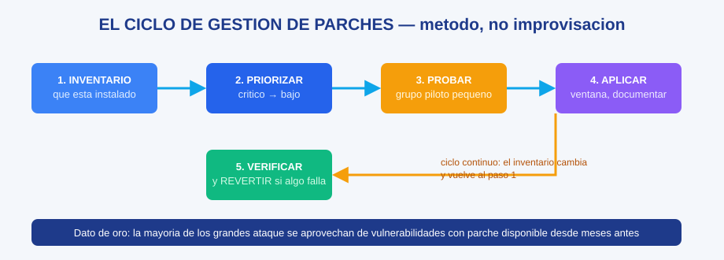

# MS-04 · Módulo 4: Seguridad y continuidad

> Guía Microsoft · Módulo 4 de 6 · Temas: amenazas del panorama informático, gestión de parches, planes de continuidad de negocio

---

## Objetivos de este módulo

- [ ] Identificar las amenazas más comunes y sus orígenes
- [ ] Gestionar parches con método (prioridad, prueba, ventana)
- [ ] Diseñar un plan de continuidad de negocio básico completo
- [ ] Explicar la tríada CIA aplicada al mundo empresarial

---

## Diagramas de esta sección

| Diagrama | Qué te enseña |
|----------|---------------|
| [El ciclo de gestión de parches](./ms-04-modulo-4-seguridad-y-continuidad-diagrama-ciclo-parches.svg) | Los 5 pasos del mantenimiento profesional: inventario → priorizar → probar → aplicar → verificar |



## 1. El panorama de amenazas (de dónde viene el peligro)

| Origen | Ejemplos | Vía de entrada |
|--------|----------|----------------|
| **Humano** (el más común) | Ingeniería social, phishing, contraseñas débiles, USB perdidos | Correo, WhatsApp, llamadas, escritorio |
| **Software malicioso** | Virus, ransomware, troyanos, spyware | Archivos, descargas, exploits |
| **Red** | Intercepción, DNS mal configurado, Wi-Fi falso | Tráfico no cifrado, redes públicas |
| **Físico** | Robo del portátil, disco desechado sin borrar | Acceso físico, descuido |
| **Proveedores** | Brecha en un servicio de nube | Credenciales y API expuestas |

**La estadística que debes saber**: en las brechas reportadas, la mayoría inicia con un **clic humano** (phishing), no con un ataque técnico brillante. Por eso la seguridad es 80% cultura, 20% tecnología — coherente con el curso de seguridad informática de la ruta principal.

**Tríada CIA en empresa** (los tres pilares desde el módulo 1 de esa ruta):

| Pilar | En la empresa | Ejemplo de fallo |
|-------|---------------|------------------|
| **Confidencialidad** | Solo quien debe, ve | Empleado lee nóminas ajenas |
| **Integridad** | Los datos no se alteran | Factura modificada en tránsito |
| **Disponibilidad** | El sistema está cuando se necesita | Servidor caído en hora pico |

## 2. Gestión de parches (el método de mantenimiento)

Un **parche** es una actualización que corrige un fallo o cierra una vulnerabilidad. El proceso profesional (método científico):

1. **Inventario**: saber qué hay instalado (el día 1 de todo buen administrador).
2. **Priorizar** (matriz de riesgo): crítico (vulnerabilidad pública y explotada) > alto > medio > bajo.
3. **Probar en un entorno pequeño** (laboratorio o grupo piloto) antes de todo el parque.
4. **Aplicar por ventana** (hora de poco uso) y **documentar** qué se aplicó a qué.
5. **Verificar** que nada se rompió (una variable por prueba) y **revertir** si algo falla (cambios reversibles).

**Ejemplo resuelto**: anuncian vulnerabilidad crítica en el software de escritorio remoto (explotada en el mundo). Respuesta: inventario (50 equipos) → prioridad alta en todos → prueba en 1 equipo de prueba → ventana de noche → verificación y registro. Debemos poder contar ese plan en una entrevista — es exactamente el tipo de pregunta de escenario.

**Dato de oro**: la mayoría de los grandes compromisos famosos se explotaron con vulnerabilidades que tenían **parche disponible desde meses antes** y no se aplicaron a tiempo.

## 3. Plan de continuidad de negocio (BCP) y recuperación de desastres (DRP)

| Concepto | Pregunta que responde |
|----------|----------------------|
| **BCP** (Business Continuity Plan) | ¿Cómo seguimos operando si esto se cae? |
| **DRP** (Disaster Recovery Plan) | ¿Cómo volvemos a tener los sistemas en pie? |
| **DR site** | ¿Dónde está el respaldo del sitio principal? |
| **RPO/RTO** | ¿Cuánto dato perdemos y cuánto tardamos? (ver módulo 3) |

**Plantilla mínima de un BCP** (cópiala para tus ejercicios):

```
1. Análisis de impacto (BIA): sistemas críticos y su costo por hora de caída
2. Estrategia: backups verificados, DR site, proveedores alternos
3. Roles y contactos: quién hace qué (y a quién avisar)
4. Procedimiento paso a paso de activación
5. Pruebas periódicas: simular una caída y practicar la recuperación
```

**El secreto profesional**: el plan que **nunca se prueba no existe**. La práctica repetida (mes a mes, distinta cada vez) es la única forma de que la recuperación funcione bajo presión.

## 4. Ejercicios

1. **Ejemplo resuelto desvanecido**: una oficina pierde el acceso a su NAS por ransomware. Le damos el plan completo (aislar, fotos, restaurar desde la nube 3-2-1, comunicación al equipo, revisar la causa). Ahora resuelve el caso "se pierde el portátil del director con datos sensibles" con la misma plantilla.
2. **Laboratorio**: en tu PC, habilita las actualizaciones automáticas del SO y documenta: qué actualizó en el último ciclo, cuándo se aplica, y cómo revertirías una actualización problemática de este mes.
3. **Análisis**: investiga un incidente de seguridad famoso del año pasado (2 fuentes) y escribí: cómo entró, qué falló (parche, clic, config), y qué regla de este módulo lo habría evitado.
4. **Auto-explicación**: explica en 3 frases por qué "el plan no probado no existe".

## 5. Checklist de dominio (sin mirar el módulo)

- [ ] Listo amenazas con su vía de entrada más común
- [ ] Explico la tríada CIA con ejemplos empresariales
- [ ] Ejecuto el ciclo de parches en 5 pasos
- [ ] Diseño un BCP con sus 5 secciones
- [ ] Defiendo por qué las pruebas periódicas son obligatorias

---

**Siguiente módulo**: [MS-05 — Aplicaciones de negocio](./ms-05-modulo-5-aplicaciones-de-negocio.md)