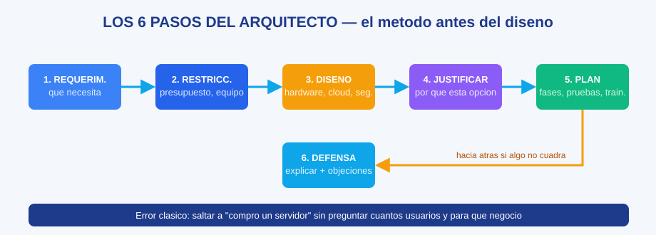

# MS-06 · Módulo 6: Proyecto final — Arquitecto de soluciones

> Guía Microsoft · Módulo 6 de 6 · Temas: diseño integral de sistemas, análisis de requerimientos, justificación técnica y defensa del proyecto

---

## Objetivos de este módulo

- [ ] Diseñar una solución informática integral desde cero
- [ ] Justificar cada decisión con criterios técnicos y de negocio
- [ ] Presentar y defender el diseño (oral y por escrito)
- [ ] Integrar TODOS los conceptos de los módulos 1-5 en un solo artefacto

---

## Diagramas de esta sección

| Diagrama | Qué te enseña |
|----------|---------------|
| [Los 6 pasos del arquitecto](./ms-06-modulo-6-proyecto-final-diagrama-6-pasos-arquitecto.svg) | El método completo del diseño de soluciones, con su bucle de retroalimentación |



## 1. El rol: arquitecto de soluciones

El arquitecto diseña **la casa entera** antes de contratar al constructor. Su método profesional (seis pasos, método científico puro):

```
1. REQUERIMIENTOS       → ¿Qué necesita el negocio de verdad? (preguntar, no presumir)
2. RESTRICCIONES        → presupuesto, equipo, tiempo, regulaciones
3. DISEÑO               → hardware, SO, cloud, seguridad, aplicaciones
4. JUSTIFICACIÓN        → ¿por qué esta opción y no la otra? (matrices de decisión)
5. PLAN DE IMPLEMENTACIÓN → fases, pruebas, capacitación, respaldo
6. DEFENSA              → explicarlo y responder objeciones
```

**El error clásico del principiante** (y cómo evitarlo): saltar directo a "compro este servidor" sin preguntar cuántos usuarios, qué datos, qué presupuesto. La primera pregunta del arquitecto siempre es: **"¿qué intenta lograr el negocio?"**.

## 2. Declaración del proyecto (tu misión)

**Escenario único para todos**: "La clínica dental *Sonrisa Digital* tiene 4 sucursales, 40 empleados, registros de pacientes sensibles (confidencialidad), agenda online y facturación. Hoy trabajan en 4 computadoras sueltas con carpetas compartidas en red local. Crecen y quieren: centralizar pacientes, agenda en línea, acceso seguro desde las sucursales, contabilidad integrada y no morir si se cae una sucursal. Presupuesto: medio."

## 3. Tu entregable: el documento de diseño (plantilla)

```
SONRISA DIGITAL — DISEÑO DE SOLUCIÓN TI
Autor · Fecha · Versión

1. Resumen ejecutivo (10 líneas: qué propones y por qué)
2. Requerimientos (traducidos de la misión: 5-8 funcionales + 3 de seguridad)
3. Arquitectura propuesta:
   - Hardware (servidores o cloud, equipos por sucursal)   [M1, M3]
   - Sistemas (SO elegido y por qué)                        [M2]
   - Almacenamiento y backups (3-2-1, RPO/RTO elegidos)     [M3]
   - Seguridad (CIA, parches, acceso por roles)             [M4]
   - Aplicaciones (ERP de salud/facturación + BI básico)    [M5]
4. Matriz de decisión: 2 alternativas con 5 criterios ponderados
5. Plan de implementación en fases (con pruebas y capacitación)
6. Plan de continuidad y de prueba del plan
7. Riesgos (5 máximo) y mitigaciones
8. Anexos: diagrama simple de la solución
```

## 4. Ejemplo resuelto — el bloque "Seguridad" (una sección completa)

Para *Sonrisa Digital* (misión: datos de pacientes = confidencialidad legal):

```
Hipótesis de diseño: datos sensibles → nunca solos en 4 PCs.
Solución: base central en cloud con cifrado en tránsito y reposo;
acceso por roles (dentista/administrativo/contador) con MFA;
parches automáticos con ventana nocturna (M4);
backups cifrados diarios + off-site (3-2-1; RPO 24h, RTO 8h).
Justificación: cumplimiento de regulación sanitaria + coste de una filtración
>> costo de la medida (criterio de decisión del módulo 4).
```

Ahora haz TÚ la sección "Backups" completa con la misma estructura (pasos desvanecidos: te damos la hipótesis, tú completas el plan y la justificación).

## 5. Tu defensa (la prueba oral — rúbrica nivel Experto)

Prepara 3 minutos para presentar el diseño y responde estas 5 preguntas asaltante (quien te examina):

1. ¿Por qué cloud y no un servidor en la clínica principal? (o viceversa)
2. ¿Qué pasa si el proveedor de internet de una sucursal cae?
3. ¿Cuánto cuesta el plan de backup al año y por qué vale la pena?
4. ¿Qué haces primero: capacitar al personal o instalar todo? ¿Por qué?
5. Un dentista te dice "esto es caro": ¿qué le respondes? (negociación técnica)

**Cómo practicar**: grábate la presentación en video (recuperación + auto-explicación), pruébala con alguien, y usa tu asistente IA como público exigente: *"Actúa como dueño de clínica y auditor: hazme las preguntas más duras sobre mi propuesta."* — verifica que tus respuestas no inventen datos.

## 6. Rúbrica de evaluación del proyecto

| Criterio | Nivel 3 (Competente) | Nivel 4 (Experto) |
|----------|----------------------|-------------------|
| Requerimientos | Identifica los 8 de la misión | Los traduce a métricas (usuarios, RPO/RTO, presupuesto) |
| Arquitectura | Propone solución razonable | Compara 2 alternativas con matriz ponderada |
| Seguridad | Aplica CIA y backups | Defiende costo vs riesgo con números |
| Implementación | Fases lógicas | Incluye pruebas, capacitación y reversión |
| Defensa | Responde las 5 preguntas | Anticipa objeciones antes de que las digan |

**Meta mínima**: nivel 3 en todo. Es tu carta de presentación: guárdalo en tu portafolio, es un proyecto que "un arquitecto junior" puede mostrar con orgullo.

## 7. Ejercicios finales

1. Completa el documento completo de *Sonrisa Digital* (las 8 secciones).
2. Presenta la defensa de 3 minutos (grabada, autoevaluada con la rúbrica).
3. Publica el documento en tu portafolio con una intro de 5 líneas.
4. Auto-explicación final: resume en 4 frases tu solución como si se la explicaras a otro estudiante — si puedes, puedes; si no puedes, indica qué sección repasar (el método nunca falla).

## 8. Checklist de dominio (sin mirar el módulo)

- [ ] Nombro los 6 pasos del arquitecto en orden
- [ ] Traduzco una misión de negocio a requerimientos
- [ ] Justifico cada decisión con un criterio (no con gustos)
- [ ] Respondo objeciones de costo con datos y riesgo
- [ ] Presenté y defendí mi proyecto completo

---

## Fin de la guía

Del transistor a la arquitectura empresarial: ya piensas en **sistemas**, no en apuntes. Este es exactamente el nivel de pensamiento que las empresas buscan en perfiles junior — y ahora está en tu portafolio para demostrarlo.